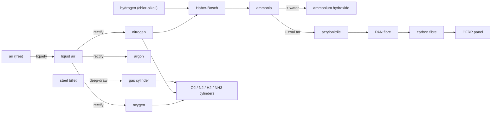

# Industrial gases — cracking the air & fixing nitrogen

Two of the most important feedstocks in all of chemistry are quite literally free:
nitrogen and oxygen make up 99% of the air around you. The catch is *separating*
them, and then — for nitrogen — forcing the most stubborn molecule in nature to
react. This package builds the two plants that do it, plus the humble steel
cylinder that bottles the results.

!!! abstract "Why these were keystones"
    Three whole branches of the tree were stranded for want of a feed gas:
    nothing produced **nitrogen**, nothing produced **ammonia**, and the empty
    **gas cylinder** that every fill recipe consumes had no source at all. Build
    these two plants and the nitrogen cylinders, ammonia cylinders, ammonium
    hydroxide, *and* the entire acrylonitrile → carbon-fibre → CFRP tail all come
    alive at once.

## 1 · Air separation — distilling the sky

The atmosphere is an ore body you never have to dig: ~78% N₂, ~21% O₂, ~1% Ar.
To split it you cool air until it turns to liquid, then distil it — because the
three gases boil at slightly different temperatures.

| Gas | Boiling point | Share of air |
|-----|---------------|--------------|
| Nitrogen | −196 °C | 78% |
| Argon | −186 °C | ~1% |
| Oxygen | −183 °C | 21% |

| # | Step · station | In → Out | Tier · time · energy |
|---|----------------|----------|----------------------|
| 1 | **Liquefy** · ASU | 10 air → 10 liquid air | T3 · 60s · **220 kJ** |
| 2 | **Rectify** · ASU | 10 liquid air → 7 N₂ + 2 O₂ + 1 Ar | T3 · 90s · 120 kJ |

Liquefying the air is the expensive part (all that compression and cooling); the
separation that follows is almost free. The double column does it in one elegant
counter-current pass — **one feed, three pure products**, the cleanest multi-output
in the whole plant.

## 2 · Haber-Bosch — fixing nitrogen into ammonia

Nitrogen gas is famously inert: that N≡N triple bond is one of the strongest in
chemistry, which is exactly why the air doesn't just spontaneously burn. To make
it react you need brute force — a hot, high-pressure reactor over an iron catalyst.

$$
N_2 + 3\,H_2 \rightarrow 2\,NH_3
$$

| Step · station | In → Out | Conditions | Tier · time · energy |
|----------------|----------|------------|----------------------|
| **Synthesise** · Haber-Bosch converter | 1 N₂ + 3 H₂ → 2 NH₃ | promoted iron cat., ~450 °C, >100 bar | T4 · 150s · **320 kJ** |

Only a fraction of the gas converts on each pass, so a real plant recirculates the
unreacted nitrogen and hydrogen around a loop. The beauty here is the feedstock:
**hydrogen comes straight from the chlor-alkali cell, nitrogen from the ASU** — the
two new gas plants closing into one. This single reaction is the root of
fertiliser, nitric acid, explosives, and the ammonium hydroxide reagent.

## 3 · Gas cylinders

Every compressed-gas product needs a container. A high-pressure cylinder is a
**seamless, deep-drawn steel** bottle — so we fabricate `cylinder_gas_basic` from a
steel billet, and the existing fills (oxygen, nitrogen, hydrogen, ammonia) snap
into place. *(This also retired a broken placeholder that tried to make an "empty"
cylinder by consuming a full one.)*

!!! note "Why no helium?"
    Helium is barely a trace in air — commercially it's extracted from
    **natural-gas wells**, not the atmosphere. Rather than fake it, `cylinder_helium`
    is left open until a natural-gas chain exists. Honesty over a shortcut.
