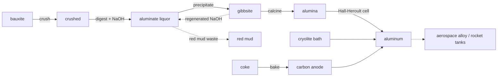

# Aluminum — Bayer process & the Hall-Héroult cell

Aluminum is the most abundant metal in the crust and yet it was a **precious metal**
until 1886 — Napoleon III supposedly served his best guests on aluminum plates while
everyone else made do with gold. The reason is chemistry: alumina (`Al₂O₃`) is one
of the most stable oxides there is, and **carbon cannot pull the oxygen off it**.
No blast furnace will ever make aluminum. It took *electricity* — lots of it — to
break the bond, and that is the whole story of this chain.

!!! danger "The fix this chain makes"
    The old placeholder smelted aluminum by reducing alumina with **charcoal**. That
    reaction does not happen at any practical temperature — it is the textbook
    example of why electrolysis was *necessary*. This chain replaces it with the
    real **Hall-Héroult** molten-salt electrolysis and deepens the **Bayer** refining
    side into its four genuine stages.

## Stage 1 — Bayer process (bauxite → alumina)

Bauxite is only 30–60% alumina; the rest is iron oxide, silica and titania. You
don't concentrate it mechanically — you dissolve the alumina out *chemically* with
hot caustic soda, leaving the rest behind as **red mud**.

| # | Step · station | In → Out | Chemistry | Tier · time · energy |
|---|----------------|----------|-----------|----------------------|
| 1 | **Crush** · stamp mill | 2 bauxite → 2 crushed + stone dust | mill for caustic access | T2 · 30s · 16 kJ |
| 2 | **Digest** · Bayer autoclave | 3 crushed + 2 NaOH → 3 aluminate liquor + 2 **red mud** | `Al(OH)₃ + NaOH → NaAlO₂`; Fe/Si/Ti → mud | T3 · 120s · 140 kJ |
| 3 | **Precipitate** · precipitation tank | 3 liquor → 2 gibbsite + 1 NaOH | `NaAlO₂ + 2H₂O → Al(OH)₃ + NaOH` | T3 · 180s · 35 kJ |
| 4 | **Calcine** · rotary kiln | 3 gibbsite → 2 **alumina** | `2Al(OH)₃ → Al₂O₃ + 3H₂O` | T3 · 90s · 120 kJ |

Two honest details worth noting:

- **Red mud** is the industry's great unsolved waste — ~1–1.5 tonnes per tonne of alumina, piling up in ponds worldwide.
- The **caustic soda is recycled**: precipitation regenerates the NaOH, which is pumped straight back to digestion. The Bayer circuit drinks its own lye.

## Stage 2 — Hall-Héroult (alumina → aluminum)

Alumina melts above 2000 °C, far too hot to electrolyse directly. The trick Hall and
Héroult found independently in 1886: **dissolve it in molten cryolite** (`Na₃AlF₆`),
which drops the working temperature to ~960 °C, then run a massive DC current through it.

| # | Step · station | In → Out | Chemistry | Tier · time · energy |
|---|----------------|----------|-----------|----------------------|
| 5 | **Bake anode** · prebake furnace | 2 coke → 1 carbon anode | coke + pitch, baked | T3 · 75s · 90 kJ |
| 6 | **Electrolyse** · Hall-Héroult pot | 2 alumina + 1 anode + 1 cryolite → 2 **aluminum** + 2 CO₂ | `2Al₂O₃ + 3C → 4Al + 3CO₂` | T4 · 200s · **600 kJ** |

The carbon anode is **consumed** — the oxygen freed from the alumina burns it to CO₂,
so pots are forever being re-anoded. At ~17,000 kWh per tonne, this is the **most
energy-hungry single step in the entire tech tree**: aluminum is solid electricity.

!!! note "Why cryolite matters"
    Cryolite (made in its own chain from fluorite → hydrofluoric acid) finally has a job here — it is the *solvent* that makes electrolysis possible at a survivable temperature. Without it you would need to hold over 2000 °C; with it, ~960 °C. That single substitution is what turned aluminum from a curiosity into structural metal.
