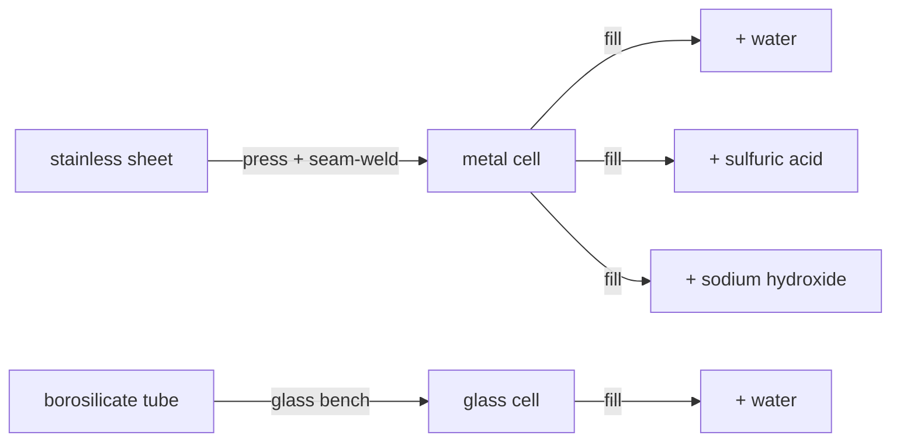

# Cells & canisters — what the wall can survive

A “cell” is just a container, but in a chemistry game the container is a real engineering decision: the wall has to survive whatever you pour into it. Conduvia had `cell_metal` and `cell_glass` sitting in the item list with **no recipe at all**, which meant every filled canister downstream was unreachable. This chain gives them a proper forming route and turns four hand-waved fills into real, stationed recipes.

## Why stainless, and why it matters

One metal cell body has to survive **both** strong sulfuric acid **and** hot caustic soda:

- Plain steel is eaten by acid.
- **Aluminium dissolves outright in lye:** `2 Al + 2 NaOH + 6 H2O -> 2 Na[Al(OH)4] + 3 H2` — it doesn't just corrode, it generates flammable hydrogen.

Only **stainless** shrugs off both, so the metal cell is deep-drawn and seam-welded from stainless sheet. The **glass cell** is sealed borosilicate — inert to acids and thermal shock, but fragile, so it's used where you want to see the contents.

## The route

| Step | Station | In → Out |
|---|---|---|
| Form metal cell | Sheet-Metal Forming & Seaming Press | 2 stainless sheet → 2 metal cell |
| Form glass cell | Glass Bench | 2 borosilicate tube → 2 glass cell |
| Fill (water) | Reagent Filling & Sealing Line | metal cell + water → filled |
| Fill (acid) | Reagent Filling & Sealing Line | metal cell + H₂SO₄ → filled |
| Fill (caustic) | Reagent Filling & Sealing Line | metal cell + NaOH → filled |
| Fill (glass, water) | Reagent Filling & Sealing Line | glass cell + water → filled |

This ties the **steel**, **glass**, **sulfuric-acid** and **chlor-alkali** chains together — the container branch every reagent eventually needs.
