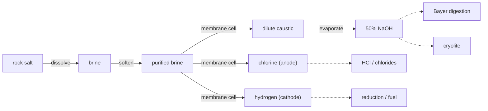

# Chlor-alkali — caustic soda, chlorine & hydrogen from brine

Two of the most-used industrial chemicals on Earth — **sodium hydroxide** (caustic
soda) and **chlorine** — come out of the same machine: an electrolysis cell fed
nothing but salt water. As a bonus it makes **hydrogen** too. This is the
chlor-alkali process, and it is the quiet workhorse behind half the chemistry in
Conduvia: the NaOH it makes digests bauxite in the Bayer process, builds cryolite,
makes soaps and epoxies, and neutralises acid waste plant-wide.

!!! abstract "One cell, three products"
    `2 NaCl + 2 H₂O → Cl₂ + H₂ + 2 NaOH` 
    Chlorine leaves the **anode**, hydrogen the **cathode**, and the sodium ion
    crosses an ion-selective membrane to leave caustic soda behind. The membrane's
    whole job is to keep the chlorine away from the caustic and hydrogen — mix them
    and you get useless (or dangerous) products.

## The plant, step by step

The chemistry is one line, but a real plant is three unit operations bolted around
the cell — and skipping any of them ruins the run.

| # | Step · station | In → Out | Why | Tier · time · energy |
|---|----------------|----------|-----|----------------------|
| 1 | **Dissolve** · brine unit | 2 salt + 1 water → 2 brine | saturate the feedstock | T2 · 30s · 20 kJ |
| 2 | **Purify** · brine unit | 2 brine → 2 purified + tailings | strip Ca/Mg to ppb — else the membrane fouls | T3 · 45s · 40 kJ |
| 3 | **Electrolyse** · membrane cell | 2 purified → 1 **Cl₂** + 2 dilute caustic + 1 **H₂** | the cell itself | T3 · 120s · **350 kJ** |
| 4 | **Concentrate** · evaporator | 2 dilute caustic → 1 **NaOH** + 1 water | cell makes only ~12–33%; boil to ~50% | T3 · 60s · 110 kJ |

The two details that make this honest rather than hand-wavy:

- **Brine purity is the hidden discipline.** The ion-selective membrane is wrecked by calcium and magnesium hardness, so the brine is softened to parts-per-billion before it ever reaches the cell. That is why purification is its own gated step.
- **The cell makes *weak* caustic.** Straight from the cathode loop it is only ~12–33% NaOH — too dilute to use — so it is boiled down to the ~50% product everything downstream actually consumes. Evaporation is energy-hungry in its own right.

!!! note "Two great electrolysis cells, side by side"
    Conduvia now runs the two defining industrial electrolyses back to back: the **Hall-Héroult** cell turns alumina into aluminium, and the **chlor-alkali** cell turns brine into caustic + chlorine. Both are enormous electricity sinks — together they are why an industrial base lives or dies by its power supply.
