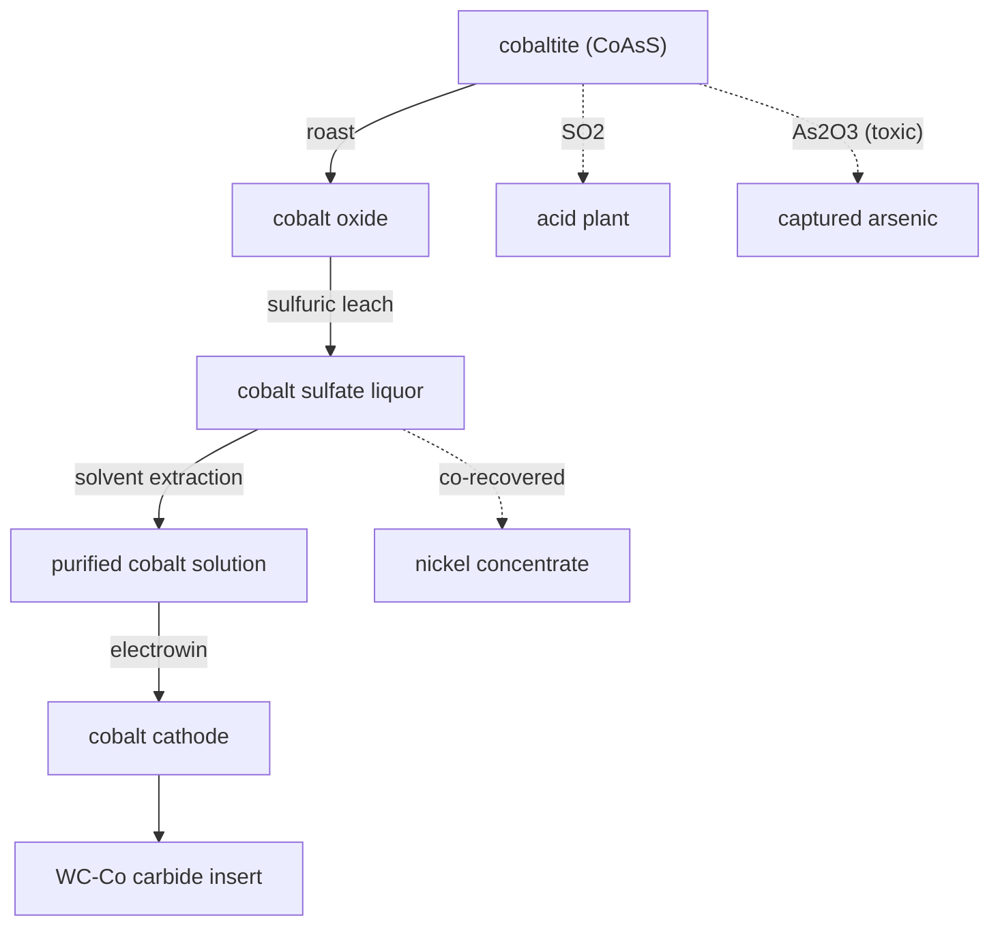

# Cobalt — refining cobaltite, and fixing the carbide binder

Cobalt sat in the ground as cobaltite with no way to refine it, so the tungsten chain had to bond its cemented-carbide insert with **nickel** as a stand-in. This chain refines real cobalt and then closes that loop: the insert becomes a proper **WC-Co** hardmetal, the grade actually used in cutting tools.

## Roast
Cobaltite is **CoAsS** — a cobalt arsenide-sulfide — so roasting it is messy on purpose. Sulfur leaves as **SO₂** (to the contact acid plant), arsenic is captured from the flue as toxic **arsenic trioxide** rather than vented (a real, ugly liability of cobalt and gold ores), and cobalt stays behind as a roasted oxide.

## Leach & purify
The oxide is **leached in sulfuric acid** to a pink cobalt sulfate liquor, then **solvent-extracted** to strip out the nickel and copper that always ride with cobalt. The recovered nickel comes off as concentrate (cobalt and nickel are inseparable in nature, so we don't waste it), and the cleaned liquor is **electrowon** to a bright cobalt cathode.

## The payoff: WC-Co
With real cobalt available, the tungsten-carbide insert is rebuilt with its correct binder: **WC-Co**. Cobalt wets and bonds tungsten-carbide grains far better than nickel, which is why every real cemented-carbide cutting tool uses ~6–10% cobalt. The nickel stand-in is retired.

## Honest notes
- The arsenic byproduct is captured, not magicked away — it's a genuine hazard of this ore.
- Cobalt's other real homes (superalloys, magnets, batteries) are noted but not yet built; the carbide binder is the live sink today.
