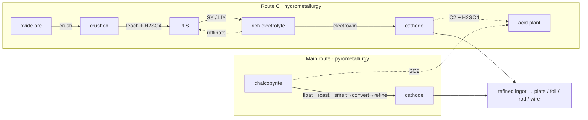

# Copper Route C — oxide leach (SX-EW)

The copper field guide's main line is the **sulfide route**: crush → float → roast
→ smelt → convert → refine. But a huge share of the world's copper never sees a
furnace at all. The weathered, brightly coloured **oxide cap** above a sulfide
orebody is leached with acid and won back with electricity — the **SX-EW** route.
It only became possible in Conduvia once the **sulfuric-acid** chain existed,
because the whole thing runs on H₂SO₄… and hands most of it back at the end.

!!! abstract "Why a second copper route?"
    **Sulfide (smelting):** high-grade ore → furnace → SO₂ → (feeds the acid plant). Pyrometallurgy.
    **Oxide (SX-EW, this page):** low-grade oxide ore → acid leach → solvent extraction → electrowinning. Hydrometallurgy — ambient temperature, no smelter, no SO₂.
    Both converge on the **same cathode copper**, so they share the remelt → ingot → forms tail.

## The acid loop

This is the satisfying part. Route C is not just an acid *consumer* — it's a
nearly closed loop:

- **Leach** spends concentrated H₂SO₄ to dissolve the copper.
- **Solvent extraction** spits the acid back out as the copper-stripped **raffinate** (dilute acid), which is recirculated onto the heap.
- **Electrowinning** *regenerates* concentrated acid at the anode: `2 CuSO₄ + 2 H₂O → 2 Cu + O₂ + 2 H₂SO₄`.

So the acid plant only has to top up the **make-up** acid lost to gangue — exactly
as a real tank-house does.

## The chain, step by step

| # | Step · station | In → Out | Byproduct / note | Tier · time · energy |
|---|----------------|----------|------------------|----------------------|
| 0 | **Mine oxide cap** · — | → 3 oxidized copper ore | world resource (gossan) | T1 · 25s · — |
| 1 | **Crush (coarse)** · stamp mill | 2 ore → 2 crushed + stone dust | coarse on purpose — keep the heap permeable | T1 · 25s · 12 kJ |
| 2 | **Heap leach** · leach pad | 3 crushed + 2 H₂SO₄ → 3 PLS + tailings | no oxidant needed; gangue eats acid | T2 · 120s · 20 kJ |
| 3 | **Solvent extraction** · mixer-settler | 3 PLS → 1 rich electrolyte + 1 dilute acid | LIX oxime, pH<2.5, rejects iron; raffinate recycles | T3 · 40s · 30 kJ |
| 4 | **Electrowinning** · EW cell | 2 electrolyte → 2 **cathode** + 1 H₂SO₄ + 1 O₂ | regenerates acid; Pb anode / SS cathode | T3 · 90s · 400 kJ |

From the cathode, you're back on the shared copper tail: remelt → refined ingot
→ plate / foil / rod / wire / dust.

## The chemistry (verified)

- **Oxide dissolution** — oxides dissolve in dilute acid with **no oxidant**, unlike sulfides:
    - `CuO + H₂SO₄ → CuSO₄ + H₂O`
    - malachite: `Cu₂CO₃(OH)₂ + 2 H₂SO₄ → 2 CuSO₄ + 3 H₂O + CO₂`
    - Common oxide minerals: malachite, azurite, chrysocolla, cuprite, tenorite.
- **Solvent extraction** — a LIX **oxime** dissolved in kerosene chelates Cu²⁺ at pH < 2.5 and **rejects iron**; the loaded organic is stripped by strong spent electrolyte. The organic recirculates indefinitely (modelled in the station, not consumed).
- **Electrowinning** — cathode `Cu²⁺ + 2e⁻ → Cu⁰` (~99.99% pure); anode `2 H₂O → O₂ + 4 H⁺ + 4e⁻`. The net cell reaction regenerates the acid.

!!! note "What it unlocks elsewhere"
    Electrowinning is the **first producer of `gas_oxygen`** in the game — the anode
    O₂ that used to just vent now becomes a real product, feeding the oxygen-cylinder
    and liquid-oxygen lines downstream.

## Sulfide vs oxide at a glance

!!! tip "When to run which"
    Smelt **high-grade sulfide** for bulk tonnage and to feed the acid plant with SO₂. Leach **low-grade oxide** when you already have acid to spare and want copper without a furnace — it trades fuel and heat for electricity and acid.
