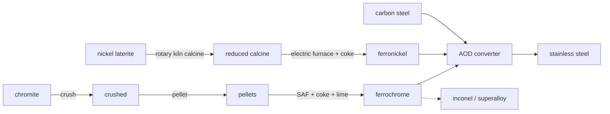

# Ferroalloys — ferrochrome & ferronickel

Plain carbon steel becomes **stainless** at the AOD converter, but only if you can
feed it chromium and nickel in a form that survives a steel bath. You don't add
pure Cr or Ni — they're far too expensive to make and too easily lost to slag.
You add **master alloys**: *ferrochrome* (Fe-Cr) and *ferronickel* (Fe-Ni),
both smelted straight from ore. This page covers both.

!!! abstract "Where these go"
    Both alloys are charged at the **AOD converter** alongside carbon steel and lime
    to make stainless; ferrochrome also feeds the **inconel / superalloy** line.
    Before this chain they were conjured by one-step placeholders — now they have
    honest, furnace-deep upstreams.

## Ferrochrome (FeCr) — carbothermic, submerged-arc

Chromite (`FeCr₂O₄`) is the *only* commercial source of chromium, and it's a
stubborn spinel — you reduce it the brute-force way, with carbon and enormous
electrical power.

| # | Step · station | In → Out | Note | Tier · time · energy |
|---|----------------|----------|------|----------------------|
| 1 | **Crush** · stamp mill | 2 chromite → 2 crushed + stone dust | friable, sheds fines | T2 · 30s · 16 kJ |
| 2 | **Pelletize** · disc + induration | 3 crushed → 3 pellets | keeps the burden permeable | T3 · 45s · 40 kJ |
| 3 | **SAF smelt** · submerged-arc furnace | 3 pellets + 3 coke + 1 lime → 2 **ferrochrome** + 2 slag + 2 CO₂ | `FeCr₂O₄ + 4C → Fe + 2Cr + 4CO` | T4 · 150s · 380 kJ |

High-carbon ferrochrome taps at **50–70% Cr** (with a few % carbon — the AOD blows
that carbon out later). The lime fluxes the Mg/Al/Si gangue to slag; the CO
off-gas burns to CO₂. SAF smelting is one of the most **energy-hungry** steps in
the entire tech tree.

## Ferronickel (FeNi) — RKEF from laterite

Laterite nickel ore is low grade (~1–2% Ni) and can't be concentrated by flotation
— the nickel is locked in hydrous silicates. So you don't beneficiate it; you
**dry, calcine, and smelt the whole tonnage**. This is the **R**otary **K**iln–
**E**lectric **F**urnace route.

| # | Step · station | In → Out | Note | Tier · time · energy |
|---|----------------|----------|------|----------------------|
| 0 | **Strip-mine laterite** · — | → 3 saprolite | shallow, no shaft | T2 · 30s · — |
| 1 | **Calcine** · rotary kiln | 3 laterite + 1 coke → 3 calcine + CO₂ | drives off crystal water, pre-reduces | T3 · 90s · 120 kJ |
| 2 | **Electric-furnace smelt** · SAF | 3 calcine + 2 coke + 1 lime → 2 **ferronickel** + 2 slag | ~99% Ni recovery | T4 · 150s · 360 kJ |

The hot calcine is rushed straight from the kiln into the furnace to save its
heat — the *RK* feeds the *EF*. Crude FeNi taps at ~20–40% Ni.

## Both routes at a glance

!!! note "Two philosophies of reduction"
    **Ferrochrome** concentrates the value *first* (pelletize) then hits it with carbon and power. **Ferronickel** can't concentrate at all, so it spends its energy *drying and smelting the whole orebody*. Both end at a carbon-bearing master alloy that the AOD finishes — a nice illustration of why ore grade dictates process.
