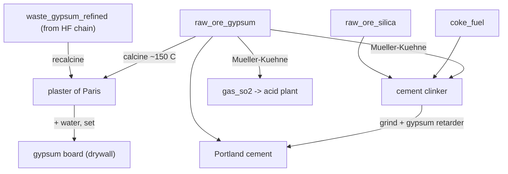

# Gypsum — plaster, drywall, sulfuric acid & cement

**Tier 2–4 · Branch · Pack `T4_Gypsum.luau`**

Gypsum (calcium sulfate) is the humblest mineral in the game and one of the most
useful. From a dead `raw_ore_gypsum` it now branches into building plaster,
drywall, sulfuric acid and cement — and it quietly **closes a loop** by eating the
waste gypsum the hydrofluoric-acid chain throws off.

## Flow

## Steps

| # | Recipe | Station | In | Out |
|---|--------|---------|----|-----|
| 1 | `gyp_calcine_plaster` | Rotary Calciner Kiln | 2 gypsum | 2 plaster of Paris |
| 2 | `gyp_recover_waste_plaster` | Rotary Calciner Kiln | 2 HF waste gypsum | 2 plaster of Paris |
| 3 | `gyp_cast_board` | Clay Casting Pit | 2 plaster + 1 water | 2 gypsum board |
| 4 | `gyp_muller_kuhne` | Rotary Calciner Kiln | 2 gypsum + coke + silica | 1 SO₂ + 2 clinker |
| 5 | `gyp_grind_portland` | Cement Ball Mill | 2 clinker + 1 gypsum | 2 Portland cement |

## Why it's built this way

- **Calcination is reversible — that's the point.** Driving ¾ of gypsum's water
  off near 150 °C gives the hemihydrate (plaster of Paris); add water back and it
  re-sets hard. Drywall is literally that reaction run backwards between paper
  sheets. Overshoot the temperature and you get dead-burnt anhydrite that won't
  set — so it's a low, controlled bake.
- **One kiln, two products (Müller-Kühne).** Starve gypsum of oxygen with coke at
  ~1400 °C and it decomposes: sulfur leaves as **SO₂** (piped to the contact acid
  plant) while the lime sinters with silica into **cement clinker**. This is the
  real industrial answer to "how do you make sulfuric acid without native
  sulfur?" — and you get cement for free.
- **Gypsum is also cement's brake.** Clinker is ground with a few percent raw
  gypsum as a set-retarder; without it, Portland cement flash-sets in the mixer.
  So gypsum appears at both ends of the cement story.

## Byproducts, loops & sinks

- **`waste_gypsum_refined`** — the HF chain's waste is now feedstock (loop closed).
- **`gas_so2`** — fed to the existing contact sulfuric-acid plant.
- **`gypsum_board` / `portland_cement`** — terminal building materials (future
  hook: concrete = Portland + sand + gravel + water).

*Verified against Wikipedia (Gypsum, Plaster of Paris, Müller-Kühne process /
sulfuric acid from gypsum, Portland cement clinker) and process references.*
