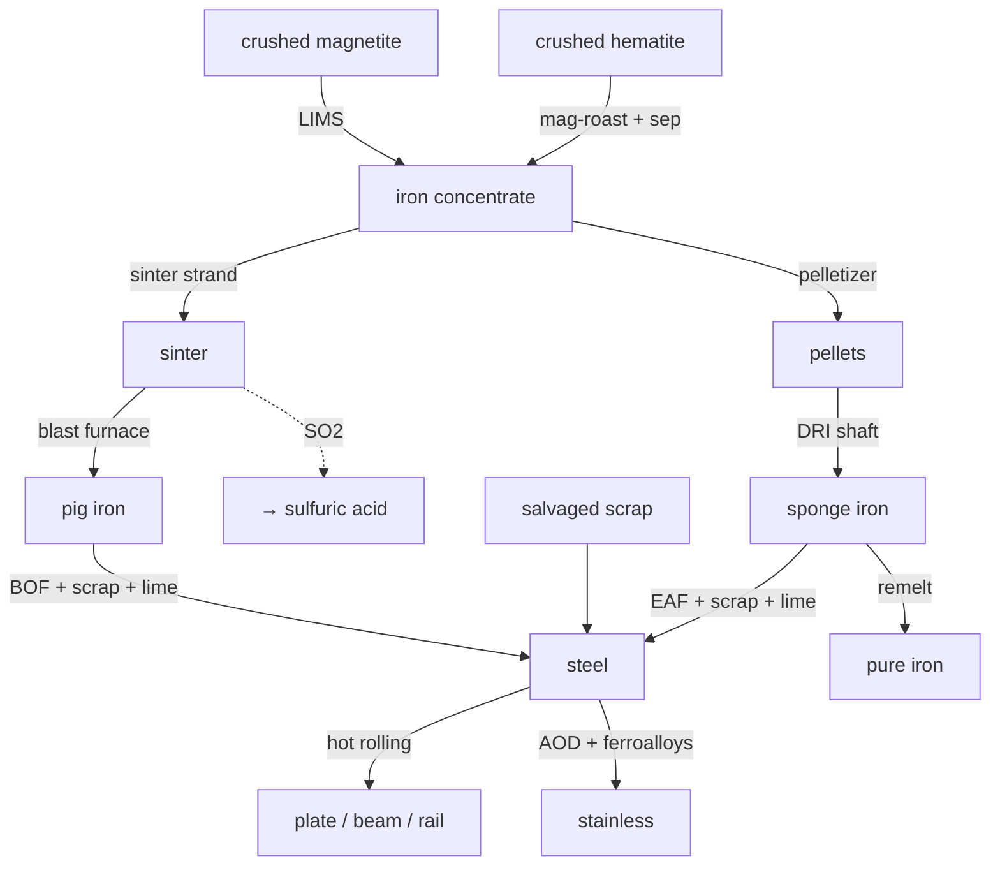

# Iron & steel — the backbone chain

Iron is the structural metal the whole tech tree leans on: rolled plate and beam
alone gate dozens of machines, rails, and buildings. Conduvia's iron line now runs
the full industrial arc — from a lump of bog iron forged in a clay hearth all the
way to a basic-oxygen converter and an electric-arc furnace eating recycled scrap.
Every step below mirrors real metallurgy and is backed by the recipe data the game
runs.

!!! abstract "Two eras, two primary routes"
    **Bloomery → wrought iron (Tier 1):** solid-state reduction in a clay furnace; the iron *never melts*. Sponge bloom is forged out to wrought iron. Your earliest, charcoal-only iron.
    **Blast furnace → pig iron → steel (Tier 2–4):** coke + flux melt the ore to high-carbon pig iron, then a converter burns the carbon back down to steel. The modern mass-production spine — refined three honest ways: **Bessemer**, **Basic Oxygen (BOF)**, and **Electric Arc (EAF)**.

## From rock to furnace feed (beneficiation & agglomeration)

You rarely shovel raw crushed ore straight into a furnace — fines choke it and
low-grade gangue wastes coke. Two ore types, two honest upgrade paths:

- **Magnetite (Fe₃O₄)** is strongly magnetic, so **low-intensity wet magnetic separation (LIMS)** pulls a clean ~65–69 % Fe concentrate out of it. This finally gives crushed magnetite a use.
- **Hematite (Fe₂O₃)** is only weakly magnetic, so it gets a **magnetizing roast** first — `3 Fe₂O₃ + CO → 2 Fe₃O₄ + CO₂` — *then* magnetic separation. Recovers concentrate from low-grade fines.

Concentrate is a powder, so it must be **agglomerated** before the furnace:

- **Sinter** — fuse fines with coke breeze + limestone on a travelling-grate strand into a hard, self-fluxing cake. The roast burns sulfur off as **SO₂** → pipe it to the acid plant.
- **Pellets** — roll moist concentrate with ~1 % bentonite (clay) binder into green balls, then fire (indurate) them hard. Higher Fe, higher strength — the preferred **direct-reduction** feed.

## Ironmaking — three ways to win the metal

| Route | What happens | Product |
|-------|--------------|---------|
| **Bloomery** (T1) | Solid-state reduction in a clay furnace; bloom never melts, forged to bar | wrought iron (soft, tough, low-C) |
| **Blast furnace** (T2) | Coke → CO reduces oxide as it descends (`Fe₂O₃/Fe₃O₄ + CO → Fe + CO₂`); limestone fluxes gangue to slag | pig iron (~4 % C, brittle) |
| **Direct reduction (DRI)** (T3) | Coal/CO reduce pellets *below* melting point | sponge iron (porous, metallic — clean EAF charge) |

The blast furnace now accepts the **sinter** burden (cleaner and more permeable
than raw crushed ore), and the new **direct-reduction shaft** turns pellets into
sponge iron without ever melting them.

## Steelmaking — burning the carbon back out

Pig iron has too much carbon to be useful; steel is made by oxidising that carbon
out. Conduvia models the three routes that actually matter:

| Furnace · station | Charge | How | Tier |
|---|---|---|---|
| **Bessemer** (existing) | pig iron | air blast burns out C (historical) | T2 |
| **Open hearth** (existing) | pig iron + coal | slow, controllable bath | T3 |
| **Basic Oxygen (BOF / LD)** | pig iron + ~25 % scrap + burnt lime | pure-O₂ blow, autogenous heat, basic slag pulls P & S | T3 |
| **Electric Arc (EAF)** | sponge iron + scrap + lime | electric arc melts a cold charge — the recycling route | T4 |

The **BOF** is the dominant primary route on Earth today; the **EAF** is the
scrap/DRI recycling route behind most specialty and low-CO₂ steel. Both now exist
in-game, and both make **steel scrap** a first-class feedstock — gathered from the
world as salvage (rail offcuts, demolition stock, worn machinery), exactly as real
arc steelmaking treats it.

## Stainless — keeping the chromium

Naïvely blowing oxygen through a chromium melt just burns the expensive chromium
away as slag. The **AOD converter (Argon-Oxygen Decarburization)** dilutes the
oxygen with argon so **carbon burns out while chromium stays in the metal** — which
is why cheap high-carbon ferrochrome can be used. AOD makes ~75 % of the world's
stainless, and it's now the deeper, more accurate stainless route alongside the
simple arc-furnace alloying step.

`2 steel + ferrochrome + ferronickel + burnt lime → 2 stainless + slag`

!!! note "Ferroalloys have their own chains"
    The AOD step consumes **ferrochrome** and **ferronickel**. Both now have
    honest, furnace-deep upstreams — proper chromite→ferrochrome and
    laterite/sulfide→ferronickel chains — documented in the
    [Ferroalloys field guide](ferroalloys.md).

## Byproduct & cross-chain loops

- **Slag** falls out of every melt (blast furnace, BOF, EAF, AOD) — a flux/aggregate sink, never a dead-end.
- **Tailings** are the rejected gangue from beneficiation.
- **SO₂** off the sinter strand feeds the **sulfuric-acid** plant.
- **Pyrite cinder** from the acid chain's dead-roast is roasted hematite — it drops straight into ironmaking.
- **Sponge iron** melts down to nearly pure `metal_iron_ingot` for electromagnet cores and clean alloying stock.

## The chain at a glance

!!! tip "Tier ladder"
    Bloomery (T1) → blast furnace + Bessemer + beneficiation/sinter (T2) → BOF + pellets + DRI + open hearth (T3) → EAF + AOD stainless (T4). Hot rolling rides on top to turn ingots into plate, beam, and rail — the parts the rest of the tree actually consumes.
