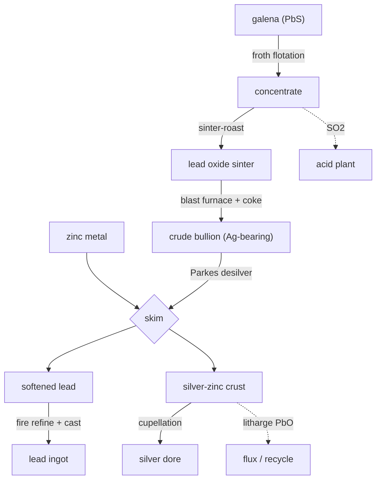

# Lead — galena, and the silver that rides with it

Lead is the easy metal to smelt and the interesting one to refine. Galena (PbS) reduces readily, but crude lead bullion always carries the ore's silver dissolved in it — and getting that silver out is the most characterful step in the whole chain: the **Parkes process**, where you stir zinc into molten lead and the silver follows the zinc out.

## Concentrate → sinter → bullion
Galena is **froth-floated** to a clean concentrate, **sinter-roasted** (PbS → PbO, sulfur off as SO₂ to the acid plant), and reduced with coke in a **blast furnace** to crude lead bullion. Iron and rock leave as slag; the silver reports almost entirely into the lead.

## Parkes desilvering — the clever bit
Silver is far more soluble in zinc than in lead. Stir a little **zinc** into the molten bullion, let it cool, and the silver climbs into a zinc-rich crust that freezes on top and is skimmed off. The lead left behind is "softened" — desilvered — and the crust is **cupelled**: an air blast burns the zinc and lead away to litharge (PbO), leaving a button of **dore silver**. This is why lead refining quietly consumes zinc from the zinc chain.

## Honest notes
- The silver is a genuine byproduct, not a bonus drop — it really does ride through smelting in the lead and come out at cupellation.
- Litharge (PbO) is recyclable to the furnace and is also a real glass/ceramic flux; left here as a byproduct.
- Refined lead's real homes: radiation shielding, lead-acid batteries, and acid-plant plumbing.
