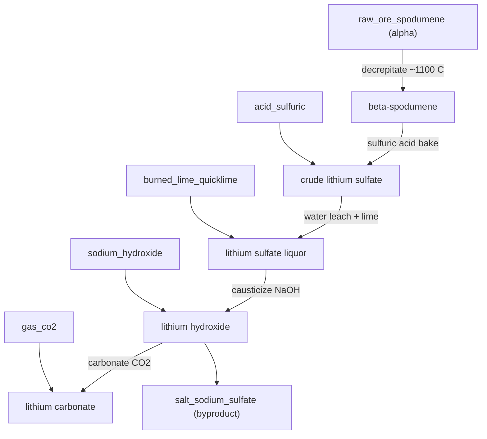

# Lithium — spodumene to battery salts

**Tier 4 · Branch · Pack `T4_Lithium.luau`**

Lithium is the lightest metal and the one the modern world is fighting over. In
Conduvia it starts as a dead `raw_ore_spodumene` and ends as the two salts that
actually feed lithium-ion cathodes: **lithium hydroxide** and **lithium
carbonate**.

The whole chain turns on one fact most games miss: **you cannot leach raw
spodumene.** The natural alpha crystal is chemically inert. You must first cook
it to a different crystal form before any acid will touch it.

## Flow

## Steps

| # | Recipe | Station | In | Out |
|---|--------|---------|----|-----|
| 1 | `li_decrepitate` | Rotary Calciner Kiln | 2 spodumene | 2 beta-spodumene |
| 2 | `li_acid_bake` | Sulfation Acid-Roast Kiln | 2 beta + 1 H₂SO₄ | 2 crude Li sulfate + tailings |
| 3 | `li_leach_purify` | Heap Leach Pad | 2 crude + 1 quicklime | 2 Li sulfate liquor + tailings |
| 4 | `li_causticize` | Caustic Digester Autoclave | 2 liquor + 2 NaOH | 2 LiOH + 1 Na₂SO₄ |
| 5 | `li_carbonate` | Carbonation Reactor | 2 LiOH + 1 CO₂ | 1 Li₂CO₃ |

## Why it's built this way

- **Decrepitation is the gate.** Alpha-spodumene is inert; roasting near 1100 °C
  flips it to the open beta form whose lattice lithium will ion-exchange. The
  step looks like a waste of energy until you realise nothing downstream works
  without it — exactly the kind of "why won't this react?" puzzle the game rewards.
- **Acid bake, not acid leach.** Beta-spodumene is baked with concentrated
  sulfuric acid (~250 °C), not dissolved in dilute acid. Lithium swaps onto the
  sulfate and leaves the alumino-silicate skeleton behind.
- **Two real products.** Causticising with NaOH gives **lithium hydroxide**
  (Li₂SO₄ + 2 NaOH → 2 LiOH + Na₂SO₄), preferred for high-nickel cathodes;
  carbonating LiOH with CO₂ gives **lithium carbonate**, the classic feedstock.
- **A dead item comes alive.** The causticization byproduct, sodium sulfate,
  was a producer-less placeholder — now it has an honest source instead of
  appearing from nowhere.

## Byproducts & sinks

- **`salt_sodium_sulfate`** — recovered salt, not waste (glass/detergent).
- **`lithium_hydroxide` / `lithium_carbonate`** — terminal battery feedstocks;
  the future hook is a lithium-ion cell chain that consumes them.

*Verified against Wikipedia (Lithium extraction, Spodumene, Lithium hydroxide,
Lithium carbonate) and standard lithium-process references.*
