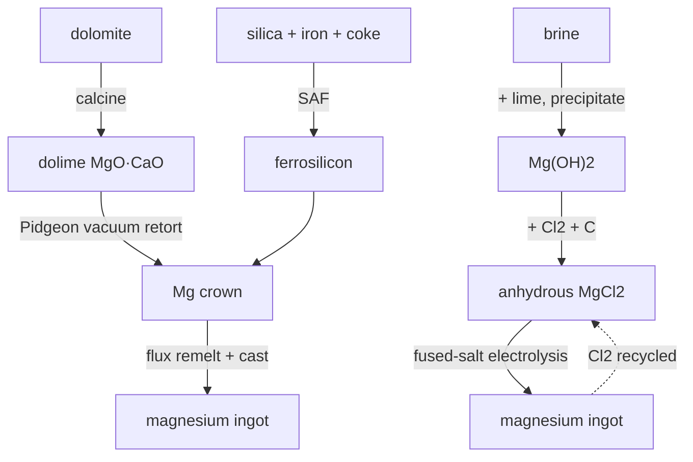

# Magnesium — the lightest structural metal, two ways

Magnesium is everywhere (it's a major fraction of seawater and of dolomite rock) but you can't just smelt it: MgO is too stable for carbon to reduce, and any magnesium vapour you free will re-oxidise the moment it meets the furnace gas. So the world makes magnesium two completely different ways, and Conduvia builds both. Both end at the same `magnesium_ingot`.

## Route A — Pidgeon (silicothermic)
The dominant modern route. Dolomite is **calcined** to dolime (MgO·CaO). Separately, **ferrosilicon** is smelted in a submerged-arc furnace from silica + iron + coke — a real steel deoxidiser in its own right. In the **Pidgeon retort**, under vacuum at ~1200 °C, silicon reduces the magnesia:

> 2 (MgO·CaO) + Si → 2 Mg↑ + Ca₂SiO₄

Magnesium boils off and condenses as a **crown** at the cold end; dicalcium-silicate slag stays behind. The crown is remelted under a protective salt flux (magnesium burns in air) and cast to an ingot.

## Route B — Electrolytic (Dow, from brine)
Lime is stirred into magnesium-bearing **brine**, dropping **Mg(OH)₂**. That is carbo-chlorinated to bone-dry **MgCl₂** (carbon takes the oxygen as CO₂, chlorine takes the magnesium), then **electrolysed molten**: magnesium plates the cathode, chlorine comes off the anode — and the chlorine is piped straight back to the chlorinator, closing the loop exactly like the sodium loop in titanium.

## Honest notes
- No carbothermic shortcut exists — both routes respect why magnesium is hard to win.
- Ferrosilicon is introduced here as a genuine new ferroalloy; it also belongs in steelmaking as a deoxidiser.
- The electrolytic route's chlorine is recycled; the first batch's chlorine comes from the chlor-alkali plant.
- Magnesium is itself a Kroll reductant; this gives titanium/zirconium a documented Mg alternative to the sodium route.
