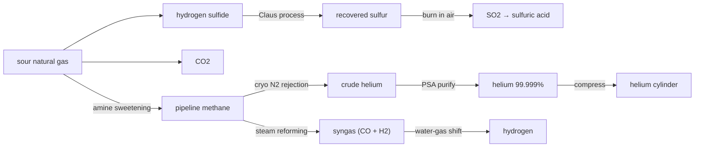

# Natural gas & helium — the only place helium comes from

Natural gas looks like a fuel and nothing more, but raw wellhead gas is a little chemistry plant in its own right. It is mostly **methane**, fouled with **CO₂** and toxic **hydrogen sulfide** — and, in a lucky few fields, carrying a trace of **helium**. There is no other economic source of helium on Earth: every atom is primordial, and if you don't catch it here it escapes to the air and then to space, gone for good.

## Three things come out of one gas field

### 1. Sulfur (from the poison)
The hydrogen sulfide stripped out during sweetening is deadly — but the **Claus process** turns it into bright-yellow elemental sulfur: `2 H2S + O2 -> 2 S + 2 H2O`. This is not a curiosity: **most of the world's sulfur is recovered from sour gas and refineries, not mined.** Burn that sulfur (`S + O2 -> SO2`) and you have a cleaner feed for the contact sulfuric-acid plant than roasting pyrite — so the gas field quietly feeds the acid chain.

### 2. Helium (the whole reason to bother)
After sweetening, the gas is chilled in a **cryogenic nitrogen-rejection unit** until everything but helium has liquefied. What's skimmed off is **crude helium** (~50–70%), polished to **99.999%** by pressure-swing adsorption and bottled. You process an enormous volume of gas for a little helium — an honest reflection of why helium is expensive and worth conserving.

### 3. Hydrogen (the second road)
The sweet methane also feeds a **steam-methane reformer**: `CH4 + H2O -> CO + 3 H2`, then the **water-gas shift** wrings out more: `CO + H2O -> CO2 + H2`. This is the route most of the world's hydrogen — and therefore most ammonia — actually comes from. It gives Conduvia a genuine alternative to the chlor-alkali hydrogen byproduct.

## Honest notes

- Helium is the one common industrial gas with **no synthesis route** — the chain deliberately has only this one source, and the cylinder seals matter because helium leaks through everything.
- Steam reforming makes CO₂; it is cheap hydrogen, not clean hydrogen. The water-electrolysis (chlor-alkali) route is cleaner but pricier — both exist in the tree on purpose.
- Recovered-sulfur → SO₂ and pyrite-roast → SO₂ are both real, and both now feed the acid chain.
