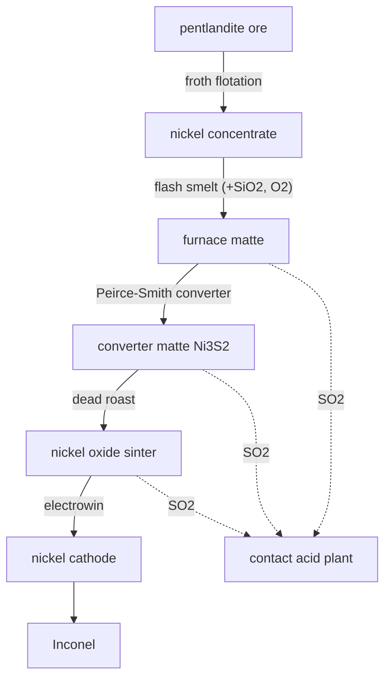

# Nickel — the sulfide route (matte smelting)

The world gets nickel two ways. The **laterite** route (oxide ore, RKEF: calcine then electric-furnace smelt to ferronickel) is already built in the ferroalloys pack. This is the other half: **sulfide** ore (pentlandite), refined by matte smelting — the deep counterpart, and the one that comes with an acid plant bolted to its side.

## Flotation
Ground pentlandite is **froth-floated**: sulfide grains cling to air bubbles and ride the froth off the top while silicate gangue sinks, upgrading the ore to a concentrate before any fuel is burned.

## Flash smelting
The concentrate is **flash-smelted** in an oxygen-enriched blast. The sulfide is its own fuel (autogenous), iron is slagged off with silica flux, and the sulfur leaves as **SO₂**. A molten **furnace matte** (Ni-Fe-S) is tapped from below.

## Converting
Air is blown through the molten matte in a **Peirce-Smith converter**, oxidising the remaining iron out as slag and leaving high-grade **converter matte (Ni₃S₂)** — plus more SO₂.

## Roast & electrowin
The converter matte is **dead-roasted** to **nickel oxide** (the last sulfur off as SO₂), then **electrowon** onto starter sheets as pure **nickel cathode**. That is the same cathode the laterite route is chasing — and the feed for Inconel.

## The acid tie-in
Three separate steps throw SO₂, all piped to the **contact sulfuric-acid plant**. This is not a bonus — it is how sulfide metallurgy actually works: you cannot smelt sulfides at scale without capturing the sulfur, so a nickel (or copper) smelter is always married to an acid plant.

## Honest notes
- Real sulfide ores also carry cobalt, copper and platinum-group metals recovered alongside nickel; here we keep the SO₂ and slag byproducts and leave the minor metals as a documented simplification.
- The laterite/RKEF route is untouched; both routes converge on the same `nickel_cathode`.
