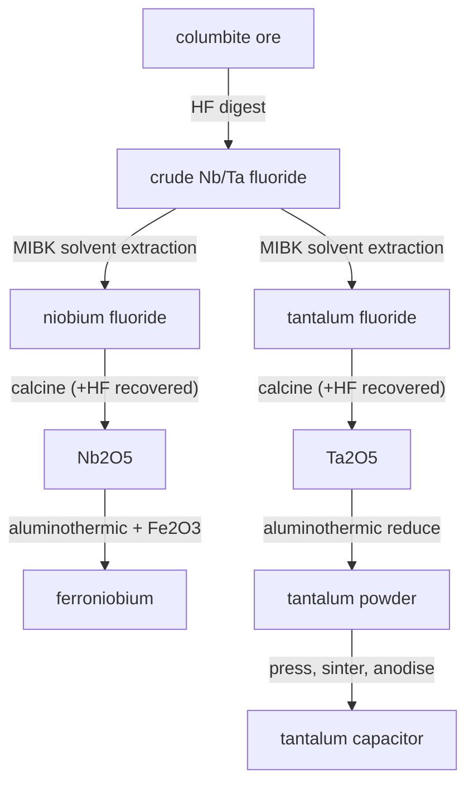

# Niobium & tantalum — the inseparable twins

Niobium and tantalum are the closest pair of metals in the periodic table — the lanthanide contraction makes tantalum almost exactly the same size as niobium — so they always occur together in the same ore (columbite/coltan) and refuse to be told apart. Telling them apart is the whole story.

## Digestion
Columbite is digested in hot **hydrofluoric acid** — the only acid that attacks these oxides — dissolving both metals together as fluoro-complexes and leaving the gangue as tailings.

## The keystone: solvent extraction
The mixed liquor goes through an **MIBK solvent-extraction column** that pulls tantalum into the organic phase and leaves niobium behind. This twin-separation is one of the hardest routine separations in metallurgy (the same class of problem as Hf/Zr) and is exactly why tantalum is expensive.

## Niobium → ferroniobium
The niobium fluoride is calcined to **Nb₂O₅** (recovering HF for re-use), then reduced **aluminothermically** with aluminium and iron oxide: `3 Nb₂O₅ + 10 Al → 6 Nb + 5 Al₂O₃`, run with iron oxide so the product is **ferroniobium** directly — the real way FeNb is made. A pinch micro-alloys HSLA steel; more of it fights creep in superalloys like Inconel.

## Tantalum → capacitor
The tantalum fluoride is calcined to **Ta₂O₅** (again recovering HF), aluminothermically reduced to **capacitor-grade powder**, then pressed, sintered and anodised into a **tantalum capacitor**. Tantalum's self-healing oxide film makes the most compact, reliable capacitors in electronics — the payoff that makes the whole separation worth it.

## Honest notes
- HF is recovered at both calcination steps and looped back to digestion.
- Ferroniobium is made in one aluminothermic step (oxide + Al + Fe₂O₃), not by melting niobium metal — that is how the ferroalloy is actually produced.
- Tantalum and niobium share one ore and one column; giving tantalum a capacitor sink turns a former dead-end byproduct into a reason to mine.
