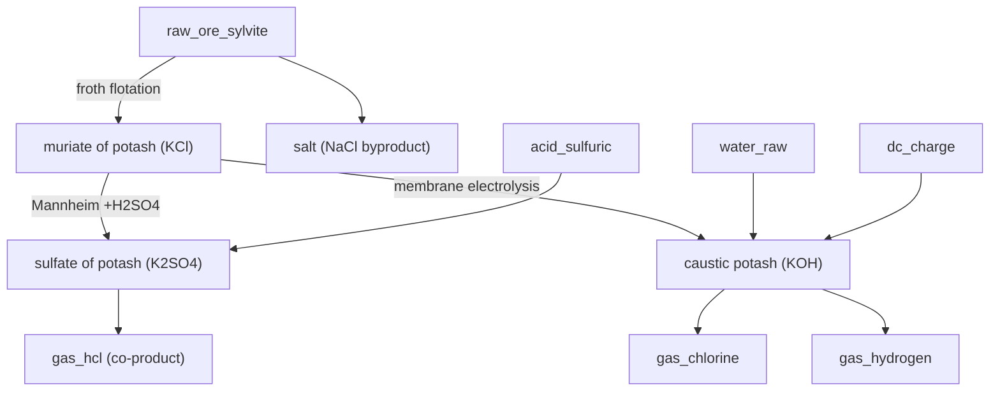

# Potash — sylvite to three potassium products

**Tier 3–4 · Branch · Pack `T3_Potash.luau`**

Potash is potassium for crops — the K in N-P-K. It started as a dead
`raw_ore_sylvite` and now forks into the three products a real potash operation
actually sells: **muriate of potash (KCl)**, **sulfate of potash (K₂SO₄)**, and
**caustic potash (KOH)**.

Sylvinite ore is KCl intergrown with ordinary salt (NaCl). The whole chain is
first separating the two, then choosing which potassium chemical to make.

## Flow

## Steps

| # | Recipe | Station | In | Out |
|---|--------|---------|----|-----|
| 1 | `k_froth_flotation` | Froth Flotation Cell | 3 sylvite | 2 MOP + 1 salt |
| 2 | `k_mannheim_sop` | Mannheim Muffle Furnace | 2 MOP + 1 H₂SO₄ | 2 SOP + 1 HCl gas |
| 3 | `k_membrane_koh` | Membrane Electrolysis Cell | 2 MOP + 2 water + 2 DC | 2 KOH + Cl₂ + H₂ |

## Why it's built this way

- **Flotation, not just dissolving.** An amine collector floats the KCl off and
  leaves the NaCl behind — which is recovered as salable **salt**, finally giving
  the previously producer-less `salt` item an honest source.
- **Mannheim makes the premium grade.** `2 KCl + H₂SO₄ → K₂SO₄ + 2 HCl`.
  Sulfate of potash is chloride-free and gentler on sensitive crops, so it sells
  above muriate — and the hydrogen chloride driven off is a genuine co-product
  feeding the game's existing HCl economy.
- **KOH is chlor-alkali on potassium.** The membrane cell is the exact potassium
  twin of the sodium chlor-alkali cell: caustic at the cathode, chlorine at the
  anode, hydrogen alongside.

## Byproducts & sinks

- **`salt`** — NaCl reject, now a real product (food/industrial/feedstock).
- **`gas_hcl`** — Mannheim co-product; adds a second source to the HCl economy.
- **`gas_chlorine` / `gas_hydrogen`** — membrane-cell co-products.
- **MOP / SOP / KOH** — terminal fertilizer and chemical products.

*Verified against Wikipedia (Potash, Potassium chloride, Mannheim process,
Potassium sulfate, Potassium hydroxide) and standard fertilizer references.*
