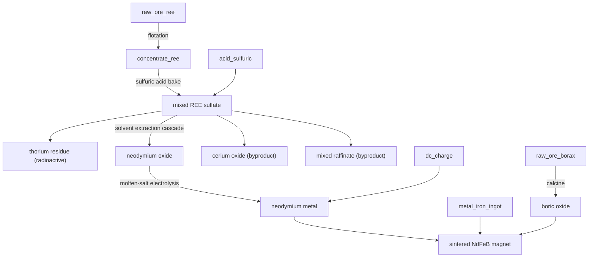

# Rare earths — the brutal separation to an NdFeB magnet

**Tier 5–6 · Branch · Pack `T5_RareEarths.luau`**

Rare earths are the hardest separation in all of metallurgy: fifteen chemically
near-identical lanthanides that must be teased apart one at a time. The game had
`raw_ore_ree` and a dead `concentrate_ree` and nothing else. This chain models
the real horror honestly — including the radioactive thorium that rides in every
rare-earth ore — and lands on the payoff people actually mine rare earths for: a
**sintered neodymium-iron-boron permanent magnet.**

## Flow

## Steps

| # | Recipe | Station | In | Out |
|---|--------|---------|----|-----|
| 1 | `ree_flotation` | Froth Flotation Cell | 3 REE ore | 2 concentrate + tailings |
| 2 | `ree_acid_bake` | Sulfation Acid-Roast Kiln | 2 concentrate + 2 H₂SO₄ | 2 mixed REE sulfate + 1 thorium residue |
| 3 | `ree_sx_split` | SX Mixer-Settler | 2 mixed sulfate | Nd oxide + Ce oxide + raffinate |
| 4 | `ree_reduce_neodymium` | Molten-Salt Electrolysis Cell | 2 Nd oxide + 3 DC | 2 Nd metal + O₂ |
| 5 | `reb_calcine_boric_oxide` | Rotary Calciner Kiln | 2 borax | 2 boric oxide |
| 6 | `nd_make_ndfeb_magnet` | Powder Press / Sinter Furnace | 2 Nd + 1 Fe + 1 B₂O₃ | 2 NdFeB magnet + slag |

## Why it's built this way

- **The acid bake captures the thorium.** Monazite-type rare-earth ores are
  radioactive: thorium follows the lanthanides through mining. Rather than
  hand-wave it, step 2 drops it out as a captured `thorium_residue` — a real
  disposal headache and a future breeder fuel, not vanished matter.
- **Solvent extraction is the keystone.** Step 3 is one abstracted step standing
  in for *hundreds* of real counter-current mixer-settler stages that exploit
  vanishingly small solubility differences. It splits cheap **cerium** off first,
  the prized **neodymium** next, and banks the rest as **raffinate**. This is the
  single most expensive, most multi-output step in the whole game.
- **Electrowinning Nd is brutally energy-hungry** (460 kJ) — most of why
  rare-earth metals cost what they do.
- **Real NdFeB needs boron.** You cannot fake Nd₂Fe₁₄B. A tiny borax micro-chain
  (borax → boric oxide) supplies it, so the magnet is genuinely neodymium-iron-
  **boron**, not a hand-waved "rare-earth magnet."

## Byproducts & sinks

- **`cerium_oxide`** — abundant byproduct: glass polish and catalyst, not waste.
- **`ree_raffinate_mixed`** — the heavier lanthanides, banked for future splits.
- **`thorium_residue`** — radioactive leaf; future tie-in to a thorium breeder.
- **`nd_magnet_sintered`** — the payoff: premium permanent magnet for compact
  motors and generators (a tier above the wrought-iron magnet core).

*Verified against Wikipedia (Rare-earth element processing, Monazite, Solvent
extraction, Neodymium magnet, Borax) and standard REE-process references.*
