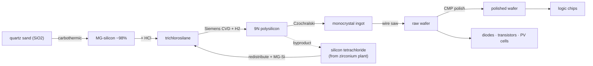

# Silicon — from beach sand to the wafer that runs the world

Silicon is everywhere — it's the second most abundant element in the crust, and
quartz sand is *free*. The hard part is purity. A finished chip wafer is silicon
refined to **99.9999999% ("9N")** and grown as a single flawless crystal. Getting
there is one of the longest purification ladders in all of industry, and every
rung trades energy for purity.

!!! abstract "The trick: make it a liquid"
    You cannot distil a solid. So the whole strategy is to convert crude silicon
    into a **volatile liquid** (trichlorosilane), distil *that* to insane purity,
    then rebuild solid silicon from it. Liquid in, ultra-pure solid out.

## The ladder

| # | Step · station | In → Out | Tier · time · energy |
|---|----------------|----------|----------------------|
| 1 | **Carbothermic reduction** · submerged-arc furnace | 2 quartz + 2 coke → 1 MG-silicon + 2 CO₂ | T3 · 120s · **260 kJ** |
| 2 | **Hydrochlorination** · fluidised-bed reactor | 1 MG-Si + 3 HCl → 1 trichlorosilane + H₂ | T4 · 70s · 90 kJ |
| 2b | **SiCl₄ redistribution** · fluidised-bed reactor | 3 SiCl₄ + 1 MG-Si + 2 H₂ → 4 trichlorosilane | T4 · 80s · 110 kJ |
| 3 | **Siemens deposition** · CVD reactor | 3 trichlorosilane + 2 H₂ → 1 polysilicon (9N) + 3 HCl + 1 SiCl₄ | T4 · 200s · **380 kJ** |
| 4 | **Czochralski pull** · crystal puller | 4 polysilicon → 1 monocrystal ingot | T4 · 180s · 300 kJ |
| 5 | **Slice** · wafer fab line | 1 ingot → 8 raw wafers | T4 · 60s · 80 kJ |
| 6 | **Polish (CMP)** · wafer fab line | 1 raw wafer → 1 polished wafer | T4 · 50s · 70 kJ |

$$
SiO_2 + 2\,C \rightarrow Si + 2\,CO \qquad Si + 3\,HCl \rightarrow SiHCl_3 + H_2
$$
$$
SiHCl_3 + H_2 \rightarrow Si + 3\,HCl
$$

## Why each rung matters

- **Carbothermic reduction** gives cheap ~98% "metallurgical-grade" silicon — great
  for alloys, hopelessly dirty for electronics. It's also brutally power-hungry
  (~11 kWh/kg), which is why the submerged-arc furnace is a Tier-3 gate.
- **Hydrochlorination** turns that dirty solid into a distillable liquid — the
  single cleverest move in the whole chain.
- **SiCl₄ redistribution** is where two chains meet: the **zirconium** carbochlorinator
  and the Siemens reactor both throw off silicon tetrachloride, and rather than
  dump it, you redistribute it straight back into trichlorosilane. Nothing wasted.
- **The Siemens process** is the purity miracle — and the most energy-hungry step
  in all of electronics — depositing 9N silicon atom by atom on a glowing rod.
- **Czochralski pulling** grows one continuous crystal from the melt; **slicing**
  and **CMP polishing** turn that crystal into the wafers every chip and solar
  cell is built on.

!!! note "No more silicon-from-sand magic"
    The old shortcut let raw wafers appear straight from sand and charcoal,
    skipping the entire purification ladder. Now every diode, transistor and
    photovoltaic cell is properly gated behind the real chain — you must climb all
    the way to a monocrystal ingot before you can slice a single wafer.
