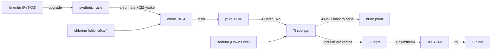

# Titanium — the chloride route & the Hunter reduction

Titanium is the 9th most abundant element in the crust and one of the most
expensive structural metals you can buy. That contradiction *is* the lesson of
this chain: titanium grabs oxygen, nitrogen and carbon so greedily that you cannot
smelt it like iron — throw it in a furnace with carbon and you get titanium
*carbide*, not metal. The industrial workaround is a long, indirect dance through
a **volatile chloride**, and it is why titanium stayed a laboratory curiosity until
the 1940s.

!!! abstract "The trick: go through a chloride"
    You cannot purify or reduce the stubborn oxide directly. So you turn it into
    **TiCl₄** ("tickle") — a liquid that boils at 136 °C and distils to high purity
    trivially — then reduce *that* with a reactive metal under an inert blanket.
    Volatility is the whole strategy.

## The plant, step by step

| # | Step · station | In → Out | Chemistry | Tier · time · energy |
|---|----------------|----------|-----------|----------------------|
| 1 | **Upgrade** · rotary kiln | 2 ilmenite + coke → 2 synthetic rutile + slag | strip iron from FeTiO₃ | T3 · 90s · 130 kJ |
| 2 | **Chlorinate** · fluidised bed | 2 rutile + coke + 2 Cl₂ → 2 crude TiCl₄ + CO₂ | `TiO₂ + C + 2Cl₂ → TiCl₄ + CO₂` | T4 · 120s · 200 kJ |
| 3 | **Distil** · distillation column | 2 crude → 2 **TiCl₄** + tailings | fractional distillation to purity | T4 · 80s · 90 kJ |
| 4 | **Reduce** · Hunter retort | TiCl₄ + 4 Na → **sponge** + 4 NaCl | `TiCl₄ + 4Na → Ti + 4NaCl` | T4 · 200s · 300 kJ |
| 5 | **Remelt** · VAR furnace | 3 sponge → 1 **ingot** | vacuum arc remelting | T4 · 180s · **400 kJ** |

Downstream the existing steps continue: ingot + aluminium → **Ti-6Al-4V**, the
workhorse aerospace alloy → rolled into **titanium plate**.

Three details that make this honest:

- **Clean the feed first.** Ilmenite is `FeTiO₃` — a third iron. Upgrading it to synthetic rutile (~90%+ TiO₂) before chlorination means the chlorine is spent on titanium, not wasted making iron chloride.
- **The salt loops home.** Hunter reduction spits out 4 NaCl per TiCl₄ — that rock salt goes straight back to the brine plant. Real Kroll/Hunter plants close exactly this loop (recycling MgCl₂ or NaCl back to chlorine + metal).
- **Everything runs sealed and slow.** Fresh titanium sponge is pyrophoric and oxygen-hungry, so reduction happens in a sealed inert retort and melting happens under vacuum. That gating — slow, high-energy, high-tier — is *why* titanium is expensive.

!!! note "Hunter vs Kroll"
    The modern world reduces TiCl₄ with **magnesium** (the Kroll process); the older **Hunter process** uses **sodium**. Conduvia runs Hunter because sodium is the reactive metal the plant already makes — from the Downs cell and chlor-alkali line. Same idea, different reducing metal: `TiCl₄ + 2Mg → Ti + 2MgCl₂` (Kroll) versus `TiCl₄ + 4Na → Ti + 4NaCl` (Hunter).
