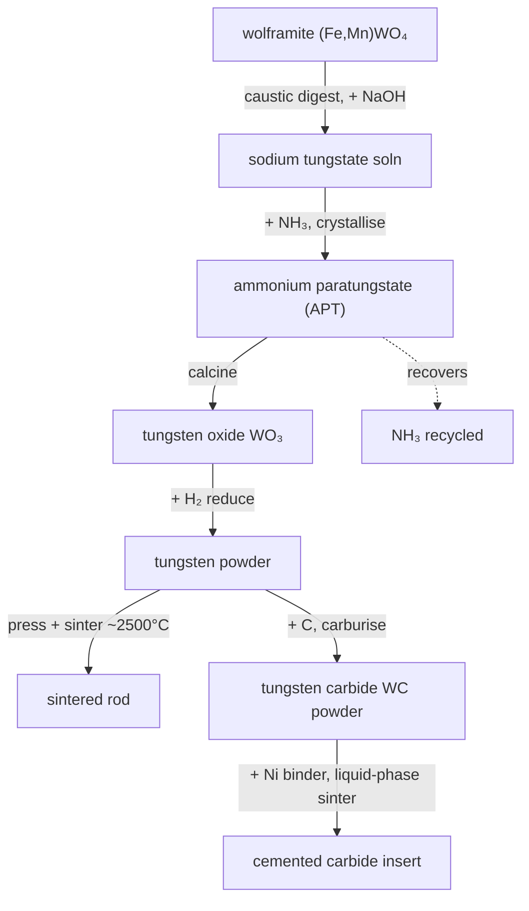

# Tungsten — the metal you cannot melt

> Tungsten melts at **3422 °C** — hotter than any other metal, hotter than anything you could build a crucible from. The entire industry is organised around *never melting it*. You reduce it to a powder and press it into shape; you carburise that powder into the hardest common tooling on Earth.

## Why it's different

Every other metal in Conduvia ends with a *cast*. Tungsten cannot. Nothing holds molten tungsten, so the finishing move is **powder metallurgy**: reduce the oxide to a fine metal powder, then press and sinter that powder solid below its melting point. And the same powder, fed carbon, becomes **tungsten carbide** — cemented with a metal binder into the inserts that machine hardened steel and drill rock.

## The chain

### 1 · Caustic digestion — *digester autoclave*, T4
Boil wolframite in hot caustic soda under pressure: **(Fe,Mn)WO₄ + 2 NaOH → Na₂WO₄ + Fe/Mn hydroxide slag.** Tungsten dissolves as sodium tungstate; the iron and manganese drop out. The first and biggest purity gain.

### 2 · APT crystallisation — *APT crystalliser*, T4
Precipitate **ammonium paratungstate**, (NH₄)₁₀(W₁₂O₄₁), with ammonia. Essentially *all* the world's tungsten passes through APT — recrystallising it rejects the last impurities, so it's the clean, tradeable form. Some caustic is regenerated back to the digester.

### 3 · Calcination — *rotary calciner kiln*, T4
**APT → WO₃ + NH₃ + H₂O.** Drive off ammonia (captured and piped back to the crystalliser) and water, leaving canary-yellow tungsten trioxide.

### 4 · Hydrogen reduction — *pusher furnace*, T4
**WO₃ + 3 H₂ → W + 3 H₂O.** Reduce the oxide to metal in flowing hydrogen. The product is a fine grey **powder** — and powder is the only practical form, because you cannot cast a metal that melts at 3422 °C.

### 5 · Press & sinter — *powder press + sinter furnace*, T5
Press the powder into a bar and sinter it near 2500 °C until the grains weld into a dense rod — **without ever melting the metal**. Powder metallurgy is the only route. Used for rocket nozzles, electrodes and filaments.

### 6 · Carburising — *electric arc furnace*, T5
**W + C → WC.** Heat tungsten powder with carbon until it takes up carbon as tungsten carbide — near diamond-hard, but still just a loose powder.

### 7 · Cemented carbide — *powder press + sinter furnace*, T5
Liquid-phase sinter WC powder with a **nickel binder**: the metal melts and wicks between the carbide grains, gluing them into a dense, almost diamond-hard yet shatter-resistant solid — the cutting insert that machines hardened steel.

## Honest notes

- **Why nickel, not cobalt?** Cobalt is the textbook binder, but Conduvia only has cobaltite *ore* — no refined cobalt yet. Nickel-bonded grades are entirely real: the corrosion-resistant, non-magnetic hard-metals. When a cobalt refining chain lands, a true WC-Co grade can join it.
- **Ammonia is recycled.** The NH₃ used to crystallise APT comes back out at calcination and loops — honest reagent accounting, fed by the Haber-Bosch plant.
- **Feeds:** wolframite (gatherable), NaOH + H₂ (chlor-alkali), NH₃ (gases/Haber-Bosch), nickel cathode (sulfide chain), carbon (charcoal).

*Verified against Wikipedia (Tungsten, Ammonium paratungstate, Tungsten carbide, Cemented carbide, Powder metallurgy), the International Tungsten Industry Association, and ScienceDirect Topics.*
