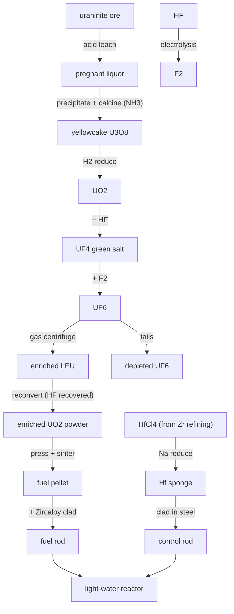

# Uranium — the full nuclear fuel cycle

Uranium is the longest single road in the game: a faintly radioactive yellow rock becomes, eleven careful steps later, a running reactor. Every step here is real, and two of them are the payoff for chains we already built — **Zircaloy** cladding (zirconium) and **hafnium** control rods (zirconium's separated twin).

## Milling — rock to yellowcake
Crushed uraninite is **acid-leached** (sulfuric acid) into a pregnant liquor, leaving radioactive tailings behind. The liquor is concentrated and the uranium dropped out as **ammonium diuranate** (using Haber-Bosch ammonia), then calcined to **U3O8 — yellowcake**, the yellow powder uranium is actually shipped as.

## Conversion — yellowcake to UF₆
The only uranium compound volatile enough to enrich is the **hexafluoride**, so:

1. `U3O8 + 2 H2 -> 3 UO2 + 2 H2O` (hydrogen reduction)
2. `UO2 + 4 HF -> UF4 + 2 H2O` (hydrofluorination — the green salt)
3. `UF4 + F2 -> UF6` (fluorination)

The fluorine for step 3 has to be made on-site: **`2 HF -> H2 + F2`** in an electrolytic cell. Fluorine is the one element nothing chemical can displace — electrolysis is the only way.

## Enrichment — the expensive middle
Natural uranium is **0.7% U-235**; a reactor wants **~3–5%**. A **gas-centrifuge cascade** spins UF₆ and skims the slightly-lighter U-235 upward. The honest part: you feed in a lot and take out a little LEU, leaving a **large depleted-uranium tails** stream. That gap — *separative work* — is the whole cost and difficulty of nuclear fuel, and (in the real world) the whole proliferation concern.

## Fabrication — back to a ceramic
Enriched UF₆ is **reconverted to UO₂ powder**, and crucially the fluorine comes back off as **HF that is recycled** to conversion. The powder is **pressed and sintered** into hard ceramic pellets, which are stacked into **Zircaloy** tubes — the neutron-transparent cladding the zirconium chain exists to make — and sealed into a **fuel rod**.

## Control rods — the orphan twin returns
When zirconium was refined, its chemical twin **hafnium** had to be removed because it *absorbs* neutrons. That very property makes hafnium an excellent **control-rod** metal. The `HfCl4` byproduct — previously orphaned — is sodium-reduced to sponge and clad into control rods. Zirconium and hafnium, separated at great effort, are reunited inside the same reactor doing opposite jobs.

## Reactor
Four fuel rods, hafnium control rods, a steel pressure vessel, steam valves, a coolant pump and a generator assemble into a **light-water reactor**: fission heats water, water spins the generator. The capstone of the whole tech tree.

## Honest notes
- Depleted tails are kept as a real item, not deleted — they are a genuine stockpile (and later useful as dense shielding/ballast).
- HF is recovered at reconversion and looped back; fluorine is never "free".
- Hafnium control rods are a real grade (alongside Ag-In-Cd and B₄C); we use hafnium because the world already produces it as a zirconium byproduct.
