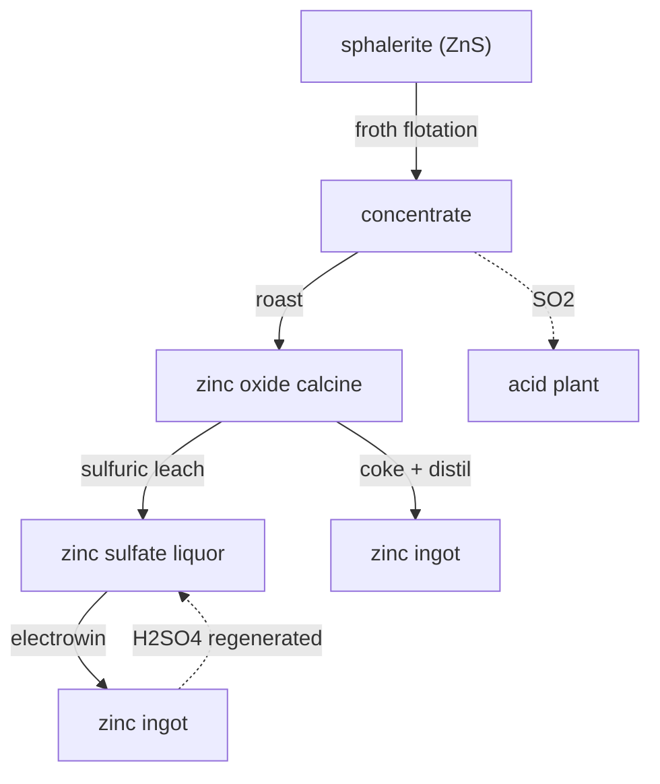

# Zinc — sphalerite two ways, from one calcine

Zinc is won from sphalerite (ZnS) the same first two steps every time — float, then roast to oxide — and then splits into the modern electrolytic route and the historic thermal route. Both converge on one ingot.

## Shared start: float & roast
Sphalerite is **froth-floated** to concentrate and **roasted** to a zinc oxide calcine, the sulfur leaving as SO₂ for the contact acid plant — sulfide metallurgy is always married to an acid plant.

## Route A — Electrolytic (RLE: roast–leach–electrowin)
The dominant modern route. The calcine is **leached in sulfuric acid** to a zinc sulfate liquor (purified of cadmium/cobalt by zinc-dust cementation in reality), then **electrowon** onto aluminium cathodes. The cell regenerates sulfuric acid that loops straight back to the leach — a closed acid circuit. The cathode zinc is melted and cast.

## Route B — Thermal (retort / distillation)
The old way, still alive in the Imperial Smelting Process. The calcine is reduced with **coke** and the zinc distilled off as **vapour** (zinc boils at only 907 °C), then condensed to metal. No electricity needed, but energy-hungry and lower-purity.

## Honest notes
- The electrolytic route's acid loop is real — electrowinning sulfate liquor regenerates H₂SO₄.
- Zinc's real homes: galvanising steel, brass, die-casting — and, in this game, feeding the **lead chain's Parkes desilvering**, which is why the two co-occurring ores are wired together.
