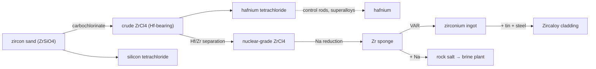

# Zirconium — the nuclear metal & the hardest separation in the table

Zirconium earns its keep in one place above all others: inside a nuclear reactor.
It is almost **invisible to neutrons**, which makes it the perfect skin for fuel
rods. But winning reactor-grade zirconium runs straight into the single nastiest
separation problem in routine metallurgy — and that problem *is* the chain.

!!! abstract "The hafnium problem"
    Zircon ore always carries **1–3% hafnium**, and hafnium is a near-perfect
    chemical *twin* of zirconium (the lanthanide contraction leaves the two atoms
    almost the same size, so they behave almost identically). They refuse to
    separate by ordinary chemistry. Yet hafnium is a **voracious neutron
    absorber** — the exact opposite of what cladding needs. Nuclear-grade
    zirconium therefore demands driving hafnium below **~100 ppm**. Conveniently,
    the hafnium you pull out is then exactly what you want for reactor **control
    rods**.

## The route

Zircon is a *silicate* (ZrSiO₄), so the very first step liberates **two** chlorides
— and the silicon one is a valuable product, not waste.

| # | Step · station | In → Out | Tier · time · energy |
|---|----------------|----------|----------------------|
| 1 | **Carbochlorinate** · fluidised-bed chlorinator | 2 zircon + 2 coke + 4 Cl₂ → 2 crude ZrCl₄ + 1 SiCl₄ + 2 CO₂ | T4 · 130s · 210 kJ |
| 2 | **Separate hafnium** · Hf/Zr column | 3 crude ZrCl₄ → 3 nuclear-grade ZrCl₄ + 1 HfCl₄ | T4 · 110s · 150 kJ |
| 3 | **Reduce** · Hunter retort | 1 ZrCl₄ + 4 Na → 1 Zr sponge + 4 NaCl | T4 · 200s · 300 kJ |
| 4 | **VAR ingot** · vacuum-arc furnace | 3 sponge → 1 zirconium ingot | T4 · 180s · 400 kJ |
| 5 | **Alloy** · electric arc furnace | 4 ingot + 1 tin + 1 steel → 4 Zircaloy | T4 · 120s · 220 kJ |

$$
ZrSiO_4 + 2\,C + 4\,Cl_2 \rightarrow ZrCl_4 + SiCl_4 + 2\,CO_2
$$
$$
ZrCl_4 + 4\,Na \rightarrow Zr + 4\,NaCl
$$

## Why each step is a real gate

- **Carbochlorination splits the silicate.** Because zircon is ZrSiO₄, chlorinating
  it gives off both ZrCl₄ *and* SiCl₄. Silicon tetrachloride is collected (it feeds
  fumed silica, fibre-optic preforms and high-purity silicon) rather than vented.
- **Hf/Zr separation is the keystone.** Extractive distillation / solvent
  extraction is the only way to part the twins. Skip it and your "zirconium" eats
  neutrons and is useless for reactors. This is the step that makes zirconium
  expensive and strategic.
- **Sodium reduction + closed salt loop.** Like titanium, the Hunter-style
  reduction regenerates rock salt that loops straight back to the brine plant —
  chlorine from chlor-alkali, sodium from the Downs cell, salt returned. (Industry
  runs **Kroll with magnesium**, `ZrCl₄ + 2 Mg → Zr + 2 MgCl₂`; we run sodium
  because that's the reactive metal our plant already makes.)
- **Vacuum-arc remelt.** Hot zirconium grabs oxygen and nitrogen as greedily as
  titanium, so the melt runs under vacuum.
- **Zircaloy.** ~98% Zr with ~1.5% tin and a trace of Fe/Cr/Ni (carried in by the
  steel) — strong, corrosion-proof in hot water, and nearly transparent to neutrons.

!!! note "Shares tooling with titanium"
    The fluidised-bed chlorinator, Hunter reduction retort and vacuum-arc furnace
    are the very same machines built for the titanium chain — the chloride route is
    a *family* of processes, and the game models them that way. Only the Hf/Zr
    separation column is new.
