# Tier 5 — Electric & Chemistry

83 recipes

## Aluminum chain

6 recipes

```mermaid
%%{init: {'securityLevel':'loose','flowchart':{'htmlLabels':true,'curve':'basis','nodeSpacing':38,'rankSpacing':70}, 'theme':'base', 'themeVariables':{'fontSize':'13px'}}}%%
graph LR
  i_raw_ore_bauxite["<img src='/Conduvia/assets/icons/raw_ore_bauxite.png' class='mmd-ico' />raw bauxite ore"]
  i_crushed_ore_bauxite["<img src='/Conduvia/assets/icons/crushed_ore_bauxite.png' class='mmd-ico' />crushed bauxite"]
  i_stone_dust["<img src='/Conduvia/assets/icons/stone_dust.png' class='mmd-ico' />stone dust"]
  i_sodium_hydroxide["<img src='/Conduvia/assets/icons/sodium_hydroxide.png' class='mmd-ico' />sodium hydroxide"]
  i_liquor_sodium_aluminate["<img src='/Conduvia/assets/icons/liquor_sodium_aluminate.png' class='mmd-ico' />sodium aluminate liquor"]
  i_waste_red_mud["<img src='/Conduvia/assets/icons/waste_red_mud.png' class='mmd-ico' />red mud"]
  i_hydrate_gibbsite["<img src='/Conduvia/assets/icons/hydrate_gibbsite.png' class='mmd-ico' />aluminum hydroxide (gibbsite)"]
  i_intermediate_alumina["<img src='/Conduvia/assets/icons/intermediate_alumina.png' class='mmd-ico' />alumina"]
  i_coke_fuel["<img src='/Conduvia/assets/icons/coke_fuel.png' class='mmd-ico' />coke fuel"]
  i_anode_carbon["<img src='/Conduvia/assets/icons/anode_carbon.png' class='mmd-ico' />prebaked carbon anode"]
  i_cryolite["<img src='/Conduvia/assets/icons/cryolite.png' class='mmd-ico' />cryolite"]
  i_metal_aluminum_ingot["<img src='/Conduvia/assets/icons/metal_aluminum_ingot.png' class='mmd-ico' />aluminum ingot"]
  i_gas_co2["<img src='/Conduvia/assets/icons/gas_co2.png' class='mmd-ico' />carbon dioxide gas"]
  p_al_crush_bauxite{"Trip Hammer"}
  p_al_digest_bauxite{"Bayer Digestion Autoclave"}
  p_al_precipitate_gibbsite{"Gibbsite Precipitation Tank"}
  p_al_calcine_alumina{"Rotary Calcining Kiln (RKEF dry/reduce)"}
  p_al_bake_anode{"Prebake Anode Furnace"}
  p_al_hall_heroult_smelt{"Hall-Heroult Reduction Cell (Pot)"}
  i_raw_ore_bauxite --> |"x2"| p_al_crush_bauxite
  p_al_crush_bauxite --> |"x2"| i_crushed_ore_bauxite
  p_al_crush_bauxite --> |"x1"| i_stone_dust
  i_crushed_ore_bauxite --> |"x3"| p_al_digest_bauxite
  i_sodium_hydroxide --> |"x2"| p_al_digest_bauxite
  p_al_digest_bauxite --> |"x3"| i_liquor_sodium_aluminate
  p_al_digest_bauxite --> |"x2"| i_waste_red_mud
  i_liquor_sodium_aluminate --> |"x3"| p_al_precipitate_gibbsite
  p_al_precipitate_gibbsite --> |"x2"| i_hydrate_gibbsite
  p_al_precipitate_gibbsite --> |"x1"| i_sodium_hydroxide
  i_hydrate_gibbsite --> |"x3"| p_al_calcine_alumina
  p_al_calcine_alumina --> |"x2"| i_intermediate_alumina
  i_coke_fuel --> |"x2"| p_al_bake_anode
  p_al_bake_anode --> |"x1"| i_anode_carbon
  i_intermediate_alumina --> |"x2"| p_al_hall_heroult_smelt
  i_anode_carbon --> |"x1"| p_al_hall_heroult_smelt
  i_cryolite --> |"x1"| p_al_hall_heroult_smelt
  p_al_hall_heroult_smelt --> |"x2"| i_metal_aluminum_ingot
  p_al_hall_heroult_smelt --> |"x2"| i_gas_co2
  classDef proc fill:#3b2f1e,stroke:#d98a2b,stroke-width:1px,color:#ffd9a0;
  classDef world fill:#1d2a1d,stroke:#5a8f4d,color:#bfe6b0;
  class p_al_crush_bauxite proc;
  class p_al_digest_bauxite proc;
  class p_al_precipitate_gibbsite proc;
  class p_al_calcine_alumina proc;
  class p_al_bake_anode proc;
  class p_al_hall_heroult_smelt proc;
```

:ci[anode_carbon|1]

:ci[coke_fuel|2] → :ci[anode_carbon|1]

Prebake Anode Furnace 75s T3 90 kJ

Bind petroleum coke with pitch and bake it into a dense, conductive block. These prebaked anodes are fed into the pots and slowly eaten as the cell runs.

<code>al_bake_anode</code>

:ci[crushed_ore_bauxite|2] :ci[stone_dust|1]

:ci[raw_ore_bauxite|2] → :ci[crushed_ore_bauxite|2] :ci[stone_dust|1]

Trip Hammer 30s T2 16 kJ +1 byproduct

Mill the bauxite fine so hot caustic can reach every grain. No flotation here -- bauxite is refined chemically, not concentrated mechanically.

<code>al_crush_bauxite</code>

:ci[hydrate_gibbsite|2] :ci[sodium_hydroxide|1]

:ci[liquor_sodium_aluminate|3] → :ci[hydrate_gibbsite|2] :ci[sodium_hydroxide|1]

Gibbsite Precipitation Tank 180s T3 35 kJ +1 byproduct

Cool the supersaturated liquor and seed it with fine gibbsite. Over hours, Al(OH)3 crystallises out: NaAlO2 + 2 H2O -> Al(OH)3 + NaOH. The freed caustic soda is pumped back to digestion -- the Bayer circuit recycles its own lye.

<code>al_precipitate_gibbsite</code>

:ci[intermediate_alumina|2]

:ci[hydrate_gibbsite|3] → :ci[intermediate_alumina|2]

Rotary Calcining Kiln (RKEF dry/reduce) 90s T3 120 kJ

Fire the gibbsite white-hot in the rotary kiln to drive off its chemical water: 2 Al(OH)3 -> Al2O3 + 3 H2O. Out comes smelter-grade alumina, a free-flowing white sand.

<code>al_calcine_alumina</code>

:ci[liquor_sodium_aluminate|3] :ci[waste_red_mud|2]

:ci[crushed_ore_bauxite|3] :ci[sodium_hydroxide|2] → :ci[liquor_sodium_aluminate|3] :ci[waste_red_mud|2]

Bayer Digestion Autoclave 120s T3 140 kJ +1 byproduct

Cook the bauxite in hot, pressurised caustic soda. The alumina dissolves as sodium aluminate while iron oxide, silica and titania refuse to and settle out as red mud: ~1-1.5 t of red mud per t of alumina, the industry's great unsolved waste stream. Decant the clear liquor off the mud.

<code>al_digest_bauxite</code>

:ci[metal_aluminum_ingot|2] :ci[gas_co2|2]

:ci[intermediate_alumina|2] :ci[anode_carbon|1] :ci[cryolite|1] → :ci[metal_aluminum_ingot|2] :ci[gas_co2|2]

Hall-Heroult Reduction Cell (Pot) 200s T4 600 kJ +1 byproduct

Dissolve the alumina in a molten cryolite bath (~960 C) and drive a brutal DC current through it. Oxygen migrates to the carbon anode and burns it away while pure aluminum pools at the cathode: 2 Al2O3 + 3 C -> 4 Al + 3 CO2. At ~17,000 kWh per tonne this is the most energy-hungry single step in the whole tech tree -- aluminum is, quite literally, solid electricity.

<code>al_hall_heroult_smelt</code>

## Cells chain

6 recipes

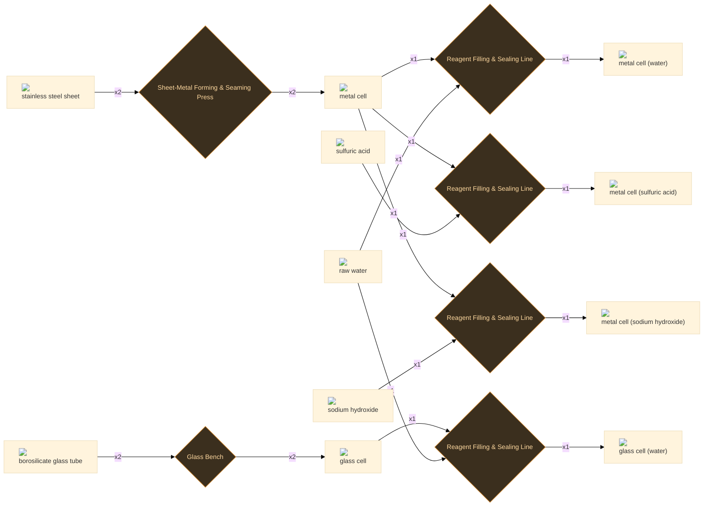

:ci[cell_glass|2]

:ci[glass_tube|2] → :ci[cell_glass|2]

Glass Bench 45s T3 60 kJ

Blow and seal borosilicate tube into a glass cell -- inert to acids and thermal shock, for corrosive contents you want to see.

<code>cell_form_glass</code>

:ci[cell_glass_water_raw|1]

:ci[cell_glass|1] :ci[water_raw|1] → :ci[cell_glass_water_raw|1]

Reagent Filling & Sealing Line 20s T3 15 kJ

Charge a borosilicate cell with raw water and seal -- a clear, inert canister.

<code>cell_fill_glass_water</code>

:ci[cell_metal|2]

:ci[stainless_steel_sheet|2] → :ci[cell_metal|2]

Sheet-Metal Forming & Seaming Press 60s T4 90 kJ

Deep-draw and seam-weld stainless sheet into an empty cell body. Stainless, not plain steel or aluminium, because this one container has to survive both acid and caustic fills.

<code>cell_form_metal</code>

:ci[cell_metal_acid_sulfuric|1]

:ci[cell_metal|1] :ci[acid_sulfuric|1] → :ci[cell_metal_acid_sulfuric|1]

Reagent Filling & Sealing Line 25s T4 20 kJ

Charge a stainless cell with sulfuric acid. The stainless body earns its cost here -- acid would eat an ordinary can.

<code>cell_fill_metal_acid</code>

:ci[cell_metal_sodium_hydroxide|1]

:ci[cell_metal|1] :ci[sodium_hydroxide|1] → :ci[cell_metal_sodium_hydroxide|1]

Reagent Filling & Sealing Line 25s T4 20 kJ

Charge a stainless cell with sodium hydroxide. Caustic in aluminium would dissolve the can and vent hydrogen; stainless holds it safely.

<code>cell_fill_metal_caustic</code>

:ci[cell_metal_water_raw|1]

:ci[cell_metal|1] :ci[water_raw|1] → :ci[cell_metal_water_raw|1]

Reagent Filling & Sealing Line 20s T4 15 kJ

Charge a stainless cell with raw water and seal it -- the neutral reference fill.

<code>cell_fill_metal_water</code>

## Chloralkali chain

4 recipes

```mermaid
%%{init: {'securityLevel':'loose','flowchart':{'htmlLabels':true,'curve':'basis','nodeSpacing':38,'rankSpacing':70}, 'theme':'base', 'themeVariables':{'fontSize':'13px'}}}%%
graph LR
  i_raw_ore_halite["<img src='/Conduvia/assets/icons/raw_ore_halite.png' class='mmd-ico' />raw halite ore"]
  i_water_raw["<img src='/Conduvia/assets/icons/water_raw.png' class='mmd-ico' />raw water"]
  i_brine_solution["<img src='/Conduvia/assets/icons/brine_solution.png' class='mmd-ico' />brine solution"]
  i_brine_purified["<img src='/Conduvia/assets/icons/brine_purified.png' class='mmd-ico' />purified brine"]
  i_waste_tailings["<img src='/Conduvia/assets/icons/waste_tailings.png' class='mmd-ico' />tailings"]
  i_gas_chlorine["<img src='/Conduvia/assets/icons/gas_chlorine.png' class='mmd-ico' />chlorine gas"]
  i_caustic_dilute["<img src='/Conduvia/assets/icons/caustic_dilute.png' class='mmd-ico' />dilute cell caustic"]
  i_gas_hydrogen["<img src='/Conduvia/assets/icons/gas_hydrogen.png' class='mmd-ico' />hydrogen gas"]
  i_sodium_hydroxide["<img src='/Conduvia/assets/icons/sodium_hydroxide.png' class='mmd-ico' />sodium hydroxide"]
  p_ca_dissolve_brine{"Brine Saturation & Softening Unit"}
  p_ca_purify_brine{"Brine Saturation & Softening Unit"}
  p_ca_membrane_cell{"Chlor-Alkali Membrane Cell"}
  p_ca_concentrate_caustic{"Caustic Concentration Evaporator"}
  i_raw_ore_halite --> |"x2"| p_ca_dissolve_brine
  i_water_raw --> |"x1"| p_ca_dissolve_brine
  p_ca_dissolve_brine --> |"x2"| i_brine_solution
  i_brine_solution --> |"x2"| p_ca_purify_brine
  p_ca_purify_brine --> |"x2"| i_brine_purified
  p_ca_purify_brine --> |"x1"| i_waste_tailings
  i_brine_purified --> |"x2"| p_ca_membrane_cell
  p_ca_membrane_cell --> |"x1"| i_gas_chlorine
  p_ca_membrane_cell --> |"x2"| i_caustic_dilute
  p_ca_membrane_cell --> |"x1"| i_gas_hydrogen
  i_caustic_dilute --> |"x2"| p_ca_concentrate_caustic
  p_ca_concentrate_caustic --> |"x1"| i_sodium_hydroxide
  p_ca_concentrate_caustic --> |"x1"| i_water_raw
  classDef proc fill:#3b2f1e,stroke:#d98a2b,stroke-width:1px,color:#ffd9a0;
  classDef world fill:#1d2a1d,stroke:#5a8f4d,color:#bfe6b0;
  class p_ca_dissolve_brine proc;
  class p_ca_purify_brine proc;
  class p_ca_membrane_cell proc;
  class p_ca_concentrate_caustic proc;
```

:ci[brine_purified|2] :ci[waste_tailings|1]

:ci[brine_solution|2] → :ci[brine_purified|2] :ci[waste_tailings|1]

Brine Saturation & Softening Unit 45s T3 40 kJ +1 byproduct

Pass the brine through ion-exchange softening to strip calcium and magnesium to ppb levels. Skip this and the cell membrane fouls within days -- brine purity is the hidden discipline of a chlor-alkali plant.

<code>ca_purify_brine</code>

:ci[brine_solution|2]

:ci[raw_ore_halite|2] :ci[water_raw|1] → :ci[brine_solution|2]

Brine Saturation & Softening Unit 30s T2 20 kJ

Dissolve rock salt in water to a saturated brine -- the raw feedstock for the whole plant. Salt is cheap and the sea is endless; the cost here is all electricity downstream.

<code>ca_dissolve_brine</code>

:ci[gas_chlorine|1] :ci[caustic_dilute|2] :ci[gas_hydrogen|1]

:ci[brine_purified|2] → :ci[gas_chlorine|1] :ci[caustic_dilute|2] :ci[gas_hydrogen|1]

Chlor-Alkali Membrane Cell 120s T3 350 kJ +2 byproducts

Electrolyse the purified brine across an ion-selective membrane: chlorine bubbles off the anode, hydrogen off the cathode, and sodium ions cross the membrane to leave caustic soda behind. 2 NaCl + 2 H2O -> Cl2 + H2 + 2 NaOH. The single biggest electricity draw outside the aluminium pots.

<code>ca_membrane_cell</code>

:ci[sodium_hydroxide|1] :ci[water_raw|1]

:ci[caustic_dilute|2] → :ci[sodium_hydroxide|1] :ci[water_raw|1]

Caustic Concentration Evaporator 60s T3 110 kJ +1 byproduct

Boil the weak cell liquor down to ~50% caustic soda, recovering the water. Evaporation is energy-hungry in its own right, which is why caustic is sold by the tonne, not the litre.

<code>ca_concentrate_caustic</code>

## Cobalt chain

4 recipes

```mermaid
%%{init: {'securityLevel':'loose','flowchart':{'htmlLabels':true,'curve':'basis','nodeSpacing':38,'rankSpacing':70}, 'theme':'base', 'themeVariables':{'fontSize':'13px'}}}%%
graph LR
  i_raw_ore_cobaltite["<img src='/Conduvia/assets/icons/raw_ore_cobaltite.png' class='mmd-ico' />raw cobaltite ore"]
  i_gas_oxygen["<img src='/Conduvia/assets/icons/gas_oxygen.png' class='mmd-ico' />oxygen gas"]
  i_cobalt_oxide_roasted["<img src='/Conduvia/assets/icons/cobalt_oxide_roasted.png' class='mmd-ico' />roasted cobalt oxide"]
  i_gas_so2["<img src='/Conduvia/assets/icons/gas_so2.png' class='mmd-ico' />sulfur dioxide gas"]
  i_arsenic_trioxide["<img src='/Conduvia/assets/icons/arsenic_trioxide.png' class='mmd-ico' />arsenic trioxide (toxic)"]
  i_acid_sulfuric["<img src='/Conduvia/assets/icons/acid_sulfuric.png' class='mmd-ico' />sulfuric acid"]
  i_cobalt_sulfate_solution["<img src='/Conduvia/assets/icons/cobalt_sulfate_solution.png' class='mmd-ico' />cobalt sulfate liquor"]
  i_waste_tailings["<img src='/Conduvia/assets/icons/waste_tailings.png' class='mmd-ico' />tailings"]
  i_cobalt_purified_solution["<img src='/Conduvia/assets/icons/cobalt_purified_solution.png' class='mmd-ico' />purified cobalt solution"]
  i_nickel_concentrate["<img src='/Conduvia/assets/icons/nickel_concentrate.png' class='mmd-ico' />nickel concentrate"]
  i_dc_charge["<img src='/Conduvia/assets/icons/dc_charge.png' class='mmd-ico' />DC power charge"]
  i_cobalt_cathode["<img src='/Conduvia/assets/icons/cobalt_cathode.png' class='mmd-ico' />cobalt cathode"]
  i_slag["<img src='/Conduvia/assets/icons/slag.png' class='mmd-ico' />slag"]
  p_co_roast_cobaltite{"Roasting Pit"}
  p_co_leach{"Heap Leach Pad (acid irrigation)"}
  p_co_solvent_extract{"Solvent-Extraction Mixer-Settler (LIX)"}
  p_co_electrowin{"Electrowinning Cell (Pb anode / SS cathode)"}
  i_raw_ore_cobaltite --> |"x2"| p_co_roast_cobaltite
  i_gas_oxygen --> |"x1"| p_co_roast_cobaltite
  p_co_roast_cobaltite --> |"x1"| i_cobalt_oxide_roasted
  p_co_roast_cobaltite --> |"x1"| i_gas_so2
  p_co_roast_cobaltite --> |"x1"| i_arsenic_trioxide
  i_cobalt_oxide_roasted --> |"x2"| p_co_leach
  i_acid_sulfuric --> |"x2"| p_co_leach
  p_co_leach --> |"x2"| i_cobalt_sulfate_solution
  p_co_leach --> |"x1"| i_waste_tailings
  i_cobalt_sulfate_solution --> |"x2"| p_co_solvent_extract
  p_co_solvent_extract --> |"x1"| i_cobalt_purified_solution
  p_co_solvent_extract --> |"x1"| i_nickel_concentrate
  i_cobalt_purified_solution --> |"x1"| p_co_electrowin
  i_dc_charge --> |"x2"| p_co_electrowin
  p_co_electrowin --> |"x1"| i_cobalt_cathode
  p_co_electrowin --> |"x1"| i_slag
  classDef proc fill:#3b2f1e,stroke:#d98a2b,stroke-width:1px,color:#ffd9a0;
  classDef world fill:#1d2a1d,stroke:#5a8f4d,color:#bfe6b0;
  class p_co_roast_cobaltite proc;
  class p_co_leach proc;
  class p_co_solvent_extract proc;
  class p_co_electrowin proc;
```

:ci[cobalt_cathode|1] :ci[slag|1]

:ci[cobalt_purified_solution|1] :ci[dc_charge|2] → :ci[cobalt_cathode|1] :ci[slag|1]

Electrowinning Cell (Pb anode / SS cathode) 120s T4 200 kJ +1 byproduct

Electrowin bright cobalt metal onto starter sheets -- the pure cathode that finally lets the carbide insert use its correct binder.

<code>co_electrowin</code>

:ci[cobalt_oxide_roasted|1] :ci[gas_so2|1] :ci[arsenic_trioxide|1]

:ci[raw_ore_cobaltite|2] :ci[gas_oxygen|1] → :ci[cobalt_oxide_roasted|1] :ci[gas_so2|1] :ci[arsenic_trioxide|1]

Roasting Pit 100s T3 110 kJ +2 byproducts

Dead-roast cobaltite (CoAsS): sulfur leaves as SO2 for the acid plant, arsenic is captured as toxic As2O3 from the flue rather than vented, and cobalt stays as a roasted oxide.

<code>co_roast_cobaltite</code>

:ci[cobalt_purified_solution|1] :ci[nickel_concentrate|1]

:ci[cobalt_sulfate_solution|2] → :ci[cobalt_purified_solution|1] :ci[nickel_concentrate|1]

Solvent-Extraction Mixer-Settler (LIX) 140s T4 120 kJ +1 byproduct

Solvent-extract the liquor to separate cobalt from its near-twin nickel (and copper). Cobalt and nickel always travel together in nature, so the stripped nickel is recovered as concentrate, not wasted.

<code>co_solvent_extract</code>

:ci[cobalt_sulfate_solution|2] :ci[waste_tailings|1]

:ci[cobalt_oxide_roasted|2] :ci[acid_sulfuric|2] → :ci[cobalt_sulfate_solution|2] :ci[waste_tailings|1]

Heap Leach Pad (acid irrigation) 120s T4 90 kJ +1 byproduct

Leach the roasted oxide in sulfuric acid to a pink cobalt sulfate liquor, leaving the inert gangue as tailings.

<code>co_leach</code>

## Gases chain

5 recipes

```mermaid
%%{init: {'securityLevel':'loose','flowchart':{'htmlLabels':true,'curve':'basis','nodeSpacing':38,'rankSpacing':70}, 'theme':'base', 'themeVariables':{'fontSize':'13px'}}}%%
graph LR
  i_air_raw["<img src='/Conduvia/assets/icons/air_raw.png' class='mmd-ico' />compressed air"]
  i_liquid_air["<img src='/Conduvia/assets/icons/liquid_air.png' class='mmd-ico' />liquid air"]
  i_gas_nitrogen["<img src='/Conduvia/assets/icons/gas_nitrogen.png' class='mmd-ico' />nitrogen gas"]
  i_gas_oxygen["<img src='/Conduvia/assets/icons/gas_oxygen.png' class='mmd-ico' />oxygen gas"]
  i_gas_argon["<img src='/Conduvia/assets/icons/gas_argon.png' class='mmd-ico' />argon gas"]
  i_gas_hydrogen["<img src='/Conduvia/assets/icons/gas_hydrogen.png' class='mmd-ico' />hydrogen gas"]
  i_gas_ammonia["<img src='/Conduvia/assets/icons/gas_ammonia.png' class='mmd-ico' />ammonia gas"]
  i_steel_ingot["<img src='/Conduvia/assets/icons/steel_ingot.png' class='mmd-ico' />steel ingot"]
  i_cylinder_gas_basic["<img src='/Conduvia/assets/icons/cylinder_gas_basic.png' class='mmd-ico' />basic gas cylinder"]
  p_gather_air_raw{"Gas Compressor"}
  p_asu_liquefy_air{"Cryogenic Air Separation Unit (ASU)"}
  p_asu_rectify_air{"Cryogenic Air Separation Unit (ASU)"}
  p_hb_synthesize_ammonia{"Haber-Bosch Ammonia Converter (iron cat., high P)"}
  p_gas_fab_cylinder{"Steam Machine Shop"}
  src_world["world"]:::world --> p_gather_air_raw
  p_gather_air_raw --> |"x10"| i_air_raw
  i_air_raw --> |"x10"| p_asu_liquefy_air
  p_asu_liquefy_air --> |"x10"| i_liquid_air
  i_liquid_air --> |"x10"| p_asu_rectify_air
  p_asu_rectify_air --> |"x7"| i_gas_nitrogen
  p_asu_rectify_air --> |"x2"| i_gas_oxygen
  p_asu_rectify_air --> |"x1"| i_gas_argon
  i_gas_nitrogen --> |"x1"| p_hb_synthesize_ammonia
  i_gas_hydrogen --> |"x3"| p_hb_synthesize_ammonia
  p_hb_synthesize_ammonia --> |"x2"| i_gas_ammonia
  i_steel_ingot --> |"x1"| p_gas_fab_cylinder
  p_gas_fab_cylinder --> |"x2"| i_cylinder_gas_basic
  classDef proc fill:#3b2f1e,stroke:#d98a2b,stroke-width:1px,color:#ffd9a0;
  classDef world fill:#1d2a1d,stroke:#5a8f4d,color:#bfe6b0;
  class p_gather_air_raw proc;
  class p_asu_liquefy_air proc;
  class p_asu_rectify_air proc;
  class p_hb_synthesize_ammonia proc;
  class p_gas_fab_cylinder proc;
```

:ci[air_raw|10]

Gas Compressor 5s T1

Draw in and filter atmospheric air. Free and inexhaustible -- the feedstock for everything downstream of the ASU.

<code>gather_air_raw</code>

:ci[cylinder_gas_basic|2]

:ci[steel_ingot|1] → :ci[cylinder_gas_basic|2]

Steam Machine Shop 70s T3 90 kJ

Deep-draw and spin a steel billet into a seamless high-pressure cylinder, empty and ready to fill. The reusable container behind every compressed-gas product.

<code>gas_fab_cylinder</code>

:ci[gas_ammonia|2]

:ci[gas_nitrogen|1] :ci[gas_hydrogen|3] → :ci[gas_ammonia|2]

Haber-Bosch Ammonia Converter (iron cat., high P) 150s T4 320 kJ

Fix nitrogen: N2 + 3 H2 -> 2 NH3 over a promoted-iron catalyst at ~450C and >100 bar. Only a fraction converts per pass, so the unreacted gas is recycled. Hydrogen comes from the chlor-alkali cell, nitrogen from the ASU -- the two new gas plants closing into one.

<code>hb_synthesize_ammonia</code>

:ci[gas_nitrogen|7] :ci[gas_oxygen|2] :ci[gas_argon|1]

:ci[liquid_air|10] → :ci[gas_nitrogen|7] :ci[gas_oxygen|2] :ci[gas_argon|1]

Cryogenic Air Separation Unit (ASU) 90s T3 120 kJ +2 byproducts

Rectify liquid air in a double column: counter-current distillation pulls volatile nitrogen (-196C) up and out the top, oxygen (-183C) collects at the bottom, and argon (-186C) is drawn from a side column. One feed, three pure products -- the cleanest multi-output in the plant.

<code>asu_rectify_air</code>

:ci[liquid_air|10]

:ci[air_raw|10] → :ci[liquid_air|10]

Cryogenic Air Separation Unit (ASU) 60s T3 220 kJ

Compress filtered air, scrub out CO2 and moisture (they freeze and plug the column), then chill it against the cold product streams until it condenses. Liquefying the air is the energy-hungry step; the separation that follows is nearly free.

<code>asu_liquefy_air</code>

## Gypsum chain

5 recipes

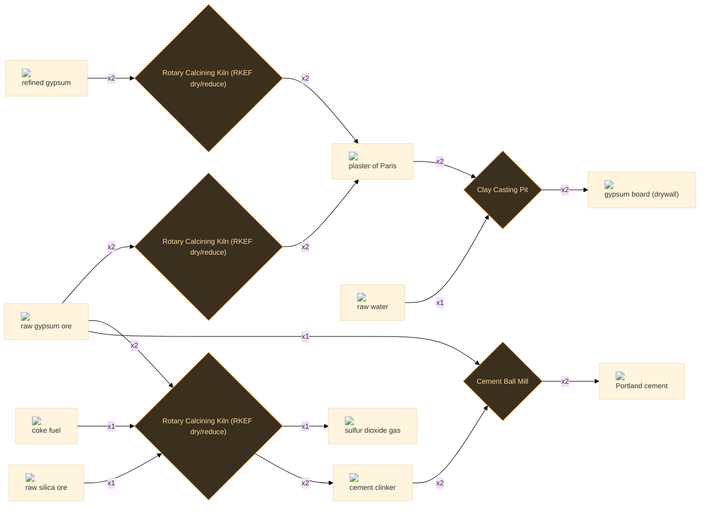

:ci[gas_so2|1] :ci[cement_clinker|2]

:ci[raw_ore_gypsum|2] :ci[coke_fuel|1] :ci[raw_ore_silica|1] → :ci[gas_so2|1] :ci[cement_clinker|2]

Rotary Calcining Kiln (RKEF dry/reduce) 260s T4 250 kJ +1 byproduct

Mueller-Kuehne: starve gypsum of oxygen with coke at ~1400 C and it splits -- sulfur leaves as SO2 (sent to the contact acid plant) while the lime sinters with silica into cement clinker. One kiln makes both sulfuric acid AND cement, the classic move where native sulfur is scarce.

<code>gyp_muller_kuhne</code>

:ci[gypsum_board|2]

:ci[plaster_of_paris|2] :ci[water_raw|1] → :ci[gypsum_board|2]

Clay Casting Pit 40s T2 20 kJ

Slurry plaster with water between paper sheets and let it re-hydrate to set rock-hard: gypsum board. The reaction is just the calcination run backwards.

<code>gyp_cast_board</code>

:ci[plaster_of_paris|2]

:ci[raw_ore_gypsum|2] → :ci[plaster_of_paris|2]

Rotary Calcining Kiln (RKEF dry/reduce) 70s T2 70 kJ

Gently calcine gypsum near 150 C to the hemihydrate -- plaster of Paris. Overshoot the temperature and you get dead-burnt anhydrite that will not set, so this is a low, controlled bake.

<code>gyp_calcine_plaster</code>

:ci[plaster_of_paris|2]

:ci[waste_gypsum_refined|2] → :ci[plaster_of_paris|2]

Rotary Calcining Kiln (RKEF dry/reduce) 70s T3 70 kJ

The HF chain throws off refined gypsum as a waste; calcine it the same way to plaster, turning a disposal problem into feedstock and closing the loop.

<code>gyp_recover_waste_plaster</code>

:ci[portland_cement|2]

:ci[cement_clinker|2] :ci[raw_ore_gypsum|1] → :ci[portland_cement|2]

Cement Ball Mill 90s T3 90 kJ

Grind clinker with a few percent raw gypsum as a set-retarder: Portland cement. Without that gypsum the cement would flash-set in the mixer before you could pour it.

<code>gyp_grind_portland</code>

## Lead chain

6 recipes

```mermaid
%%{init: {'securityLevel':'loose','flowchart':{'htmlLabels':true,'curve':'basis','nodeSpacing':38,'rankSpacing':70}, 'theme':'base', 'themeVariables':{'fontSize':'13px'}}}%%
graph LR
  i_raw_ore_galena["<img src='/Conduvia/assets/icons/raw_ore_galena.png' class='mmd-ico' />raw galena ore"]
  i_concentrate_galena["<img src='/Conduvia/assets/icons/concentrate_galena.png' class='mmd-ico' />galena concentrate"]
  i_waste_tailings["<img src='/Conduvia/assets/icons/waste_tailings.png' class='mmd-ico' />tailings"]
  i_gas_oxygen["<img src='/Conduvia/assets/icons/gas_oxygen.png' class='mmd-ico' />oxygen gas"]
  i_lead_sinter_oxide["<img src='/Conduvia/assets/icons/lead_sinter_oxide.png' class='mmd-ico' />lead oxide sinter"]
  i_gas_so2["<img src='/Conduvia/assets/icons/gas_so2.png' class='mmd-ico' />sulfur dioxide gas"]
  i_coke_fuel["<img src='/Conduvia/assets/icons/coke_fuel.png' class='mmd-ico' />coke fuel"]
  i_limestone_flux["<img src='/Conduvia/assets/icons/limestone_flux.png' class='mmd-ico' />limestone flux"]
  i_lead_bullion["<img src='/Conduvia/assets/icons/lead_bullion.png' class='mmd-ico' />crude lead bullion"]
  i_slag["<img src='/Conduvia/assets/icons/slag.png' class='mmd-ico' />slag"]
  i_gas_co2["<img src='/Conduvia/assets/icons/gas_co2.png' class='mmd-ico' />carbon dioxide gas"]
  i_metal_zinc_ingot["<img src='/Conduvia/assets/icons/metal_zinc_ingot.png' class='mmd-ico' />zinc ingot"]
  i_lead_softened["<img src='/Conduvia/assets/icons/lead_softened.png' class='mmd-ico' />softened lead"]
  i_silver_zinc_crust["<img src='/Conduvia/assets/icons/silver_zinc_crust.png' class='mmd-ico' />silver-zinc crust"]
  i_silver_dore["<img src='/Conduvia/assets/icons/silver_dore.png' class='mmd-ico' />silver dore"]
  i_litharge_pbo["<img src='/Conduvia/assets/icons/litharge_pbo.png' class='mmd-ico' />litharge (PbO)"]
  i_metal_lead_ingot["<img src='/Conduvia/assets/icons/metal_lead_ingot.png' class='mmd-ico' />lead ingot"]
  p_pb_froth_flotation{"Froth Flotation Cell"}
  p_pb_sinter_roast{"Sinter Strand (Dwight-Lloyd)"}
  p_pb_blast_reduce{"Blast Furnace"}
  p_pb_parkes_desilver{"Fire-Refining Furnace"}
  p_pb_cupellation{"Cupellation Hearth (silver assay/refine)"}
  p_pb_refine_cast{"Fire-Refining Furnace"}
  i_raw_ore_galena --> |"x3"| p_pb_froth_flotation
  p_pb_froth_flotation --> |"x2"| i_concentrate_galena
  p_pb_froth_flotation --> |"x1"| i_waste_tailings
  i_concentrate_galena --> |"x2"| p_pb_sinter_roast
  i_gas_oxygen --> |"x1"| p_pb_sinter_roast
  p_pb_sinter_roast --> |"x2"| i_lead_sinter_oxide
  p_pb_sinter_roast --> |"x1"| i_gas_so2
  i_lead_sinter_oxide --> |"x2"| p_pb_blast_reduce
  i_coke_fuel --> |"x1"| p_pb_blast_reduce
  i_limestone_flux --> |"x1"| p_pb_blast_reduce
  p_pb_blast_reduce --> |"x2"| i_lead_bullion
  p_pb_blast_reduce --> |"x1"| i_slag
  p_pb_blast_reduce --> |"x1"| i_gas_co2
  i_lead_bullion --> |"x2"| p_pb_parkes_desilver
  i_metal_zinc_ingot --> |"x1"| p_pb_parkes_desilver
  p_pb_parkes_desilver --> |"x2"| i_lead_softened
  p_pb_parkes_desilver --> |"x1"| i_silver_zinc_crust
  i_silver_zinc_crust --> |"x1"| p_pb_cupellation
  i_gas_oxygen --> |"x1"| p_pb_cupellation
  p_pb_cupellation --> |"x1"| i_silver_dore
  p_pb_cupellation --> |"x1"| i_litharge_pbo
  i_lead_softened --> |"x2"| p_pb_refine_cast
  p_pb_refine_cast --> |"x2"| i_metal_lead_ingot
  classDef proc fill:#3b2f1e,stroke:#d98a2b,stroke-width:1px,color:#ffd9a0;
  classDef world fill:#1d2a1d,stroke:#5a8f4d,color:#bfe6b0;
  class p_pb_froth_flotation proc;
  class p_pb_sinter_roast proc;
  class p_pb_blast_reduce proc;
  class p_pb_parkes_desilver proc;
  class p_pb_cupellation proc;
  class p_pb_refine_cast proc;
```

:ci[concentrate_galena|2] :ci[waste_tailings|1]

:ci[raw_ore_galena|3] → :ci[concentrate_galena|2] :ci[waste_tailings|1]

Froth Flotation Cell 60s T2 40 kJ +1 byproduct

Froth-float crushed galena: the heavy lead sulfide rides the bubbles to a concentrate, the silica gangue sinks as tailings.

<code>pb_froth_flotation</code>

:ci[lead_bullion|2] :ci[slag|1] :ci[gas_co2|1]

:ci[lead_sinter_oxide|2] :ci[coke_fuel|1] :ci[limestone_flux|1] → :ci[lead_bullion|2] :ci[slag|1] :ci[gas_co2|1]

Blast Furnace 220s T3 240 kJ +2 byproducts

Reduce the lead sinter with coke in a blast furnace to crude bullion. The silver in the ore reports almost entirely into the molten lead; iron and rock leave as slag.

<code>pb_blast_reduce</code>

:ci[lead_sinter_oxide|2] :ci[gas_so2|1]

:ci[concentrate_galena|2] :ci[gas_oxygen|1] → :ci[lead_sinter_oxide|2] :ci[gas_so2|1]

Sinter Strand (Dwight-Lloyd) 110s T3 120 kJ +1 byproduct

Roast-sinter the concentrate: PbS burns to PbO and a hard sinter cake, throwing SO2 to the contact acid plant -- sulfide metallurgy always feeds an acid plant.

<code>pb_sinter_roast</code>

:ci[lead_softened|2] :ci[silver_zinc_crust|1]

:ci[lead_bullion|2] :ci[metal_zinc_ingot|1] → :ci[lead_softened|2] :ci[silver_zinc_crust|1]

Fire-Refining Furnace 130s T3 110 kJ +1 byproduct

The Parkes process: stir zinc into the molten bullion. Silver is far more soluble in zinc than in lead, so it floats out as a zinc-silver crust that is skimmed off, leaving softened lead. (This is why lead refining quietly consumes zinc.)

<code>pb_parkes_desilver</code>

:ci[metal_lead_ingot|2]

:ci[lead_softened|2] → :ci[metal_lead_ingot|2]

Fire-Refining Furnace 90s T3 80 kJ

Fire-refine and cast the softened lead into clean ingots -- corrosion-proof, dense, and ready for shielding, batteries, and chamber-acid plumbing.

<code>pb_refine_cast</code>

:ci[silver_dore|1] :ci[litharge_pbo|1]

:ci[silver_zinc_crust|1] :ci[gas_oxygen|1] → :ci[silver_dore|1] :ci[litharge_pbo|1]

Cupellation Hearth (silver assay/refine) 150s T3 140 kJ +1 byproduct

Cupel the crust under an air blast: zinc and lead oxidise to litharge and are absorbed/skimmed, leaving a noble button of dore silver. The oldest assay there is.

<code>pb_cupellation</code>

## Lithium chain

5 recipes

```mermaid
%%{init: {'securityLevel':'loose','flowchart':{'htmlLabels':true,'curve':'basis','nodeSpacing':38,'rankSpacing':70}, 'theme':'base', 'themeVariables':{'fontSize':'13px'}}}%%
graph LR
  i_raw_ore_spodumene["<img src='/Conduvia/assets/icons/raw_ore_spodumene.png' class='mmd-ico' />raw spodumene ore"]
  i_spodumene_beta["<img src='/Conduvia/assets/icons/spodumene_beta.png' class='mmd-ico' />beta-spodumene"]
  i_acid_sulfuric["<img src='/Conduvia/assets/icons/acid_sulfuric.png' class='mmd-ico' />sulfuric acid"]
  i_lithium_sulfate_crude["<img src='/Conduvia/assets/icons/lithium_sulfate_crude.png' class='mmd-ico' />crude lithium sulfate"]
  i_waste_tailings["<img src='/Conduvia/assets/icons/waste_tailings.png' class='mmd-ico' />tailings"]
  i_burned_lime_quicklime["<img src='/Conduvia/assets/icons/burned_lime_quicklime.png' class='mmd-ico' />burned lime (quicklime)"]
  i_lithium_sulfate_solution["<img src='/Conduvia/assets/icons/lithium_sulfate_solution.png' class='mmd-ico' />lithium sulfate liquor"]
  i_sodium_hydroxide["<img src='/Conduvia/assets/icons/sodium_hydroxide.png' class='mmd-ico' />sodium hydroxide"]
  i_lithium_hydroxide["<img src='/Conduvia/assets/icons/lithium_hydroxide.png' class='mmd-ico' />lithium hydroxide monohydrate"]
  i_salt_sodium_sulfate["<img src='/Conduvia/assets/icons/salt_sodium_sulfate.png' class='mmd-ico' />sodium sulfate"]
  i_gas_co2["<img src='/Conduvia/assets/icons/gas_co2.png' class='mmd-ico' />carbon dioxide gas"]
  i_lithium_carbonate["<img src='/Conduvia/assets/icons/lithium_carbonate.png' class='mmd-ico' />lithium carbonate (battery grade)"]
  p_li_decrepitate{"Rotary Calcining Kiln (RKEF dry/reduce)"}
  p_li_acid_bake{"Sulfation Acid-Roast Kiln"}
  p_li_leach_purify{"Heap Leach Pad (acid irrigation)"}
  p_li_causticize{"Caustic Digester Autoclave (alkali leach)"}
  p_li_carbonate{"Carbonation Precipitation Reactor"}
  i_raw_ore_spodumene --> |"x2"| p_li_decrepitate
  p_li_decrepitate --> |"x2"| i_spodumene_beta
  i_spodumene_beta --> |"x2"| p_li_acid_bake
  i_acid_sulfuric --> |"x1"| p_li_acid_bake
  p_li_acid_bake --> |"x2"| i_lithium_sulfate_crude
  p_li_acid_bake --> |"x1"| i_waste_tailings
  i_lithium_sulfate_crude --> |"x2"| p_li_leach_purify
  i_burned_lime_quicklime --> |"x1"| p_li_leach_purify
  p_li_leach_purify --> |"x2"| i_lithium_sulfate_solution
  p_li_leach_purify --> |"x1"| i_waste_tailings
  i_lithium_sulfate_solution --> |"x2"| p_li_causticize
  i_sodium_hydroxide --> |"x2"| p_li_causticize
  p_li_causticize --> |"x2"| i_lithium_hydroxide
  p_li_causticize --> |"x1"| i_salt_sodium_sulfate
  i_lithium_hydroxide --> |"x2"| p_li_carbonate
  i_gas_co2 --> |"x1"| p_li_carbonate
  p_li_carbonate --> |"x1"| i_lithium_carbonate
  classDef proc fill:#3b2f1e,stroke:#d98a2b,stroke-width:1px,color:#ffd9a0;
  classDef world fill:#1d2a1d,stroke:#5a8f4d,color:#bfe6b0;
  class p_li_decrepitate proc;
  class p_li_acid_bake proc;
  class p_li_leach_purify proc;
  class p_li_causticize proc;
  class p_li_carbonate proc;
```

:ci[lithium_carbonate|1]

:ci[lithium_hydroxide|2] :ci[gas_co2|1] → :ci[lithium_carbonate|1]

Carbonation Precipitation Reactor 90s T4 70 kJ

Bubble CO2 through lithium hydroxide to drop battery-grade lithium carbonate: 2 LiOH + CO2 -> Li2CO3 + H2O. The classic lithium-ion feedstock.

<code>li_carbonate</code>

:ci[lithium_hydroxide|2] :ci[salt_sodium_sulfate|1]

:ci[lithium_sulfate_solution|2] :ci[sodium_hydroxide|2] → :ci[lithium_hydroxide|2] :ci[salt_sodium_sulfate|1]

Caustic Digester Autoclave (alkali leach) 110s T4 80 kJ +1 byproduct

Causticise the liquor with caustic soda: Li2SO4 + 2 NaOH -> 2 LiOH + Na2SO4. The lithium hydroxide crystallises out and the sodium sulfate byproduct is recovered as a salable salt.

<code>li_causticize</code>

:ci[lithium_sulfate_crude|2] :ci[waste_tailings|1]

:ci[spodumene_beta|2] :ci[acid_sulfuric|1] → :ci[lithium_sulfate_crude|2] :ci[waste_tailings|1]

Sulfation Acid-Roast Kiln 200s T4 200 kJ +1 byproduct

Bake beta-spodumene with concentrated sulfuric acid at ~250 C: lithium ion-exchanges onto the sulfate, leaving the alumino-silicate skeleton as inert residue.

<code>li_acid_bake</code>

:ci[lithium_sulfate_solution|2] :ci[waste_tailings|1]

:ci[lithium_sulfate_crude|2] :ci[burned_lime_quicklime|1] → :ci[lithium_sulfate_solution|2] :ci[waste_tailings|1]

Heap Leach Pad (acid irrigation) 120s T4 90 kJ +1 byproduct

Water-leach the bake and add lime to precipitate iron and aluminium, leaving a clean lithium sulfate liquor.

<code>li_leach_purify</code>

:ci[spodumene_beta|2]

:ci[raw_ore_spodumene|2] → :ci[spodumene_beta|2]

Rotary Calcining Kiln (RKEF dry/reduce) 180s T4 240 kJ

Decrepitate spodumene near 1100 C: the alpha crystal flips to the open beta form. Skip this and acid simply will not attack the ore -- the step everyone forgets.

<code>li_decrepitate</code>

## Magnesium chain

7 recipes

```mermaid
%%{init: {'securityLevel':'loose','flowchart':{'htmlLabels':true,'curve':'basis','nodeSpacing':38,'rankSpacing':70}, 'theme':'base', 'themeVariables':{'fontSize':'13px'}}}%%
graph LR
  i_raw_ore_dolomite["<img src='/Conduvia/assets/icons/raw_ore_dolomite.png' class='mmd-ico' />dolomite"]
  i_dolime_calcined["<img src='/Conduvia/assets/icons/dolime_calcined.png' class='mmd-ico' />calcined dolime (MgO·CaO)"]
  i_gas_co2["<img src='/Conduvia/assets/icons/gas_co2.png' class='mmd-ico' />carbon dioxide gas"]
  i_raw_ore_silica["<img src='/Conduvia/assets/icons/raw_ore_silica.png' class='mmd-ico' />raw silica ore"]
  i_pig_iron_ingot["<img src='/Conduvia/assets/icons/pig_iron_ingot.png' class='mmd-ico' />pig iron ingot"]
  i_coke_fuel["<img src='/Conduvia/assets/icons/coke_fuel.png' class='mmd-ico' />coke fuel"]
  i_ferrosilicon["<img src='/Conduvia/assets/icons/ferrosilicon.png' class='mmd-ico' />ferrosilicon (FeSi)"]
  i_magnesium_crown["<img src='/Conduvia/assets/icons/magnesium_crown.png' class='mmd-ico' />magnesium crown (crude)"]
  i_dicalcium_silicate_slag["<img src='/Conduvia/assets/icons/dicalcium_silicate_slag.png' class='mmd-ico' />dicalcium silicate slag"]
  i_magnesium_ingot["<img src='/Conduvia/assets/icons/magnesium_ingot.png' class='mmd-ico' />magnesium ingot"]
  i_brine_solution["<img src='/Conduvia/assets/icons/brine_solution.png' class='mmd-ico' />brine solution"]
  i_burned_lime_quicklime["<img src='/Conduvia/assets/icons/burned_lime_quicklime.png' class='mmd-ico' />burned lime (quicklime)"]
  i_magnesium_hydroxide["<img src='/Conduvia/assets/icons/magnesium_hydroxide.png' class='mmd-ico' />magnesium hydroxide"]
  i_waste_tailings["<img src='/Conduvia/assets/icons/waste_tailings.png' class='mmd-ico' />tailings"]
  i_gas_chlorine["<img src='/Conduvia/assets/icons/gas_chlorine.png' class='mmd-ico' />chlorine gas"]
  i_magnesium_chloride_anhydrous["<img src='/Conduvia/assets/icons/magnesium_chloride_anhydrous.png' class='mmd-ico' />anhydrous magnesium chloride"]
  i_dc_charge["<img src='/Conduvia/assets/icons/dc_charge.png' class='mmd-ico' />DC power charge"]
  p_mg_calcine_dolomite{"Rotary Calcining Kiln (RKEF dry/reduce)"}
  p_mg_make_ferrosilicon{"Submerged-Arc Furnace (SAF)"}
  p_mg_pidgeon_reduce{"Pidgeon Vacuum Retort (silicothermic)"}
  p_mg_remelt_ingot{"Flux-Protected Remelt Furnace (Mg)"}
  p_mg_precipitate_hydroxide{"Caustic Digester Autoclave (alkali leach)"}
  p_mg_chlorinate_mgcl2{"Carbo-Chlorination Reactor (MgCl2)"}
  p_mg_electrolysis{"Fused-Salt Electrolysis Cell (Mg)"}
  i_raw_ore_dolomite --> |"x2"| p_mg_calcine_dolomite
  p_mg_calcine_dolomite --> |"x2"| i_dolime_calcined
  p_mg_calcine_dolomite --> |"x1"| i_gas_co2
  i_raw_ore_silica --> |"x2"| p_mg_make_ferrosilicon
  i_pig_iron_ingot --> |"x1"| p_mg_make_ferrosilicon
  i_coke_fuel --> |"x2"| p_mg_make_ferrosilicon
  p_mg_make_ferrosilicon --> |"x1"| i_ferrosilicon
  p_mg_make_ferrosilicon --> |"x1"| i_gas_co2
  i_dolime_calcined --> |"x4"| p_mg_pidgeon_reduce
  i_ferrosilicon --> |"x1"| p_mg_pidgeon_reduce
  p_mg_pidgeon_reduce --> |"x2"| i_magnesium_crown
  p_mg_pidgeon_reduce --> |"x1"| i_dicalcium_silicate_slag
  i_magnesium_crown --> |"x2"| p_mg_remelt_ingot
  p_mg_remelt_ingot --> |"x1"| i_magnesium_ingot
  i_brine_solution --> |"x2"| p_mg_precipitate_hydroxide
  i_burned_lime_quicklime --> |"x1"| p_mg_precipitate_hydroxide
  p_mg_precipitate_hydroxide --> |"x1"| i_magnesium_hydroxide
  p_mg_precipitate_hydroxide --> |"x1"| i_waste_tailings
  i_magnesium_hydroxide --> |"x1"| p_mg_chlorinate_mgcl2
  i_gas_chlorine --> |"x1"| p_mg_chlorinate_mgcl2
  i_coke_fuel --> |"x1"| p_mg_chlorinate_mgcl2
  p_mg_chlorinate_mgcl2 --> |"x1"| i_magnesium_chloride_anhydrous
  p_mg_chlorinate_mgcl2 --> |"x1"| i_gas_co2
  i_magnesium_chloride_anhydrous --> |"x2"| p_mg_electrolysis
  i_dc_charge --> |"x2"| p_mg_electrolysis
  p_mg_electrolysis --> |"x2"| i_magnesium_ingot
  p_mg_electrolysis --> |"x1"| i_gas_chlorine
  classDef proc fill:#3b2f1e,stroke:#d98a2b,stroke-width:1px,color:#ffd9a0;
  classDef world fill:#1d2a1d,stroke:#5a8f4d,color:#bfe6b0;
  class p_mg_calcine_dolomite proc;
  class p_mg_make_ferrosilicon proc;
  class p_mg_pidgeon_reduce proc;
  class p_mg_remelt_ingot proc;
  class p_mg_precipitate_hydroxide proc;
  class p_mg_chlorinate_mgcl2 proc;
  class p_mg_electrolysis proc;
```

:ci[dolime_calcined|2] :ci[gas_co2|1]

:ci[raw_ore_dolomite|2] → :ci[dolime_calcined|2] :ci[gas_co2|1]

Rotary Calcining Kiln (RKEF dry/reduce) 90s T3 100 kJ +1 byproduct

Calcine dolomite to dolime, driving off CO2 and leaving mixed MgO/CaO -- the charge the Pidgeon retort will reduce.

<code>mg_calcine_dolomite</code>

:ci[ferrosilicon|1] :ci[gas_co2|1]

:ci[raw_ore_silica|2] :ci[pig_iron_ingot|1] :ci[coke_fuel|2] → :ci[ferrosilicon|1] :ci[gas_co2|1]

Submerged-Arc Furnace (SAF) 130s T3 260 kJ +1 byproduct

Smelt silica with iron and coke in a submerged-arc furnace to ferrosilicon -- a steel deoxidiser, and here the reductant that will free magnesium from dolime.

<code>mg_make_ferrosilicon</code>

:ci[magnesium_chloride_anhydrous|1] :ci[gas_co2|1]

:ci[magnesium_hydroxide|1] :ci[gas_chlorine|1] :ci[coke_fuel|1] → :ci[magnesium_chloride_anhydrous|1] :ci[gas_co2|1]

Carbo-Chlorination Reactor (MgCl2) 130s T4 140 kJ +1 byproduct

Carbo-chlorinate the hydroxide to bone-dry MgCl2 (carbon scavenges the oxygen as CO2, chlorine takes the magnesium). Anhydrous feed is essential -- any water hydrolyses it back to oxide.

<code>mg_chlorinate_mgcl2</code>

:ci[magnesium_crown|2] :ci[dicalcium_silicate_slag|1]

:ci[dolime_calcined|4] :ci[ferrosilicon|1] → :ci[magnesium_crown|2] :ci[dicalcium_silicate_slag|1]

Pidgeon Vacuum Retort (silicothermic) 300s T4 220 kJ +1 byproduct

The Pidgeon step: under vacuum at ~1200 C, silicon in ferrosilicon reduces magnesia (2 MgO.CaO + Si -> 2 Mg + Ca2SiO4). Magnesium boils off and condenses as a crown at the cold end; dicalcium-silicate slag stays behind.

<code>mg_pidgeon_reduce</code>

:ci[magnesium_hydroxide|1] :ci[waste_tailings|1]

:ci[brine_solution|2] :ci[burned_lime_quicklime|1] → :ci[magnesium_hydroxide|1] :ci[waste_tailings|1]

Caustic Digester Autoclave (alkali leach) 80s T3 60 kJ +1 byproduct

Stir lime into magnesium-bearing brine; magnesium drops out as a milky Mg(OH)2 precipitate, the same trick used to win magnesium from seawater.

<code>mg_precipitate_hydroxide</code>

:ci[magnesium_ingot|1]

:ci[magnesium_crown|2] → :ci[magnesium_ingot|1]

Flux-Protected Remelt Furnace (Mg) 110s T4 100 kJ

Remelt the crude crown under a protective salt flux (magnesium burns in air) and cast a clean magnesium ingot.

<code>mg_remelt_ingot</code>

:ci[magnesium_ingot|2] :ci[gas_chlorine|1]

:ci[magnesium_chloride_anhydrous|2] :ci[dc_charge|2] → :ci[magnesium_ingot|2] :ci[gas_chlorine|1]

Fused-Salt Electrolysis Cell (Mg) 240s T4 420 kJ +1 byproduct

Electrolyse molten MgCl2: magnesium metal collects at the cathode and chlorine gas comes off the anode -- piped straight back to the chlorinator, closing the chlorine loop just like the sodium loop in titanium.

<code>mg_electrolysis</code>

## Natural Gas chain

9 recipes

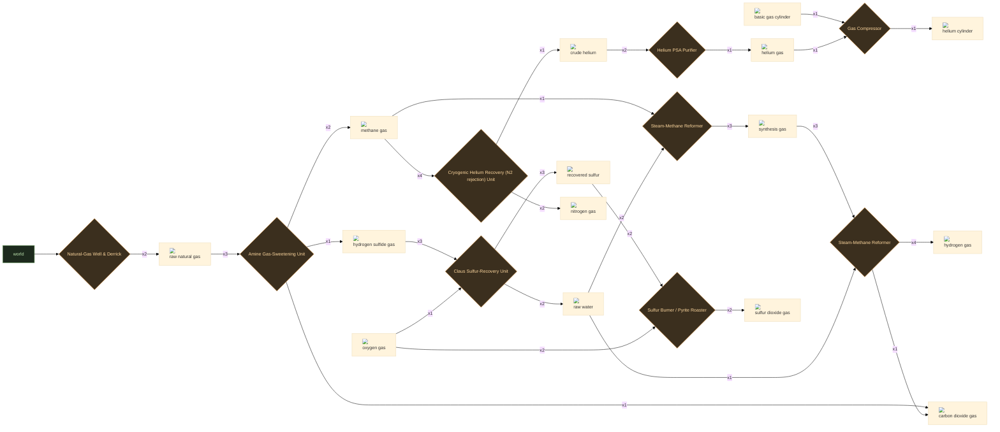

:ci[crude_helium|1] :ci[gas_nitrogen|2]

:ci[gas_methane|4] → :ci[crude_helium|1] :ci[gas_nitrogen|2]

Cryogenic Helium Recovery (N2 rejection) Unit 120s T5 200 kJ +1 byproduct

Chill the sweet gas until everything but helium liquefies (nitrogen rejection). You process a huge volume of gas to skim off a little crude helium -- but natural gas is the only place on Earth helium is concentrated enough to catch.

<code>ng_cryo_recover_helium</code>

:ci[cylinder_helium|1]

:ci[cylinder_gas_basic|1] :ci[gas_helium|1] → :ci[cylinder_helium|1]

Gas Compressor 30s T4 40 kJ

Compress purified helium into a cylinder for storage and transport. Seal it well -- helium leaks through gaskets that hold any other gas.

<code>he_fill_cylinder</code>

:ci[gas_helium|1]

:ci[crude_helium|2] → :ci[gas_helium|1]

Helium PSA Purifier 90s T5 130 kJ

Polish crude helium to 99.999% by pressure-swing adsorption and a final cold trap. Some is lost to the tails -- helium is too fugitive to chase the last fraction of a percent cheaply.

<code>ng_purify_helium</code>

:ci[gas_hydrogen|4] :ci[gas_co2|1]

:ci[gas_syngas|3] :ci[water_raw|1] → :ci[gas_hydrogen|4] :ci[gas_co2|1]

Steam-Methane Reformer 70s T4 110 kJ +1 byproduct

Water-gas shift: CO + H2O -> CO2 + H2. Convert the carbon monoxide in syngas into still more hydrogen, leaving CO2 to vent or capture. This is the cheap bulk-hydrogen route most ammonia and refining actually run on.

<code>smr_water_gas_shift</code>

:ci[gas_methane|2] :ci[gas_co2|1] :ci[gas_hydrogen_sulfide|1]

:ci[natural_gas_raw|3] → :ci[gas_methane|2] :ci[gas_co2|1] :ci[gas_hydrogen_sulfide|1]

Amine Gas-Sweetening Unit 70s T4 90 kJ +2 byproducts

Wash the raw gas with an amine solution to strip the acid gases: out comes sweet pipeline methane, plus the CO2 and hydrogen sulfide that each have to be dealt with separately.

<code>ng_amine_sweeten</code>

:ci[gas_so2|2]

:ci[sulfur_recovered|2] :ci[gas_oxygen|2] → :ci[gas_so2|2]

Sulfur Burner / Pyrite Roaster 40s T4 60 kJ

Burn recovered sulfur in air: S + O2 -> SO2. A cleaner SO2 feed for the contact sulfuric-acid plant than roasting pyrite -- and, in the real world, the dominant modern route to acid.

<code>ng_burn_sulfur</code>

:ci[gas_syngas|3]

:ci[gas_methane|1] :ci[water_raw|2] → :ci[gas_syngas|3]

Steam-Methane Reformer 90s T4 160 kJ

Steam-methane reforming: CH4 + H2O -> CO + 3 H2 over a nickel catalyst at red heat. The workhorse first step of industrial hydrogen, turning methane and steam into synthesis gas.

<code>smr_steam_reform</code>

:ci[natural_gas_raw|2]

Natural-Gas Well & Derrick 60s T4 40 kJ

Drill a gas well and bring sour natural gas up the derrick. What comes up is mostly methane, with CO2, hydrogen sulfide and -- in helium-rich fields -- a trace of helium along for the ride.

<code>ng_gather_natural_gas</code>

:ci[sulfur_recovered|3] :ci[water_raw|2]

:ci[gas_hydrogen_sulfide|3] :ci[gas_oxygen|1] → :ci[sulfur_recovered|3] :ci[water_raw|2]

Claus Sulfur-Recovery Unit 80s T4 110 kJ +1 byproduct

Run the toxic H2S through a Claus unit: 2 H2S + O2 -> 2 S + 2 H2O. A hazard becomes a product -- this is where most of the world's sulfur actually comes from.

<code>ng_claus_sulfur</code>

## Nickel Sulfide chain

5 recipes

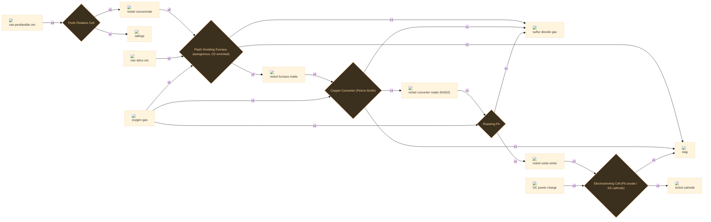

:ci[nickel_cathode|1] :ci[slag|1]

:ci[nickel_oxide_sinter|1] :ci[dc_charge|2] → :ci[nickel_cathode|1] :ci[slag|1]

Electrowinning Cell (Pb anode / SS cathode) 120s T4 200 kJ +1 byproduct

Dissolve and electrowin the nickel oxide onto starter sheets: pure nickel cathode plates out, gangue drops as anode slag. The same cathode the laterite route eventually reaches -- and the feed for Inconel.

<code>nis_electrowin</code>

:ci[nickel_concentrate|2] :ci[waste_tailings|1]

:ci[raw_ore_pentlandite|3] → :ci[nickel_concentrate|2] :ci[waste_tailings|1]

Froth Flotation Cell 70s T2 50 kJ +1 byproduct

Grind and float pentlandite: sulfide grains ride the froth while silicate gangue sinks, upgrading the ore into a nickel sulfide concentrate before any heat is spent.

<code>nis_froth_flotation</code>

:ci[nickel_converter_matte|1] :ci[slag|1] :ci[gas_so2|1]

:ci[nickel_matte|2] :ci[gas_oxygen|1] → :ci[nickel_converter_matte|1] :ci[slag|1] :ci[gas_so2|1]

Copper Converter (Peirce-Smith) 100s T3 120 kJ +2 byproducts

Blow air/oxygen through the molten matte in a Peirce-Smith converter to oxidise out the remaining iron (slagged with silica), leaving high-grade Ni3S2 converter matte and more SO2 for the acid plant.

<code>nis_converter</code>

:ci[nickel_matte|1] :ci[slag|1] :ci[gas_so2|1]

:ci[nickel_concentrate|2] :ci[raw_ore_silica|1] :ci[gas_oxygen|1] → :ci[nickel_matte|1] :ci[slag|1] :ci[gas_so2|1]

Flash Smelting Furnace (autogenous, O2-enriched) 110s T3 140 kJ +2 byproducts

Flash-smelt the concentrate in an oxygen-enriched blast: the sulfide burns its own fuel (autogenous), iron slags off with silica flux, and the sulfur leaves as SO2 -- piped straight to the contact acid plant. The molten matte is tapped below.

<code>nis_flash_smelt</code>

:ci[nickel_oxide_sinter|1] :ci[gas_so2|1]

:ci[nickel_converter_matte|1] :ci[gas_oxygen|1] → :ci[nickel_oxide_sinter|1] :ci[gas_so2|1]

Roasting Pit 90s T3 90 kJ +1 byproduct

Dead-roast the converter matte to nickel oxide, driving off the last sulfur as SO2. Three SO2 streams from one metal -- sulfide nickel, like sulfide copper, always comes with an acid plant attached.

<code>nis_roast_matte</code>

## Potash chain

3 recipes

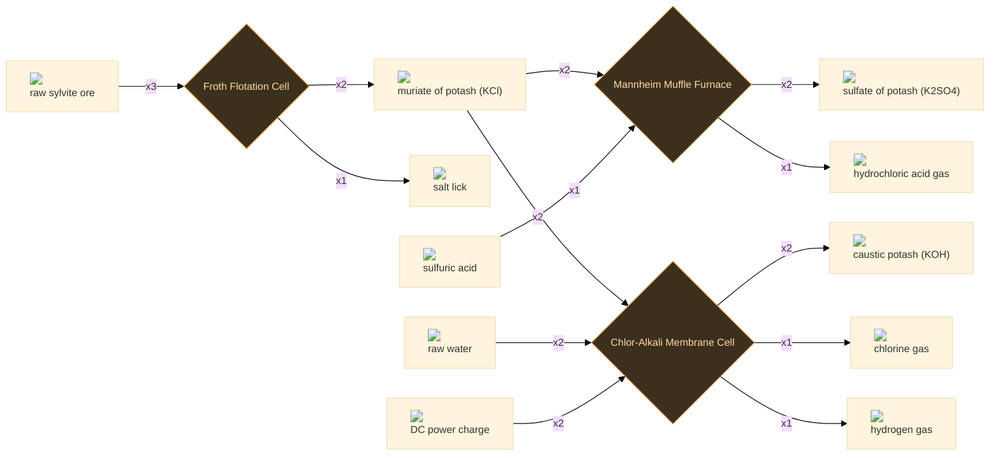

:ci[potash_muriate|2] :ci[salt|1]

:ci[raw_ore_sylvite|3] → :ci[potash_muriate|2] :ci[salt|1]

Froth Flotation Cell 80s T3 55 kJ +1 byproduct

Float sylvinite with an amine collector: the KCl rides the froth as muriate of potash while the common salt (NaCl) sinks and is recovered as a salable byproduct rather than waste.

<code>k_froth_flotation</code>

:ci[potash_sulfate|2] :ci[gas_hcl|1]

:ci[potash_muriate|2] :ci[acid_sulfuric|1] → :ci[potash_sulfate|2] :ci[gas_hcl|1]

Mannheim Muffle Furnace 180s T4 170 kJ +1 byproduct

Mannheim process: react KCl with sulfuric acid in a heated muffle -- 2 KCl + H2SO4 -> K2SO4 + 2 HCl. Yields chloride-free sulfate of potash and drives off hydrogen chloride gas as a genuine co-product.

<code>k_mannheim_sop</code>

:ci[potassium_hydroxide|2] :ci[gas_chlorine|1] :ci[gas_hydrogen|1]

:ci[potash_muriate|2] :ci[water_raw|2] :ci[dc_charge|2] → :ci[potassium_hydroxide|2] :ci[gas_chlorine|1] :ci[gas_hydrogen|1]

Chlor-Alkali Membrane Cell 160s T4 420 kJ +2 byproducts

Electrolyse a KCl brine in a membrane cell -- the potassium analogue of chlor-alkali: caustic potash at the cathode, chlorine at the anode, hydrogen alongside.

<code>k_membrane_koh</code>

## Silicon chain

7 recipes

```mermaid
%%{init: {'securityLevel':'loose','flowchart':{'htmlLabels':true,'curve':'basis','nodeSpacing':38,'rankSpacing':70}, 'theme':'base', 'themeVariables':{'fontSize':'13px'}}}%%
graph LR
  i_raw_ore_silica["<img src='/Conduvia/assets/icons/raw_ore_silica.png' class='mmd-ico' />raw silica ore"]
  i_coke_fuel["<img src='/Conduvia/assets/icons/coke_fuel.png' class='mmd-ico' />coke fuel"]
  i_silicon_mg_grade["<img src='/Conduvia/assets/icons/silicon_mg_grade.png' class='mmd-ico' />metallurgical-grade silicon"]
  i_gas_co2["<img src='/Conduvia/assets/icons/gas_co2.png' class='mmd-ico' />carbon dioxide gas"]
  i_gas_hcl["<img src='/Conduvia/assets/icons/gas_hcl.png' class='mmd-ico' />hydrochloric acid gas"]
  i_trichlorosilane["<img src='/Conduvia/assets/icons/trichlorosilane.png' class='mmd-ico' />trichlorosilane"]
  i_gas_hydrogen["<img src='/Conduvia/assets/icons/gas_hydrogen.png' class='mmd-ico' />hydrogen gas"]
  i_silicon_tetrachloride["<img src='/Conduvia/assets/icons/silicon_tetrachloride.png' class='mmd-ico' />silicon tetrachloride"]
  i_polysilicon_9n["<img src='/Conduvia/assets/icons/polysilicon_9n.png' class='mmd-ico' />electronic-grade polysilicon"]
  i_silicon_ingot_czochralski["<img src='/Conduvia/assets/icons/silicon_ingot_czochralski.png' class='mmd-ico' />Czochralski silicon ingot"]
  i_silicon_wafer_raw["<img src='/Conduvia/assets/icons/silicon_wafer_raw.png' class='mmd-ico' />raw silicon wafer"]
  i_silicon_wafer_polished["<img src='/Conduvia/assets/icons/silicon_wafer_polished.png' class='mmd-ico' />polished silicon wafer"]
  p_si_carbothermic_silicon{"Submerged-Arc Furnace (SAF)"}
  p_si_make_trichlorosilane{"Fluidised-Bed Chlorinator"}
  p_si_redistribute_sicl4{"Fluidised-Bed Chlorinator"}
  p_si_siemens_polysilicon{"Siemens CVD Reactor (polysilicon deposition)"}
  p_si_czochralski_ingot{"Czochralski Crystal Puller"}
  p_si_slice_wafer{"Wafer Slicing & Polishing Line"}
  p_si_polish_wafer{"Wafer Slicing & Polishing Line"}
  i_raw_ore_silica --> |"x2"| p_si_carbothermic_silicon
  i_coke_fuel --> |"x2"| p_si_carbothermic_silicon
  p_si_carbothermic_silicon --> |"x1"| i_silicon_mg_grade
  p_si_carbothermic_silicon --> |"x2"| i_gas_co2
  i_silicon_mg_grade --> |"x1"| p_si_make_trichlorosilane
  i_gas_hcl --> |"x3"| p_si_make_trichlorosilane
  p_si_make_trichlorosilane --> |"x1"| i_trichlorosilane
  p_si_make_trichlorosilane --> |"x1"| i_gas_hydrogen
  i_silicon_tetrachloride --> |"x3"| p_si_redistribute_sicl4
  i_silicon_mg_grade --> |"x1"| p_si_redistribute_sicl4
  i_gas_hydrogen --> |"x2"| p_si_redistribute_sicl4
  p_si_redistribute_sicl4 --> |"x4"| i_trichlorosilane
  i_trichlorosilane --> |"x3"| p_si_siemens_polysilicon
  i_gas_hydrogen --> |"x2"| p_si_siemens_polysilicon
  p_si_siemens_polysilicon --> |"x1"| i_polysilicon_9n
  p_si_siemens_polysilicon --> |"x3"| i_gas_hcl
  p_si_siemens_polysilicon --> |"x1"| i_silicon_tetrachloride
  i_polysilicon_9n --> |"x4"| p_si_czochralski_ingot
  p_si_czochralski_ingot --> |"x1"| i_silicon_ingot_czochralski
  i_silicon_ingot_czochralski --> |"x1"| p_si_slice_wafer
  p_si_slice_wafer --> |"x8"| i_silicon_wafer_raw
  i_silicon_wafer_raw --> |"x1"| p_si_polish_wafer
  p_si_polish_wafer --> |"x1"| i_silicon_wafer_polished
  classDef proc fill:#3b2f1e,stroke:#d98a2b,stroke-width:1px,color:#ffd9a0;
  classDef world fill:#1d2a1d,stroke:#5a8f4d,color:#bfe6b0;
  class p_si_carbothermic_silicon proc;
  class p_si_make_trichlorosilane proc;
  class p_si_redistribute_sicl4 proc;
  class p_si_siemens_polysilicon proc;
  class p_si_czochralski_ingot proc;
  class p_si_slice_wafer proc;
  class p_si_polish_wafer proc;
```

:ci[polysilicon_9n|1] :ci[gas_hcl|3] :ci[silicon_tetrachloride|1]

:ci[trichlorosilane|3] :ci[gas_hydrogen|2] → :ci[polysilicon_9n|1] :ci[gas_hcl|3] :ci[silicon_tetrachloride|1]

Siemens CVD Reactor (polysilicon deposition) 200s T4 380 kJ +2 byproducts

The Siemens process: pass trichlorosilane and hydrogen over glowing silicon rods so hyper-pure silicon deposits atom by atom (SiHCl3 + H2 -> Si + 3 HCl). Recovers HCl for the chlorinator and sheds SiCl4 for redistribution. The single most energy-hungry step in all of electronics.

<code>si_siemens_polysilicon</code>

:ci[silicon_ingot_czochralski|1]

:ci[polysilicon_9n|4] → :ci[silicon_ingot_czochralski|1]

Czochralski Crystal Puller 180s T4 300 kJ

Melt the polysilicon and pull a single crystal: dip a seed into the melt and draw it slowly upward while rotating, so one continuous, flawless lattice grows from the bath. The whole ingot is one crystal.

<code>si_czochralski_ingot</code>

:ci[silicon_mg_grade|1] :ci[gas_co2|2]

:ci[raw_ore_silica|2] :ci[coke_fuel|2] → :ci[silicon_mg_grade|1] :ci[gas_co2|2]

Submerged-Arc Furnace (SAF) 120s T3 260 kJ +1 byproduct

Reduce quartz with carbon in a submerged-arc furnace at ~1900C: SiO2 + 2 C -> Si + 2 CO. Brutally energy-hungry (~11 kWh/kg), and the product is still only ~98% silicon -- metallurgical grade, good for alloys but far too dirty for chips.

<code>si_carbothermic_silicon</code>

:ci[silicon_wafer_polished|1]

:ci[silicon_wafer_raw|1] → :ci[silicon_wafer_polished|1]

Wafer Slicing & Polishing Line 50s T4 70 kJ

Chemically-mechanically polish (CMP) an as-cut wafer to an atomically smooth, defect-free mirror -- the pristine substrate fine logic circuits demand.

<code>si_polish_wafer</code>

:ci[silicon_wafer_raw|8]

:ci[silicon_ingot_czochralski|1] → :ci[silicon_wafer_raw|8]

Wafer Slicing & Polishing Line 60s T4 80 kJ

Slice the monocrystal ingot into thin wafers with a wire saw and lap them flat. As-cut wafers are matte and saw-damaged -- ready for rugged devices or for polishing.

<code>si_slice_wafer</code>

:ci[trichlorosilane|1] :ci[gas_hydrogen|1]

:ci[silicon_mg_grade|1] :ci[gas_hcl|3] → :ci[trichlorosilane|1] :ci[gas_hydrogen|1]

Fluidised-Bed Chlorinator 70s T4 90 kJ +1 byproduct

Hydrochlorinate metallurgical silicon in a fluidised bed: Si + 3 HCl -> SiHCl3 + H2. The point is to turn solid silicon into a volatile liquid that can be fractionally distilled to a purity no solid could ever reach.

<code>si_make_trichlorosilane</code>

:ci[trichlorosilane|4]

:ci[silicon_tetrachloride|3] :ci[silicon_mg_grade|1] :ci[gas_hydrogen|2] → :ci[trichlorosilane|4]

Fluidised-Bed Chlorinator 80s T4 110 kJ

Redistribute silicon tetrachloride back into useful trichlorosilane: 3 SiCl4 + Si + 2 H2 -> 4 SiHCl3. This recycles the SiCl4 thrown off by the Siemens reactor (and consumes the zirconium plant's chlorinator byproduct) instead of dumping it.

<code>si_redistribute_sicl4</code>

## Sulfuric Acid chain

6 recipes

```mermaid
%%{init: {'securityLevel':'loose','flowchart':{'htmlLabels':true,'curve':'basis','nodeSpacing':38,'rankSpacing':70}, 'theme':'base', 'themeVariables':{'fontSize':'13px'}}}%%
graph LR
  i_raw_ore_pyrite["<img src='/Conduvia/assets/icons/raw_ore_pyrite.png' class='mmd-ico' />raw pyrite ore"]
  i_gas_so2["<img src='/Conduvia/assets/icons/gas_so2.png' class='mmd-ico' />sulfur dioxide gas"]
  i_roasted_ore_hematite["<img src='/Conduvia/assets/icons/roasted_ore_hematite.png' class='mmd-ico' />roasted hematite"]
  i_gas_so3["<img src='/Conduvia/assets/icons/gas_so3.png' class='mmd-ico' />sulfur trioxide gas"]
  i_water_raw["<img src='/Conduvia/assets/icons/water_raw.png' class='mmd-ico' />raw water"]
  i_oleum["<img src='/Conduvia/assets/icons/oleum.png' class='mmd-ico' />oleum (fuming sulfuric acid)"]
  i_acid_sulfuric["<img src='/Conduvia/assets/icons/acid_sulfuric.png' class='mmd-ico' />sulfuric acid"]
  i_acid_sulfuric_dilute["<img src='/Conduvia/assets/icons/acid_sulfuric_dilute.png' class='mmd-ico' />chamber acid (dilute H2SO4)"]
  p_acid_roast_pyrite{"Sulfur Burner / Pyrite Roaster"}
  p_acid_so2_to_so3{"Contact Converter (V2O5 beds, DCDA)"}
  p_acid_form_oleum{"Oleum Absorption Tower"}
  p_acid_dilute_oleum{"Oleum Absorption Tower"}
  p_acid_lead_chamber{"Lead Chamber (NOx)"}
  p_acid_concentrate_chamber{"Lead Chamber (NOx)"}
  i_raw_ore_pyrite --> |"x4"| p_acid_roast_pyrite
  p_acid_roast_pyrite --> |"x6"| i_gas_so2
  p_acid_roast_pyrite --> |"x2"| i_roasted_ore_hematite
  i_gas_so2 --> |"x2"| p_acid_so2_to_so3
  p_acid_so2_to_so3 --> |"x2"| i_gas_so3
  i_gas_so3 --> |"x3"| p_acid_form_oleum
  i_water_raw --> |"x1"| p_acid_form_oleum
  p_acid_form_oleum --> |"x2"| i_oleum
  i_oleum --> |"x2"| p_acid_dilute_oleum
  i_water_raw --> |"x1"| p_acid_dilute_oleum
  p_acid_dilute_oleum --> |"x3"| i_acid_sulfuric
  i_gas_so2 --> |"x3"| p_acid_lead_chamber
  i_water_raw --> |"x1"| p_acid_lead_chamber
  p_acid_lead_chamber --> |"x2"| i_acid_sulfuric_dilute
  i_acid_sulfuric_dilute --> |"x2"| p_acid_concentrate_chamber
  p_acid_concentrate_chamber --> |"x1"| i_acid_sulfuric
  classDef proc fill:#3b2f1e,stroke:#d98a2b,stroke-width:1px,color:#ffd9a0;
  classDef world fill:#1d2a1d,stroke:#5a8f4d,color:#bfe6b0;
  class p_acid_roast_pyrite proc;
  class p_acid_so2_to_so3 proc;
  class p_acid_form_oleum proc;
  class p_acid_dilute_oleum proc;
  class p_acid_lead_chamber proc;
  class p_acid_concentrate_chamber proc;
```

:ci[acid_sulfuric|3]

:ci[oleum|2] :ci[water_raw|1] → :ci[acid_sulfuric|3]

Oleum Absorption Tower 20s T4 12 kJ

Bleed oleum down with a metered water add: H2S2O7 + H2O -> 2 H2SO4. Yields concentrated ~98% acid; part is drawn off as product, part recycled back to the absorption tower.

<code>acid_dilute_oleum</code>

:ci[acid_sulfuric|1]

:ci[acid_sulfuric_dilute|2] → :ci[acid_sulfuric|1]

Lead Chamber (NOx) 35s T3 25 kJ

Boil chamber acid up in the Glover tower to drive off water and lift it toward concentrated strength. Tier-3 path to H2SO4 before the vanadium contact plant is available.

<code>acid_concentrate_chamber</code>

:ci[acid_sulfuric_dilute|2]

:ci[gas_so2|3] :ci[water_raw|1] → :ci[acid_sulfuric_dilute|2]

Lead Chamber (NOx) 40s T3 15 kJ

The pre-Contact route (Roebuck, 1746): SO2 oxidised by moist air with recycled nitrogen oxides (NOx) as catalyst inside lead-lined chambers. Cheap and robust but caps out near 65-78% acid. NOx is recovered in the Gay-Lussac/Glover towers and reused.

<code>acid_lead_chamber</code>

:ci[gas_so2|6] :ci[roasted_ore_hematite|2]

:ci[raw_ore_pyrite|4] → :ci[gas_so2|6] :ci[roasted_ore_hematite|2]

Sulfur Burner / Pyrite Roaster 50s T2 40 kJ +1 byproduct

Dead-roast pyrite in excess air: 4 FeS2 + 11 O2 -> 2 Fe2O3 + 8 SO2. Drives off the SO2 acid feed AND leaves an iron-oxide cinder -- the same roasted hematite the iron chain smelts. One of the oldest acid feedstocks; the other is captured copper-smelter SO2.

<code>acid_roast_pyrite</code>

:ci[gas_so3|2]

:ci[gas_so2|2] → :ci[gas_so3|2]

Contact Converter (V2O5 beds, DCDA) 30s T4 60 kJ

Catalytic oxidation over vanadium(V) oxide beds: 2 SO2 + O2 <=> 2 SO3 (dH=-196 kJ/mol), ~450C and 1-2 atm. Exothermic + reversible, so heat is pulled between beds; double-contact/double-absorption (DCDA) pushes ~98%+ conversion and keeps SO2 stack emissions low.

<code>acid_so2_to_so3</code>

:ci[oleum|2]

:ci[gas_so3|3] :ci[water_raw|1] → :ci[oleum|2]

Oleum Absorption Tower 20s T4 18 kJ

Absorb SO3 into circulating strong acid: SO3 + H2SO4 -> H2S2O7 (oleum). SO3 is never fed to water directly -- the hydration is so violent it forms a fog of acid mist that will not condense. Make-up water keeps the loop charged.

<code>acid_form_oleum</code>

## Zinc chain

5 recipes

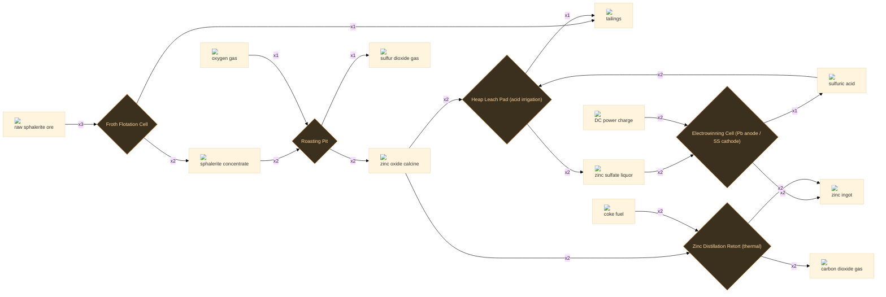

:ci[concentrate_sphalerite|2] :ci[waste_tailings|1]

:ci[raw_ore_sphalerite|3] → :ci[concentrate_sphalerite|2] :ci[waste_tailings|1]

Froth Flotation Cell 60s T2 40 kJ +1 byproduct

Froth-float sphalerite to a zinc-sulfide concentrate, rejecting the silica gangue as tailings.

<code>zn_froth_flotation</code>

:ci[metal_zinc_ingot|2] :ci[acid_sulfuric|1]

:ci[zinc_sulfate_solution|2] :ci[dc_charge|2] → :ci[metal_zinc_ingot|2] :ci[acid_sulfuric|1]

Electrowinning Cell (Pb anode / SS cathode) 150s T4 380 kJ +1 byproduct

Electrowin zinc onto aluminium cathodes; the cell regenerates sulfuric acid that is piped straight back to the leach, closing the acid loop. Strip, melt and cast to ingot.

<code>zn_electrowin</code>

:ci[metal_zinc_ingot|2] :ci[gas_co2|2]

:ci[zinc_calcine_oxide|2] :ci[coke_fuel|2] → :ci[metal_zinc_ingot|2] :ci[gas_co2|2]

Zinc Distillation Retort (thermal) 180s T3 260 kJ +1 byproduct

The old way: reduce the calcine with coke and distil the zinc off as vapour (zinc boils at 907 C), condensing it to metal. Energy-hungry but needs no electricity -- the historic and Imperial-Smelting route.

<code>zn_retort_thermal</code>

:ci[zinc_calcine_oxide|2] :ci[gas_so2|1]

:ci[concentrate_sphalerite|2] :ci[gas_oxygen|1] → :ci[zinc_calcine_oxide|2] :ci[gas_so2|1]

Roasting Pit 110s T3 120 kJ +1 byproduct

Roast the concentrate: ZnS burns to ZnO calcine, the sulfur leaving as SO2 for the contact acid plant. Both zinc routes start from this calcine.

<code>zn_roast</code>

:ci[zinc_sulfate_solution|2] :ci[waste_tailings|1]

:ci[zinc_calcine_oxide|2] :ci[acid_sulfuric|2] → :ci[zinc_sulfate_solution|2] :ci[waste_tailings|1]

Heap Leach Pad (acid irrigation) 120s T3 80 kJ +1 byproduct

Leach the calcine in sulfuric acid to a zinc sulfate liquor, leaving the iron-rich residue behind.

<code>zn_leach</code>

