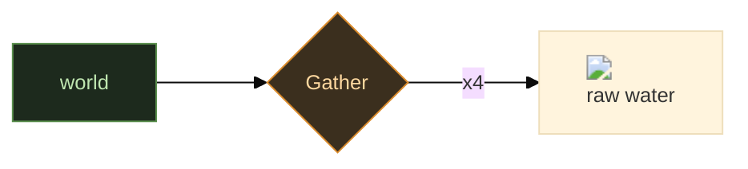

# Fabrication & High Tech

260 recipes

## Item-defined recipes

216 recipes

:ci[raw_ore_fluorite|1] :ci[acid_sulfuric|1] → :ci[acid_hydrofluoric|1] :ci[waste_gypsum_refined|1]

<a class="stn-link" href="../../stations/#arc_furnace_electric">Electric Arc Furnace</a> +1 byproduct

<code>emb_acid_hydrofluoric</code>

:ci[coal_tar|1] :ci[gas_ammonia|1] → :ci[acrylonitrile|1]

<a class="stn-link" href="../../stations/#arc_furnace_electric">Electric Arc Furnace</a>

<code>emb_acrylonitrile</code>

:ci[steel_plate_rolled|1] :ci[copper_wire_insulated|1] :ci[magnet_core_wrought|1] → :ci[alarm_bell_electric|1]

<a class="stn-link" href="../../stations/#machine_shop_electric">Electric Machine Shop</a>

<code>emb_alarm_bell_electric</code>

:ci[metal_aluminum_ingot|3] :ci[copper_ingot_refined|1] → :ci[alloy_aluminum_aerospace|1]

<a class="stn-link" href="../../stations/#arc_furnace_electric">Electric Arc Furnace</a>

<code>emb_alloy_aluminum_aerospace</code>

:ci[titanium_ingot|3] :ci[metal_aluminum_ingot|1] → :ci[alloy_ti_6al_4v|1]

<a class="stn-link" href="../../stations/#arc_furnace_electric">Electric Arc Furnace</a>

<code>emb_alloy_ti_6al_4v</code>

:ci[gas_ammonia|1] :ci[water_raw|1] → :ci[ammonium_hydroxide|1]

<a class="stn-link" href="../../stations/#station_fluid_handler">Fluid Handler</a>

<code>emb_mix_ammonia_solution</code>

:ci[antler|1] → :ci[antler_needle|1]

Hand

<code>emb_antler_needle</code>

:ci[stone_river_rounded|4] :ci[log_medium_dry|1] :ci[rope|1] → :ci[anvil_stone|1]

<a class="stn-link" href="../../stations/#camp_marker_basic">Camp Marker</a>

<code>emb_anvil_stone</code>

:ci[steel_plate_rolled|1] :ci[refractory_brick_silica|1] :ci[copper_wire_drawn|1] :ci[copper_wire_drawn|1] → :ci[arc_furnace_electric|1]

<a class="stn-link" href="../../stations/#machine_shop_electric">Electric Machine Shop</a>

<code>emb_arc_furnace_electric</code>

:ci[steel_plate_rolled|1] :ci[steel_shaft|1] → :ci[armature_core_laminated|1]

<a class="stn-link" href="../../stations/#machine_shop_steam">Steam Machine Shop</a>

<code>emb_armature_core_laminated</code>

:ci[feather_dark|1] :ci[plant_fibers|1] → :ci[arrow_fletching|1]

Hand

<code>emb_arrow_fletching</code>

:ci[steel_plate_rolled|1] :ci[electric_motor_small_dc|1] :ci[plain_bearing_wood|1] → :ci[assembler_workshop|1]

<a class="stn-link" href="../../stations/#machine_shop_electric">Electric Machine Shop</a>

<code>emb_assembler_workshop</code>

:ci[motor_ac_induction_small|2] :ci[magnet_core_wrought|2] :ci[avionics_flight_computer|1] → :ci[attitude_control_array|1]

<a class="stn-link" href="../../stations/#assembler_workshop">Assembly Cell</a>

<code>emb_attitude_control_array</code>

:ci[computer_industrial_rugged|1] :ci[plc_rack_basic|1] :ci[diode_silicon_small|2] → :ci[avionics_flight_computer|1]

<a class="stn-link" href="../../stations/#machine_shop_electric">Electric Machine Shop</a>

<code>emb_avionics_flight_computer</code>

:ci[wrought_iron_bar|1] :ci[iron_strap|1] :ci[wood|1] → :ci[beam_frame_wrought|1]

<a class="stn-link" href="../../stations/#workbench">Workbench</a>

<code>emb_beam_frame_wrought</code>

:ci[wood|1] :ci[hide|1] :ci[rope|1] → :ci[bellows|1]

<a class="stn-link" href="../../stations/#workbench">Workbench</a>

<code>emb_bellows</code>

:ci[pig_iron_ingot|1] :ci[wood|1] → :ci[belt_pulley_iron|1]

<a class="stn-link" href="../../stations/#iron_anvil_block">Iron Anvil</a>

<code>emb_belt_pulley_iron</code>

:ci[refractory_brick_fireclay|1] :ci[pig_iron_ingot|1] → :ci[bessemer_converter_basic|1]

<a class="stn-link" href="../../stations/#workbench">Workbench</a>

<code>emb_bessemer_converter_basic</code>

:ci[refractory_brick_fireclay|1] :ci[stone|1] :ci[coke_fuel|1] :ci[limestone_rock|1] → :ci[blast_furnace_small|1]

<a class="stn-link" href="../../stations/#workbench">Workbench</a>

<code>emb_blast_furnace_small</code>

:ci[wood|1] → :ci[board_plank_rough|1]

<a class="stn-link" href="../../stations/#carving_bench">Carving Bench</a>

<code>emb_board_plank_rough</code>

:ci[plant_fibers|1] :ci[wood|1] :ci[tar|1] → :ci[boiler_lagging_mat|1]

<a class="stn-link" href="../../stations/#workbench">Workbench</a>

<code>emb_boiler_lagging_mat</code>

:ci[wrought_iron_bar|1] :ci[iron_strap|1] → :ci[boiler_shell_riveted|1]

<a class="stn-link" href="../../stations/#workbench">Workbench</a>

<code>emb_boiler_shell_riveted</code>

:ci[bronze_ingot|1] :ci[bronze_ingot|1] → :ci[bronze_tool_blank|1]

<a class="stn-link" href="../../stations/#clay_crucible_small">Clay Crucible</a>

<code>emb_bronze_tool_blank</code>

:ci[coke_fuel|1] :ci[pitch|1] → :ci[brush_block_carbon|1]

<a class="stn-link" href="../../stations/#workbench">Workbench</a>

<code>emb_brush_block_carbon</code>

:ci[bucket_clay|1] :ci[water_raw|1] → :ci[bucket_clay_water_raw|1]

<a class="stn-link" href="../../stations/#station_fluid_handler">Fluid Handler</a>

<code>emb_bucket_clay_water_raw</code>

:ci[bucket_iron|1] :ci[water_raw|1] → :ci[bucket_iron_water_raw|1]

<a class="stn-link" href="../../stations/#station_fluid_handler">Fluid Handler</a>

<code>emb_bucket_iron_water_raw</code>

:ci[bucket_wood|1] :ci[water_raw|1] → :ci[bucket_wood_water_raw|1]

<a class="stn-link" href="../../stations/#station_fluid_handler">Fluid Handler</a>

<code>emb_bucket_wood_water_raw</code>

:ci[limestone_rock|1] → :ci[burned_lime_quicklime|1] :ci[gas_co2|1]

<a class="stn-link" href="../../stations/#earthen_kiln_updraft">Earthen Kiln</a> +1 byproduct

<code>emb_burned_lime_quicklime</code>

:ci[copper_ingot_refined|1] → :ci[bus_bar_copper|1]

<a class="stn-link" href="../../stations/#workbench">Workbench</a>

<code>emb_bus_bar_copper</code>

:ci[cactus_fruit|1] → :ci[cactus_water|1]

Hand

<code>emb_cactus_water</code>

:ci[coke_fuel|3] :ci[coal_tar|1] → :ci[carbon_anode|1]

<a class="stn-link" href="../../stations/#arc_furnace_electric">Electric Arc Furnace</a>

<code>emb_carbon_anode</code>

:ci[pan_fiber|1] → :ci[carbon_fiber|1]

<a class="stn-link" href="../../stations/#arc_furnace_electric">Electric Arc Furnace</a>

<code>emb_carbon_fiber</code>

:ci[plant_fibers|1] :ci[pitch|1] :ci[charcoal|1] → :ci[carbon_filament_preform|1]

<a class="stn-link" href="../../stations/#earthen_kiln_updraft">Earthen Kiln</a>

<code>emb_carbon_filament_preform</code>

:ci[silicon_wafer_raw|1] :ci[copper_wire_drawn|1] → :ci[cell_photovoltaic|1]

<a class="stn-link" href="../../stations/#machine_shop_electric">Electric Machine Shop</a>

<code>emb_cell_photovoltaic</code>

:ci[carbon_fiber|2] :ci[epoxy_resin|1] → :ci[cfrp_panel|1]

<a class="stn-link" href="../../stations/#assembler_workshop">Assembly Cell</a>

<code>emb_cfrp_panel</code>

:ci[chitin|1] :ci[chitin|1] :ci[rope|1] → :ci[chitin_plating|1]

Hand

<code>emb_chitin_plating</code>

:ci[board_plank_rough|2] :ci[rope|1] → :ci[chute_wood|1]

<a class="stn-link" href="../../stations/#camp_marker_basic">Camp Marker</a>

<code>emb_chute_wood</code>

:ci[earthenware_brick|8] :ci[clay|4] :ci[clay_tuyere|2] :ci[charcoal|10] → :ci[clay_bloomery_furnace|1]

<a class="stn-link" href="../../stations/#earthen_kiln_updraft">Earthen Kiln</a>

<code>emb_clay_bloomery_furnace</code>

:ci[earthenware_brick|1] :ci[sand|1] :ci[clay|1] → :ci[clay_casting_pit|1]

<a class="stn-link" href="../../stations/#earthen_kiln_updraft">Earthen Kiln</a>

<code>emb_clay_casting_pit</code>

:ci[clay|1] :ci[grog_crushed_ceramic_temper|1] → :ci[clay_crucible_small|1]

<a class="stn-link" href="../../stations/#earthen_kiln_updraft">Earthen Kiln</a>

<code>emb_clay_crucible_small</code>

:ci[clay|1] → :ci[clay_tuyere|1]

<a class="stn-link" href="../../stations/#earthen_kiln_updraft">Earthen Kiln</a>

<code>emb_clay_tuyere</code>

:ci[plc_rack_basic|1] :ci[plc_cpu_module|1] :ci[steel_shaft|4] :ci[steel_beam|2] :ci[motor_ac_induction_small|1] → :ci[cnc_lathe_basic|1]

<a class="stn-link" href="../../stations/#machine_shop_electric">Electric Machine Shop</a>

<code>emb_cnc_lathe_basic</code>

:ci[plc_rack_basic|1] :ci[plc_cpu_module|1] :ci[steel_beam|3] :ci[steel_plate_rolled|1] :ci[motor_ac_induction_small|1] → :ci[cnc_mill_basic|1]

<a class="stn-link" href="../../stations/#machine_shop_electric">Electric Machine Shop</a>

<code>emb_cnc_mill_basic</code>

:ci[coconut|1] → :ci[coconut_flesh|1]

Hand

<code>emb_coconut_flesh</code>

:ci[coal_bituminous|1] → :ci[coke_fuel|1] :ci[coal_tar|1] :ci[gas_syngas|1]

<a class="stn-link" href="../../stations/#coke_oven_beehive">Beehive Coke Oven</a> +2 byproducts

<code>emb_coke_fuel</code>

:ci[coal_bituminous|12] → :ci[coke_fuel|10] :ci[coal_tar|1]

<a class="stn-link" href="../../stations/#coke_oven_beehive">Beehive Coke Oven</a> +1 byproduct

<code>emb_coal_tar</code>

:ci[earthenware_brick|1] :ci[stone|1] :ci[coal_bituminous|1] → :ci[coke_oven_beehive|1]

<a class="stn-link" href="../../stations/#workbench">Workbench</a>

<code>emb_coke_oven_beehive</code>

:ci[copper_ingot_refined|1] :ci[resin|1] :ci[wood|1] → :ci[commutator_copper_segmented|1]

<a class="stn-link" href="../../stations/#machine_shop_steam">Steam Machine Shop</a>

<code>emb_commutator_copper_segmented</code>

:ci[plc_rack_basic|1] :ci[plc_cpu_module|1] :ci[plc_io_module|1] :ci[steel_plate_rolled|1] :ci[incandescent_lamp_carbon|1] :ci[bus_bar_copper|1] → :ci[computer_industrial_rugged|1]

<a class="stn-link" href="../../stations/#machine_shop_electric">Electric Machine Shop</a>

<code>emb_computer_industrial_rugged</code>

:ci[raw_ore_chalcopyrite|3] → :ci[concentrate_chalcopyrite|2]

<a class="stn-link" href="../../stations/#stamp_mill_manual_trip_hammer">Trip Hammer</a>

<code>emb_concentrate_chalcopyrite</code>

:ci[steam_pipe_wrought|1] :ci[wooden_tub|1] → :ci[condenser_jet|1]

<a class="stn-link" href="../../stations/#workbench">Workbench</a>

<code>emb_condenser_jet</code>

:ci[wrought_iron_bar|1] :ci[plain_bearing_wood|1] → :ci[connecting_rod_wrought|1]

<a class="stn-link" href="../../stations/#iron_anvil_block">Iron Anvil</a>

<code>emb_connecting_rod_wrought</code>

:ci[steel_plate_rolled|1] :ci[steel_shaft|1] :ci[bronze_ingot|1] → :ci[control_valve_steam|1]

<a class="stn-link" href="../../stations/#machine_shop_steam">Steam Machine Shop</a>

<code>emb_control_valve_steam</code>

:ci[logic_module_flipflop|1] :ci[steel_plate_rolled|1] :ci[copper_wire_drawn|1] → :ci[controller_program_cartridge|1]

<a class="stn-link" href="../../stations/#machine_shop_electric">Electric Machine Shop</a>

<code>emb_controller_program_cartridge</code>

:ci[sensor_pressure_boiler|1] :ci[sensor_level_tank|1] :ci[relay_electromagnetic|1] :ci[control_valve_steam|1] → :ci[controller_regulator_pneumatic|1]

<a class="stn-link" href="../../stations/#machine_shop_electric">Electric Machine Shop</a>

<code>emb_controller_regulator_pneumatic</code>

:ci[motor_ac_induction_small|1] :ci[steel_beam|1] :ci[flat_belt_leather|1] → :ci[conveyor_powered|1]

<a class="stn-link" href="../../stations/#machine_shop_electric">Electric Machine Shop</a>

<code>emb_conveyor_powered</code>

:ci[wood|1] :ci[wooden_peg|1] → :ci[cooling_tank_wooden|1]

<a class="stn-link" href="../../stations/#workbench">Workbench</a>

<code>emb_cooling_tank_wooden</code>

:ci[raw_ore_native_copper|3] → :ci[copper_nugget_hammered|1]

<a class="stn-link" href="../../stations/#anvil_stone">Stone Anvil</a>

<code>emb_copper_nugget_hammered</code>

:ci[copper_ingot_refined|1] → :ci[copper_wire_drawn|1]

<a class="stn-link" href="../../stations/#wire_drawing_bench">Wire Drawing Bench</a>

<code>emb_copper_wire_drawn</code>

:ci[copper_wire_drawn|1] :ci[resin|1] :ci[sail_cloth|1] → :ci[copper_wire_insulated|1]

<a class="stn-link" href="../../stations/#workbench">Workbench</a>

<code>emb_copper_wire_insulated</code>

:ci[wrought_iron_bar|1] → :ci[crank_iron_forged|1]

<a class="stn-link" href="../../stations/#iron_anvil_block">Iron Anvil</a>

<code>emb_crank_iron_forged</code>

:ci[acid_hydrofluoric|3] :ci[intermediate_alumina|1] :ci[sodium_hydroxide|1] → :ci[cryolite|1]

<a class="stn-link" href="../../stations/#arc_furnace_electric">Electric Arc Furnace</a>

<code>emb_cryolite</code>

:ci[cylinder_gas_basic|1] :ci[gas_ammonia|1] → :ci[cylinder_ammonia|1]

<a class="stn-link" href="../../stations/#station_gas_compressor">Gas Compressor</a>

<code>emb_cylinder_ammonia</code>

:ci[cylinder_gas_basic|1] :ci[gas_hydrogen|1] → :ci[cylinder_hydrogen|1]

<a class="stn-link" href="../../stations/#station_gas_compressor">Gas Compressor</a>

<code>emb_cylinder_hydrogen</code>

:ci[cylinder_gas_basic|1] :ci[gas_nitrogen|1] → :ci[cylinder_nitrogen|1]

<a class="stn-link" href="../../stations/#station_gas_compressor">Gas Compressor</a>

<code>emb_cylinder_nitrogen</code>

:ci[cylinder_gas_basic|1] :ci[gas_oxygen|1] → :ci[cylinder_oxygen|1]

<a class="stn-link" href="../../stations/#station_gas_compressor">Gas Compressor</a>

<code>emb_cylinder_oxygen</code>

:ci[silicon_wafer_raw|1] :ci[copper_wire_drawn|1] → :ci[diode_silicon_small|4]

<a class="stn-link" href="../../stations/#glass_bench">Glass Bench</a>

<code>emb_diode_silicon_small</code>

:ci[alloy_aluminum_aerospace|4] :ci[steel_shaft|2] :ci[control_valve_steam|1] → :ci[docking_port_standard|1]

<a class="stn-link" href="../../stations/#assembler_workshop">Assembly Cell</a>

<code>emb_docking_port_standard</code>

:ci[feather_white|1] :ci[feather_white|1] → :ci[down_insulation|1]

Hand

<code>emb_down_insulation</code>

:ci[motor_ac_induction_small|2] :ci[steel_shaft|3] :ci[avionics_flight_computer|1] → :ci[drill_regolith_robotic|1]

<a class="stn-link" href="../../stations/#assembler_workshop">Assembly Cell</a>

<code>emb_drill_regolith_robotic</code>

:ci[steel_shaft|1] :ci[copper_wire_drawn|1] :ci[magnet_core_wrought|1] → :ci[dynamo_dc_workshop|1]

<a class="stn-link" href="../../stations/#machine_shop_steam">Steam Machine Shop</a>

<code>emb_dynamo_dc_workshop</code>

:ci[steel_shaft|1] :ci[copper_wire_insulated|1] :ci[magnet_core_wrought|1] → :ci[electric_motor_small_dc|1]

<a class="stn-link" href="../../stations/#machine_shop_steam">Steam Machine Shop</a>

<code>emb_electric_motor_small_dc</code>

:ci[coal_tar|1] :ci[sodium_hydroxide|1] → :ci[epoxy_resin|1]

<a class="stn-link" href="../../stations/#machine_shop_electric">Electric Machine Shop</a>

<code>emb_epoxy_resin</code>

:ci[wrought_iron_bar|1] :ci[steam_pipe_wrought|1] → :ci[feedwater_pump_simple|1]

<a class="stn-link" href="../../stations/#workbench">Workbench</a>

<code>emb_feedwater_pump_simple</code>

:ci[copper_wire_insulated|1] :ci[armature_core_laminated|1] :ci[magnet_core_wrought|1] → :ci[filament_supply_dc|1]

<a class="stn-link" href="../../stations/#machine_shop_steam">Steam Machine Shop</a>

<code>emb_filament_supply_dc</code>

:ci[stick_dry_small|1] :ci[stick_dry_small|1] :ci[rope|1] :ci[tool_stone_flake|1] → :ci[fire_drill_kit|1]

Hand

<code>emb_fire_drill_kit</code>

:ci[pig_iron_ingot|1] → :ci[firebox_cast_iron|1]

<a class="stn-link" href="../../stations/#clay_casting_pit">Clay Casting Pit</a>

<code>emb_firebox_cast_iron</code>

:ci[clay|1] :ci[temper_sand_or_grog|1] → :ci[fireclay_refractory|1]

<a class="stn-link" href="../../stations/#earthen_kiln_updraft">Earthen Kiln</a>

<code>emb_fireclay_refractory</code>

:ci[stick_dry_small|2] :ci[plant_fibers|3] :ci[stone_knife_flake|1] → :ci[fishing_rod_basic|1]

<a class="stn-link" href="../../stations/#camp_marker_basic">Camp Marker</a>

<code>emb_fishing_rod_basic</code>

:ci[hide|1] :ci[grease_tallow|1] → :ci[flat_belt_leather|1]

<a class="stn-link" href="../../stations/#lever_press">Lever Press</a>

<code>emb_flat_belt_leather</code>

:ci[wrought_iron_bar|1] :ci[bronze_ingot|1] → :ci[flyball_governor|1]

<a class="stn-link" href="../../stations/#iron_anvil_block">Iron Anvil</a>

<code>emb_flyball_governor</code>

:ci[wood|1] :ci[stone|1] :ci[rope|1] → :ci[flywheel|1]

<a class="stn-link" href="../../stations/#workbench">Workbench</a>

<code>emb_flywheel</code>

:ci[foraged_berries|1] :ci[foraged_berries|1] → :ci[food_berries_safe|1]

Hand

<code>emb_foraged_berries</code>

:ci[food_berries_safe|1] :ci[food_nuts_safe|1] → :ci[food_cooked_simple|1] :ci[wood_ash|1]

<a class="stn-link" href="../../stations/#campfire_survival">Survival Campfire</a> +1 byproduct

<code>emb_food_cooked_simple</code>

:ci[forest_leaf_scatter|1] :ci[forest_leaf_scatter|1] → :ci[forest_leaf_mat_packed|1]

Hand

<code>emb_forest_leaf_mat_packed</code>

:ci[forest_moss_tuft_small|1] :ci[forest_moss_tuft_small|1] → :ci[forest_moss_mat|1]

Hand

<code>emb_forest_moss_mat</code>

:ci[earthenware_brick|6] :ci[clay|3] :ci[clay_tuyere|1] :ci[bellows|1] → :ci[forge_hearth|1]

<a class="stn-link" href="../../stations/#workbench">Workbench</a>

<code>emb_forge_hearth</code>

:ci[gas_syngas|3] → :ci[fuel_kerosene_synthetic|1]

<a class="stn-link" href="../../stations/#arc_furnace_electric">Electric Arc Furnace</a>

<code>emb_fuel_kerosene_synthetic</code>

:ci[pelt_white|1] → :ci[fur_white_cured|1]

<a class="stn-link" href="../../stations/#drying_rack_survival">Drying Rack</a>

<code>emb_fur_white_cured</code>

:ci[porcelain_insulator_pin|1] :ci[copper_wire_drawn|1] → :ci[fuse_rewireable|1]

<a class="stn-link" href="../../stations/#workbench">Workbench</a>

<code>emb_fuse_rewireable</code>

:ci[gas_chlorine|1] :ci[gas_hydrogen|1] → :ci[gas_hcl|2]

<a class="stn-link" href="../../stations/#arc_furnace_electric">Electric Arc Furnace</a>

<code>emb_gas_hcl</code>

:ci[coke_fuel|1] :ci[water_raw|1] → :ci[gas_syngas|1]

<a class="stn-link" href="../../stations/#arc_furnace_electric">Electric Arc Furnace</a>

<code>emb_gas_syngas</code>

:ci[steel_shaft|1] :ci[armature_core_laminated|1] :ci[magnet_core_wrought|1] :ci[copper_wire_insulated|1] :ci[steel_plate_rolled|1] → :ci[generator_ac_small|1]

<a class="stn-link" href="../../stations/#machine_shop_electric">Electric Machine Shop</a>

<code>emb_generator_ac_small</code>

:ci[generator_ac_small|1] :ci[copper_wire_insulated|1] :ci[bus_bar_copper|1] :ci[steel_beam|1] → :ci[generator_ac_three_phase|1]

<a class="stn-link" href="../../stations/#machine_shop_electric">Electric Machine Shop</a>

<code>emb_generator_ac_three_phase</code>

:ci[hemp_fiber|1] :ci[grease_tallow|1] → :ci[gland_packing_steam|1]

<a class="stn-link" href="../../stations/#workbench">Workbench</a>

<code>emb_gland_packing_steam</code>

:ci[steel_plate_rolled|1] :ci[refractory_brick_fireclay|1] :ci[steel_beam|1] → :ci[glass_bench|1]

<a class="stn-link" href="../../stations/#machine_shop_steam">Steam Machine Shop</a>

<code>emb_glass_bench</code>

:ci[raw_ore_silica|2] :ci[charcoal|2] → :ci[glass_tube|4]

<a class="stn-link" href="../../stations/#glass_bench">Glass Bench</a>

<code>emb_glass_tube</code>

:ci[copper_wire_insulated|4] :ci[magnet_core_wrought|2] :ci[avionics_flight_computer|1] → :ci[guidance_coil_array|1]

<a class="stn-link" href="../../stations/#machine_shop_electric">Electric Machine Shop</a>

<code>emb_guidance_coil_array</code>

:ci[metal_aluminum_sheet|4] :ci[steel_beam|2] → :ci[hopper_regolith_bulk|1]

<a class="stn-link" href="../../stations/#assembler_workshop">Assembly Cell</a>

<code>emb_hopper_regolith_bulk</code>

:ci[blast_furnace_small|1] :ci[refractory_brick_fireclay|1] → :ci[hot_blast_stove|1]

<a class="stn-link" href="../../stations/#workbench">Workbench</a>

<code>emb_hot_blast_stove</code>

:ci[copper_wire_insulated|1] :ci[carbon_filament_preform|1] → :ci[incandescent_lamp_carbon|1]

<a class="stn-link" href="../../stations/#glass_bench">Glass Bench</a>

<code>emb_incandescent_lamp_carbon</code>

:ci[nickel_cathode|3] :ci[ferrochrome|1] :ci[steel_ingot|1] :ci[ferroniobium|1] → :ci[inconel_ingot|1]

<a class="stn-link" href="../../stations/#arc_furnace_electric">Electric Arc Furnace</a>

<code>emb_inconel_ingot</code>

:ci[copper_wire_insulated|1] :ci[steel_plate_rolled|1] :ci[glass_bench|1] → :ci[instrument_ammeter_panel|1]

<a class="stn-link" href="../../stations/#machine_shop_electric">Electric Machine Shop</a>

<code>emb_instrument_ammeter_panel</code>

:ci[copper_wire_insulated|1] :ci[steel_plate_rolled|1] :ci[glass_bench|1] → :ci[instrument_voltmeter_panel|1]

<a class="stn-link" href="../../stations/#machine_shop_electric">Electric Machine Shop</a>

<code>emb_instrument_voltmeter_panel</code>

:ci[wrought_iron_bar|4] → :ci[iron_anvil_block|1]

<a class="stn-link" href="../../stations/#workbench">Workbench</a>

<code>emb_iron_anvil_block</code>

:ci[wrought_iron_bar|2] → :ci[iron_hammer_head|1]

<a class="stn-link" href="../../stations/#iron_anvil_block">Iron Anvil</a>

<code>emb_iron_hammer_head</code>

:ci[wrought_iron_bar|1] → :ci[iron_plate_hand|1]

<a class="stn-link" href="../../stations/#iron_anvil_block">Iron Anvil</a>

<code>emb_iron_plate_hand</code>

:ci[iron_rod_wrought|1] → :ci[iron_rivet_hand|1]

<a class="stn-link" href="../../stations/#iron_anvil_block">Iron Anvil</a>

<code>emb_iron_rivet_hand</code>

:ci[wrought_iron_bar|1] → :ci[iron_rod_wrought|1]

<a class="stn-link" href="../../stations/#iron_anvil_block">Iron Anvil</a>

<code>emb_iron_rod_wrought</code>

:ci[wrought_iron_bar|1] → :ci[iron_strap|1]

<a class="stn-link" href="../../stations/#iron_anvil_block">Iron Anvil</a>

<code>emb_iron_strap</code>

:ci[wrought_iron_bar|1] → :ci[iron_tool_blank|1]

<a class="stn-link" href="../../stations/#iron_anvil_block">Iron Anvil</a>

<code>emb_iron_tool_blank</code>

:ci[drill_regolith_robotic|1] :ci[motor_ac_induction_small|2] :ci[cell_photovoltaic|2] → :ci[isru_ice_extractor_demo|1]

<a class="stn-link" href="../../stations/#assembler_workshop">Assembly Cell</a>

<code>emb_isru_ice_extractor_demo</code>

:ci[steel_plate_rolled|1] :ci[copper_ingot_refined|1] → :ci[knife_switch_heavy|1]

<a class="stn-link" href="../../stations/#workbench">Workbench</a>

<code>emb_knife_switch_heavy</code>

:ci[steel_plate_rolled|1] :ci[incandescent_lamp_carbon|1] → :ci[lamp_fixture_industrial|1]

<a class="stn-link" href="../../stations/#workbench">Workbench</a>

<code>emb_lamp_fixture_industrial</code>

:ci[fireclay_refractory|1] :ci[copper_wire_insulated|1] → :ci[lamp_socket_porcelain|1]

<a class="stn-link" href="../../stations/#earthen_kiln_updraft">Earthen Kiln</a>

<code>emb_lamp_socket_porcelain</code>

:ci[tank_propellant_aluminum|1] :ci[rocket_engine_kerolox_test|1] :ci[attitude_control_array|1] :ci[avionics_flight_computer|1] :ci[alloy_aluminum_aerospace|4] → :ci[lander_lunar_robotic|1]

<a class="stn-link" href="../../stations/#assembler_workshop">Assembly Cell</a>

<code>emb_lander_lunar_robotic</code>

:ci[steel_plate_rolled|1] :ci[steel_shaft|1] :ci[plain_bearing_wood|1] → :ci[lathe_workshop|1]

<a class="stn-link" href="../../stations/#machine_shop_steam">Steam Machine Shop</a>

<code>emb_lathe_workshop</code>

:ci[steel_beam|8] :ci[refractory_brick_silica|4] :ci[control_valve_steam|2] → :ci[launch_pad_complex_basic|1]

<a class="stn-link" href="../../stations/#assembler_workshop">Assembly Cell</a>

<code>emb_launch_pad_complex_basic</code>

:ci[wood|1] :ci[stone|1] :ci[rope|1] → :ci[lever_press|1]

<a class="stn-link" href="../../stations/#workbench">Workbench</a>

<code>emb_lever_press</code>

:ci[vacuum_pump_lab|1] :ci[control_valve_steam|2] :ci[sensor_pressure_boiler|1] :ci[alloy_aluminum_aerospace|2] → :ci[life_support_loop_basic|1]

<a class="stn-link" href="../../stations/#assembler_workshop">Assembly Cell</a>

<code>emb_life_support_loop_basic</code>

:ci[raw_ore_limestone|3] → :ci[limestone_flux|2] :ci[burned_lime_quicklime|1]

<a class="stn-link" href="../../stations/#stamp_mill_manual_trip_hammer">Trip Hammer</a> +1 byproduct

<code>emb_limestone_flux</code>

:ci[raw_ore_limestone|1] → :ci[limestone_rock|1]

Hand

<code>emb_limestone_rock</code>

:ci[wrought_iron_bar|1] :ci[plain_bearing_wood|1] → :ci[line_shaft_wrought|1]

<a class="stn-link" href="../../stations/#workbench">Workbench</a>

<code>emb_line_shaft_wrought</code>

:ci[silicon_wafer_polished|1] :ci[copper_wire_drawn|1] → :ci[logic_chip|4]

<a class="stn-link" href="../../stations/#machine_shop_electric">Electric Machine Shop</a>

<code>emb_logic_chip</code>

:ci[transistor_npn_signal|4] :ci[diode_silicon_small|2] :ci[steel_plate_rolled|1] → :ci[logic_module_and_or|1]

<a class="stn-link" href="../../stations/#machine_shop_electric">Electric Machine Shop</a>

<code>emb_logic_module_and_or</code>

:ci[transistor_npn_signal|4] :ci[diode_silicon_small|2] :ci[steel_plate_rolled|1] → :ci[logic_module_flipflop|1]

<a class="stn-link" href="../../stations/#machine_shop_electric">Electric Machine Shop</a>

<code>emb_logic_module_flipflop</code>

:ci[transistor_npn_signal|1] :ci[diode_silicon_small|1] :ci[steel_plate_rolled|1] → :ci[logic_module_not|1]

<a class="stn-link" href="../../stations/#machine_shop_electric">Electric Machine Shop</a>

<code>emb_logic_module_not</code>

:ci[machine_shop_steam|1] :ci[electric_motor_small_dc|1] :ci[copper_wire_insulated|1] → :ci[machine_shop_electric|1]

<a class="stn-link" href="../../stations/#machine_shop_steam">Steam Machine Shop</a>

<code>emb_machine_shop_electric</code>

:ci[steel_beam|1] :ci[line_shaft_wrought|1] :ci[iron_anvil_block|1] → :ci[machine_shop_steam|1]

<a class="stn-link" href="../../stations/#workbench">Workbench</a>

<code>emb_machine_shop_steam</code>

:ci[wrought_iron_bar|1] → :ci[magnet_core_wrought|1]

<a class="stn-link" href="../../stations/#iron_anvil_block">Iron Anvil</a>

<code>emb_magnet_core_wrought</code>

:ci[magnet_core_wrought|8] :ci[copper_wire_insulated|6] :ci[steel_beam|4] :ci[transformer_step_up|1] → :ci[mass_driver_lunar_track|1]

<a class="stn-link" href="../../stations/#assembler_workshop">Assembly Cell</a>

<code>emb_mass_driver_lunar_track</code>

:ci[metal_aluminum_ingot|2] → :ci[metal_aluminum_sheet|1]

<a class="stn-link" href="../../stations/#rolling_mill_steam">Steam Rolling Mill</a>

<code>emb_metal_aluminum_sheet</code>

:ci[transformer_step_up|2] :ci[copper_wire_insulated|4] :ci[avionics_flight_computer|1] :ci[steel_plate_rolled|2] → :ci[microwave_beamer_downlink|1]

<a class="stn-link" href="../../stations/#machine_shop_electric">Electric Machine Shop</a>

<code>emb_microwave_beamer_downlink</code>

:ci[steel_shaft|1] :ci[armature_core_laminated|1] :ci[magnet_core_wrought|1] :ci[copper_wire_insulated|1] :ci[steel_plate_rolled|1] → :ci[motor_ac_induction_small|1]

<a class="stn-link" href="../../stations/#machine_shop_electric">Electric Machine Shop</a>

<code>emb_motor_ac_induction_small</code>

:ci[switchboard_panel_wooden|1] :ci[bus_bar_copper|1] :ci[copper_wire_insulated|1] :ci[porcelain_insulator_pin|1] :ci[steel_beam|1] → :ci[network_ac_district|1]

<a class="stn-link" href="../../stations/#machine_shop_electric">Electric Machine Shop</a>

<code>emb_network_ac_district</code>

:ci[refractory_brick_silica|1] :ci[slag_ironmaking|1] :ci[pig_iron_ingot|1] → :ci[open_hearth_furnace_basic|1]

<a class="stn-link" href="../../stations/#workbench">Workbench</a>

<code>emb_open_hearth_furnace_basic</code>

:ci[ore_iron_rock|1] → :ci[ore_iron_concentrate|1] :ci[tailings|1]

<a class="stn-link" href="../../stations/#stamp_mill_manual_trip_hammer">Trip Hammer</a> +1 byproduct

<code>emb_ore_iron_concentrate</code>

:ci[acrylonitrile|4] → :ci[pan_fiber|1]

<a class="stn-link" href="../../stations/#machine_shop_electric">Electric Machine Shop</a>

<code>emb_pan_fiber</code>

:ci[computer_industrial_rugged|1] :ci[steel_plate_rolled|1] :ci[knife_switch_heavy|1] :ci[incandescent_lamp_carbon|1] → :ci[panel_hmi_basic|1]

<a class="stn-link" href="../../stations/#machine_shop_electric">Electric Machine Shop</a>

<code>emb_panel_hmi_basic</code>

:ci[steel_plate_rolled|1] :ci[bus_bar_copper|1] :ci[instrument_ammeter_panel|1] :ci[instrument_voltmeter_panel|1] :ci[relay_electromagnetic|1] → :ci[panel_mimic_ac_grid|1]

<a class="stn-link" href="../../stations/#machine_shop_electric">Electric Machine Shop</a>

<code>emb_panel_mimic_ac_grid</code>

:ci[crushed_ore_hematite|1] :ci[coke_fuel|1] :ci[limestone_rock|1] → :ci[pig_iron_ingot|1] :ci[slag_ironmaking|1]

<a class="stn-link" href="../../stations/#blast_furnace_small">Blast Furnace</a> +1 byproduct

<code>emb_pig_iron_ingot</code>

:ci[resin|2] :ci[charcoal|1] → :ci[pitch|1]

<a class="stn-link" href="../../stations/#earthen_kiln_updraft">Earthen Kiln</a>

<code>emb_pitch</code>

:ci[logic_module_and_or|8] :ci[logic_module_flipflop|4] :ci[steel_plate_rolled|1] → :ci[plc_cpu_module|1]

<a class="stn-link" href="../../stations/#machine_shop_electric">Electric Machine Shop</a>

<code>emb_plc_cpu_module</code>

:ci[relay_electromagnetic|4] :ci[logic_module_not|4] :ci[steel_plate_rolled|1] → :ci[plc_io_module|1]

<a class="stn-link" href="../../stations/#machine_shop_electric">Electric Machine Shop</a>

<code>emb_plc_io_module</code>

:ci[steel_beam|1] :ci[steel_plate_rolled|1] :ci[bus_bar_copper|1] → :ci[plc_rack_basic|1]

<a class="stn-link" href="../../stations/#machine_shop_electric">Electric Machine Shop</a>

<code>emb_plc_rack_basic</code>

:ci[fireclay_refractory|1] → :ci[porcelain_insulator_pin|1]

<a class="stn-link" href="../../stations/#earthen_kiln_updraft">Earthen Kiln</a>

<code>emb_porcelain_insulator_pin</code>

:ci[wood|1] :ci[stone|1] → :ci[potters_wheel_kick|1]

<a class="stn-link" href="../../stations/#workbench">Workbench</a>

<code>emb_potters_wheel_kick</code>

:ci[cell_photovoltaic|12] :ci[alloy_aluminum_aerospace|4] :ci[transformer_step_down|1] :ci[bus_bar_copper|1] → :ci[power_plant_lunar_solar|1]

<a class="stn-link" href="../../stations/#assembler_workshop">Assembly Cell</a>

<code>emb_power_plant_lunar_solar</code>

:ci[fuel_kerosene_synthetic|1] :ci[gas_hydrogen|1] → :ci[propellant_kerosene_refined|1]

<a class="stn-link" href="../../stations/#arc_furnace_electric">Electric Arc Furnace</a>

<code>emb_propellant_kerosene_refined</code>

:ci[gas_oxygen|2] → :ci[propellant_lox_distilled|1]

<a class="stn-link" href="../../stations/#arc_furnace_electric">Electric Arc Furnace</a>

<code>emb_propellant_lox_distilled</code>

:ci[diode_silicon_small|4] :ci[copper_wire_drawn|1] :ci[steel_plate_rolled|1] → :ci[rectifier_bridge_silicon|1]

<a class="stn-link" href="../../stations/#machine_shop_electric">Electric Machine Shop</a>

<code>emb_rectifier_bridge_silicon</code>

:ci[steel_plate_rolled|1] :ci[bus_bar_copper|1] :ci[copper_wire_insulated|1] :ci[refractory_brick_fireclay|1] → :ci[rectifier_mercury_arc|1]

<a class="stn-link" href="../../stations/#machine_shop_electric">Electric Machine Shop</a>

<code>emb_rectifier_mercury_arc</code>

:ci[fireclay_refractory|1] → :ci[refractory_brick_fireclay|1]

<a class="stn-link" href="../../stations/#earthen_kiln_updraft">Earthen Kiln</a>

<code>emb_refractory_brick_fireclay</code>

:ci[sand|1] :ci[fireclay_refractory|1] → :ci[refractory_brick_silica|1]

<a class="stn-link" href="../../stations/#earthen_kiln_updraft">Earthen Kiln</a>

<code>emb_refractory_brick_silica</code>

:ci[steel_plate_rolled|1] :ci[copper_wire_insulated|1] :ci[magnet_core_wrought|1] → :ci[relay_electromagnetic|1]

<a class="stn-link" href="../../stations/#machine_shop_electric">Electric Machine Shop</a>

<code>emb_relay_electromagnetic</code>

:ci[spruce_resin|1] → :ci[resin|1]

Hand

<code>emb_resin</code>

:ci[stone_river_rounded|6] :ci[dirt|4] :ci[log_medium_dry|2] → :ci[roasting_pit|1]

<a class="stn-link" href="../../stations/#camp_marker_basic">Camp Marker</a>

<code>emb_roasting_pit</code>

:ci[motor_ac_induction_small|6] :ci[plc_cpu_module|1] :ci[steel_beam|1] :ci[steel_shaft|1] :ci[bus_bar_copper|1] → :ci[robot_arm_industrial_basic|1]

<a class="stn-link" href="../../stations/#machine_shop_electric">Electric Machine Shop</a>

<code>emb_robot_arm_industrial_basic</code>

:ci[steel_plate_rolled|4] :ci[bus_bar_copper|4] :ci[control_valve_steam|2] :ci[refractory_brick_silica|1] :ci[sensor_pressure_boiler|2] → :ci[rocket_engine_kerolox_test|1]

<a class="stn-link" href="../../stations/#machine_shop_electric">Electric Machine Shop</a>

<code>emb_rocket_engine_kerolox_test</code>

:ci[tank_propellant_aluminum|3] :ci[rocket_engine_kerolox_test|3] :ci[guidance_coil_array|1] :ci[attitude_control_array|1] :ci[avionics_flight_computer|1] → :ci[rocket_stack_orbital_three_stage|1]

<a class="stn-link" href="../../stations/#assembler_workshop">Assembly Cell</a>

<code>emb_rocket_stack_orbital_three_stage</code>

:ci[steel_beam|1] :ci[steel_shaft|1] :ci[steam_engine_simple|1] → :ci[rolling_mill_steam|1]

<a class="stn-link" href="../../stations/#machine_shop_steam">Steam Machine Shop</a>

<code>emb_rolling_mill_steam</code>

:ci[plant_fibers|1] :ci[plant_fibers|1] :ci[plant_fibers|1] :ci[plant_fibers|1] → :ci[rope|1]

Hand

<code>emb_rope</code>

:ci[steel_beam|4] :ci[steel_plate_rolled|2] :ci[knife_switch_heavy|1] → :ci[safety_cage_industrial|1]

<a class="stn-link" href="../../stations/#workbench">Workbench</a>

<code>emb_safety_cage_industrial</code>

:ci[wrought_iron_bar|1] :ci[bronze_ingot|1] → :ci[safety_valve_weighted|1]

<a class="stn-link" href="../../stations/#iron_anvil_block">Iron Anvil</a>

<code>emb_safety_valve_weighted</code>

:ci[acid_sulfuric|1] :ci[sodium_hydroxide|1] → :ci[salt_sodium_sulfate|1] :ci[water_raw|1]

<a class="stn-link" href="../../stations/#station_fluid_handler">Fluid Handler</a> +1 byproduct

<code>emb_mix_neutralization_sulfate</code>

:ci[alloy_aluminum_aerospace|4] :ci[refractory_brick_silica|2] :ci[attitude_control_array|1] :ci[avionics_flight_computer|1] → :ci[sample_return_capsule|1]

<a class="stn-link" href="../../stations/#assembler_workshop">Assembly Cell</a>

<code>emb_sample_return_capsule</code>

:ci[cell_photovoltaic|2] :ci[microwave_beamer_downlink|1] :ci[avionics_flight_computer|1] :ci[attitude_control_array|1] :ci[alloy_aluminum_aerospace|2] → :ci[satellite_comms_basic|1]

<a class="stn-link" href="../../stations/#assembler_workshop">Assembly Cell</a>

<code>emb_satellite_comms_basic</code>

:ci[cell_photovoltaic|2] :ci[avionics_flight_computer|1] :ci[attitude_control_array|1] :ci[alloy_aluminum_aerospace|2] → :ci[satellite_tech_demo|1]

<a class="stn-link" href="../../stations/#assembler_workshop">Assembly Cell</a>

<code>emb_satellite_tech_demo</code>

:ci[steel_plate_rolled|1] :ci[bronze_ingot|1] :ci[copper_wire_insulated|1] → :ci[sensor_level_tank|1]

<a class="stn-link" href="../../stations/#machine_shop_electric">Electric Machine Shop</a>

<code>emb_sensor_level_tank</code>

:ci[relay_electromagnetic|1] :ci[steel_plate_rolled|1] :ci[copper_wire_insulated|1] → :ci[sensor_position_limit|1]

<a class="stn-link" href="../../stations/#machine_shop_electric">Electric Machine Shop</a>

<code>emb_sensor_position_limit</code>

:ci[steel_plate_rolled|1] :ci[bronze_ingot|1] :ci[copper_wire_insulated|1] → :ci[sensor_pressure_boiler|1]

<a class="stn-link" href="../../stations/#machine_shop_electric">Electric Machine Shop</a>

<code>emb_sensor_pressure_boiler</code>

:ci[magnet_core_wrought|1] :ci[relay_electromagnetic|1] :ci[steel_shaft|1] :ci[copper_wire_insulated|1] → :ci[sensor_speed_line|1]

<a class="stn-link" href="../../stations/#machine_shop_electric">Electric Machine Shop</a>

<code>emb_sensor_speed_line</code>

:ci[wood|1] → :ci[shaft_wood_round|1]

<a class="stn-link" href="../../stations/#carving_bench">Carving Bench</a>

<code>emb_shaft_wood_round</code>

:ci[wood|1] :ci[stone|1] → :ci[sheave|1]

<a class="stn-link" href="../../stations/#workbench">Workbench</a>

<code>emb_sheave</code>

:ci[shell_fragment|3] → :ci[shell_lime|1]

<a class="stn-link" href="../../stations/#campfire_survival">Survival Campfire</a>

<code>emb_shell_lime</code>

:ci[raw_ore_halite|1] :ci[dc_charge|2] → :ci[sodium_metal|1] :ci[gas_chlorine|1]

<a class="stn-link" href="../../stations/#arc_furnace_electric">Electric Arc Furnace</a> +1 byproduct

<code>emb_sodium_metal</code>

:ci[cell_photovoltaic|24] :ci[alloy_aluminum_aerospace|8] :ci[microwave_beamer_downlink|1] → :ci[sps_solar_array_huge|1]

<a class="stn-link" href="../../stations/#assembler_workshop">Assembly Cell</a>

<code>emb_sps_solar_array_huge</code>

:ci[steel_ingot|1] :ci[ferrochrome|1] :ci[ferronickel|1] → :ci[stainless_steel_ingot|1] :ci[slag|1]

<a class="stn-link" href="../../stations/#arc_furnace_electric">Electric Arc Furnace</a> +1 byproduct

<code>emb_stainless_steel_ingot</code>

:ci[stainless_steel_ingot|2] → :ci[stainless_steel_sheet|1]

<a class="stn-link" href="../../stations/#rolling_mill_steam">Steam Rolling Mill</a>

<code>emb_stainless_steel_sheet</code>

:ci[wood|1] :ci[stone|1] :ci[rope|1] → :ci[stamp_mill_manual_trip_hammer|1]

<a class="stn-link" href="../../stations/#workbench">Workbench</a>

<code>emb_stamp_mill_manual_trip_hammer</code>

:ci[alloy_aluminum_aerospace|4] :ci[life_support_loop_basic|1] :ci[docking_port_standard|2] :ci[avionics_flight_computer|1] → :ci[station_module_core|1]

<a class="stn-link" href="../../stations/#assembler_workshop">Assembly Cell</a>

<code>emb_station_module_core</code>

:ci[cell_photovoltaic|8] :ci[alloy_aluminum_aerospace|4] :ci[steel_beam|2] :ci[transformer_step_down|1] → :ci[station_module_solar_truss|1]

<a class="stn-link" href="../../stations/#assembler_workshop">Assembly Cell</a>

<code>emb_station_module_solar_truss</code>

:ci[pig_iron_ingot|1] → :ci[steam_cylinder_cast_iron|1]

<a class="stn-link" href="../../stations/#iron_anvil_block">Iron Anvil</a>

<code>emb_steam_cylinder_cast_iron</code>

:ci[wrought_iron_bar|2] :ci[iron_hammer_head|1] :ci[steam_pipe_wrought|1] :ci[rope|2] → :ci[steam_drill|1]

<a class="stn-link" href="../../stations/#iron_anvil_block">Iron Anvil</a>

<code>emb_steam_drill</code>

:ci[steam_cylinder_cast_iron|1] :ci[steam_piston_rod|1] :ci[flywheel|1] :ci[beam_frame_wrought|1] → :ci[steam_engine_simple|1]

<a class="stn-link" href="../../stations/#workbench">Workbench</a>

<code>emb_steam_engine_simple</code>

:ci[wrought_iron_bar|1] → :ci[steam_pipe_wrought|1]

<a class="stn-link" href="../../stations/#workbench">Workbench</a>

<code>emb_steam_pipe_wrought</code>

:ci[wrought_iron_bar|1] → :ci[steam_piston_rod|1]

<a class="stn-link" href="../../stations/#iron_anvil_block">Iron Anvil</a>

<code>emb_steam_piston_rod</code>

:ci[steel_ingot|1] → :ci[steel_angle_bar|1]

<a class="stn-link" href="../../stations/#rolling_mill_steam">Steam Rolling Mill</a>

<code>emb_steel_angle_bar</code>

:ci[steel_plate_rolled|1] → :ci[steel_gusset_plate|1]

<a class="stn-link" href="../../stations/#rolling_mill_steam">Steam Rolling Mill</a>

<code>emb_steel_gusset_plate</code>

:ci[pig_iron_ingot|1] :ci[burned_lime_quicklime|1] → :ci[steel_ingot|1] :ci[slag|1]

<a class="stn-link" href="../../stations/#bessemer_converter_basic">Bessemer Converter</a> +1 byproduct

<code>emb_steel_ingot</code>

:ci[steel_ingot|1] → :ci[steel_rivet|1]

<a class="stn-link" href="../../stations/#iron_anvil_block">Iron Anvil</a>

<code>emb_steel_rivet</code>

:ci[steel_ingot|1] → :ci[steel_shaft|1]

<a class="stn-link" href="../../stations/#machine_shop_steam">Steam Machine Shop</a>

<code>emb_steel_shaft</code>

:ci[stone_river_rounded|4] → :ci[stone_mold_ingot|1]

<a class="stn-link" href="../../stations/#workbench">Workbench</a>

<code>emb_stone_mold_ingot</code>

:ci[wood|1] :ci[steel_plate_rolled|1] → :ci[switchboard_panel_wooden|1]

<a class="stn-link" href="../../stations/#workbench">Workbench</a>

<code>emb_switchboard_panel_wooden</code>

:ci[alloy_aluminum_aerospace|4] :ci[metal_aluminum_sheet|2] → :ci[tank_propellant_aluminum|1]

<a class="stn-link" href="../../stations/#assembler_workshop">Assembly Cell</a>

<code>emb_tank_propellant_aluminum</code>

:ci[steel_beam|6] :ci[steel_gusset_plate|4] :ci[control_valve_steam|2] :ci[sensor_pressure_boiler|2] → :ci[test_stand_vertical|1]

<a class="stn-link" href="../../stations/#machine_shop_electric">Electric Machine Shop</a>

<code>emb_test_stand_vertical</code>

:ci[wood|1] → :ci[timber_beam_rough|1]

<a class="stn-link" href="../../stations/#carving_bench">Carving Bench</a>

<code>emb_timber_beam_rough</code>

:ci[plant_fibers|1] :ci[forest_bark_strip|1] → :ci[tinder_dry_fibers|1]

Hand

<code>emb_tinder_dry_fibers</code>

:ci[alloy_ti_6al_4v|2] → :ci[titanium_plate|1]

<a class="stn-link" href="../../stations/#machine_shop_electric">Electric Machine Shop</a>

<code>emb_titanium_plate</code>

:ci[wrought_iron_bar|1] :ci[rope|1] :ci[forest_twigs_fine|1] → :ci[tool_geology_hammer|1]

<a class="stn-link" href="../../stations/#iron_anvil_block">Iron Anvil</a>

<code>emb_tool_geology_hammer</code>

:ci[iron_hammer_head|1] :ci[rope|1] :ci[forest_twigs_fine|2] → :ci[tool_iron_hammer|1]

<a class="stn-link" href="../../stations/#workbench">Workbench</a>

<code>emb_tool_iron_hammer</code>

:ci[stone|1] :ci[stone|1] → :ci[tool_stone_flake|1]

Hand

<code>emb_tool_stone_flake</code>

:ci[tool_stone_flake|1] :ci[wood|1] :ci[rawhide_cord|1] → :ci[tool_stone_knife_hafted|1]

Hand

<code>emb_tool_stone_knife_hafted</code>

:ci[steel_plate_rolled|1] :ci[copper_wire_insulated|1] :ci[bus_bar_copper|1] :ci[porcelain_insulator_pin|1] → :ci[transformer_step_down|1]

<a class="stn-link" href="../../stations/#machine_shop_electric">Electric Machine Shop</a>

<code>emb_transformer_step_down</code>

:ci[steel_plate_rolled|1] :ci[copper_wire_insulated|1] :ci[bus_bar_copper|1] :ci[porcelain_insulator_pin|1] → :ci[transformer_step_up|1]

<a class="stn-link" href="../../stations/#machine_shop_electric">Electric Machine Shop</a>

<code>emb_transformer_step_up</code>

:ci[silicon_wafer_raw|1] :ci[copper_wire_drawn|1] → :ci[transistor_npn_signal|4]

<a class="stn-link" href="../../stations/#glass_bench">Glass Bench</a>

<code>emb_transistor_npn_signal</code>

:ci[carbon_filament_preform|1] :ci[copper_wire_insulated|1] :ci[charcoal|1] → :ci[tube_diode_glass|1]

<a class="stn-link" href="../../stations/#glass_bench">Glass Bench</a>

<code>emb_tube_diode_glass</code>

:ci[carbon_filament_preform|1] :ci[carbon_filament_preform|1] :ci[copper_wire_insulated|1] :ci[charcoal|1] → :ci[tube_triode_glass|1]

<a class="stn-link" href="../../stations/#glass_bench">Glass Bench</a>

<code>emb_tube_triode_glass</code>

:ci[steel_plate_rolled|1] :ci[steam_pipe_wrought|1] :ci[copper_wire_insulated|1] :ci[flat_belt_leather|1] → :ci[vacuum_pump_lab|1]

<a class="stn-link" href="../../stations/#machine_shop_steam">Steam Machine Shop</a>

<code>emb_vacuum_pump_lab</code>

:ci[venom_gland|1] :ci[fat_raw|1] → :ci[venom_coating|1]

Hand

<code>emb_venom_coating</code>

:ci[forest_bark_strip|1] :ci[rope|1] :ci[stick_dry_small|1] → :ci[water_level|1]

Hand

<code>emb_water_level</code>

:ci[wood|1] :ci[rope|1] :ci[stone|1] → :ci[waterwheel_overshot|1]

<a class="stn-link" href="../../stations/#workbench">Workbench</a>

<code>emb_waterwheel_overshot</code>

:ci[willow|2] :ci[plant_fibers|1] → :ci[wicker_basket|1]

<a class="stn-link" href="../../stations/#workbench">Workbench</a>

<code>emb_wicker_basket</code>

:ci[steel_plate_rolled|1] :ci[steel_shaft|1] :ci[wood|1] → :ci[wire_drawing_bench|1]

<a class="stn-link" href="../../stations/#machine_shop_steam">Steam Machine Shop</a>

<code>emb_wire_drawing_bench</code>

:ci[wood|1] :ci[tar|1] → :ci[wood_pole_power|1]

<a class="stn-link" href="../../stations/#workbench">Workbench</a>

<code>emb_wood_pole_power</code>

:ci[wrought_iron_bar|2] :ci[wood_haft|1] → :ci[wrench_simple|1]

<a class="stn-link" href="../../stations/#iron_anvil_block">Iron Anvil</a>

<code>emb_wrench_simple</code>

## Niobium chain

```mermaid
%%{init: {'securityLevel':'loose','flowchart':{'htmlLabels':true,'curve':'basis','nodeSpacing':38,'rankSpacing':70}, 'theme':'base', 'themeVariables':{'fontSize':'13px'}}}%%
graph LR
  i_raw_ore_columbite["<img src='../../assets/icons/raw_ore_columbite.png' class='mmd-ico' />raw columbite ore"]
  i_acid_hydrofluoric["<img src='../../assets/icons/acid_hydrofluoric.png' class='mmd-ico' />hydrofluoric acid"]
  i_crude_nb_ta_fluoride["<img src='../../assets/icons/crude_nb_ta_fluoride.png' class='mmd-ico' />crude Nb/Ta fluoride liquor"]
  i_waste_tailings["<img src='../../assets/icons/waste_tailings.png' class='mmd-ico' />tailings"]
  i_niobium_fluoride["<img src='../../assets/icons/niobium_fluoride.png' class='mmd-ico' />niobium fluoride raffinate"]
  i_tantalum_fluoride["<img src='../../assets/icons/tantalum_fluoride.png' class='mmd-ico' />tantalum fluoride extract"]
  i_niobium_oxide["<img src='../../assets/icons/niobium_oxide.png' class='mmd-ico' />niobium pentoxide (Nb2O5)"]
  i_metal_aluminum_ingot["<img src='../../assets/icons/metal_aluminum_ingot.png' class='mmd-ico' />aluminum ingot"]
  i_pellet_iron_oxide["<img src='../../assets/icons/pellet_iron_oxide.png' class='mmd-ico' />iron ore pellets"]
  i_ferroniobium["<img src='../../assets/icons/ferroniobium.png' class='mmd-ico' />ferroniobium"]
  i_slag["<img src='../../assets/icons/slag.png' class='mmd-ico' />slag"]
  i_tantalum_pentoxide["<img src='../../assets/icons/tantalum_pentoxide.png' class='mmd-ico' />tantalum pentoxide (Ta2O5)"]
  i_tantalum_powder["<img src='../../assets/icons/tantalum_powder.png' class='mmd-ico' />capacitor-grade tantalum powder"]
  i_tantalum_capacitor["<img src='../../assets/icons/tantalum_capacitor.png' class='mmd-ico' />tantalum capacitor"]
  p_nb_digest_hf{"HF Digestion Reactor (acid-proof, lined)"}
  p_nb_solvent_extract{"Solvent-Extraction Mixer-Settler (LIX)"}
  p_nb_calcine_oxide{"Rotary Calcining Kiln (RKEF dry/reduce)"}
  p_nb_aluminothermic{"Aluminothermic Reduction Crucible"}
  p_ta_calcine_oxide{"Rotary Calcining Kiln (RKEF dry/reduce)"}
  p_ta_reduce_powder{"Aluminothermic Reduction Crucible"}
  p_ta_make_capacitor{"Powder Press & Sinter Furnace"}
  i_raw_ore_columbite --> |"x2"| p_nb_digest_hf
  i_acid_hydrofluoric --> |"x4"| p_nb_digest_hf
  p_nb_digest_hf --> |"x2"| i_crude_nb_ta_fluoride
  p_nb_digest_hf --> |"x1"| i_waste_tailings
  i_crude_nb_ta_fluoride --> |"x2"| p_nb_solvent_extract
  p_nb_solvent_extract --> |"x1"| i_niobium_fluoride
  p_nb_solvent_extract --> |"x1"| i_tantalum_fluoride
  i_niobium_fluoride --> |"x1"| p_nb_calcine_oxide
  p_nb_calcine_oxide --> |"x1"| i_niobium_oxide
  p_nb_calcine_oxide --> |"x1"| i_acid_hydrofluoric
  i_niobium_oxide --> |"x1"| p_nb_aluminothermic
  i_metal_aluminum_ingot --> |"x2"| p_nb_aluminothermic
  i_pellet_iron_oxide --> |"x1"| p_nb_aluminothermic
  p_nb_aluminothermic --> |"x1"| i_ferroniobium
  p_nb_aluminothermic --> |"x1"| i_slag
  i_tantalum_fluoride --> |"x1"| p_ta_calcine_oxide
  p_ta_calcine_oxide --> |"x1"| i_tantalum_pentoxide
  p_ta_calcine_oxide --> |"x1"| i_acid_hydrofluoric
  i_tantalum_pentoxide --> |"x1"| p_ta_reduce_powder
  i_metal_aluminum_ingot --> |"x3"| p_ta_reduce_powder
  p_ta_reduce_powder --> |"x1"| i_tantalum_powder
  p_ta_reduce_powder --> |"x1"| i_slag
  i_tantalum_powder --> |"x3"| p_ta_make_capacitor
  p_ta_make_capacitor --> |"x2"| i_tantalum_capacitor
  classDef proc fill:#3b2f1e,stroke:#d98a2b,stroke-width:1px,color:#ffd9a0;
  classDef world fill:#1d2a1d,stroke:#5a8f4d,color:#bfe6b0;
  class p_nb_digest_hf proc;
  class p_nb_solvent_extract proc;
  class p_nb_calcine_oxide proc;
  class p_nb_aluminothermic proc;
  class p_ta_calcine_oxide proc;
  class p_ta_reduce_powder proc;
  class p_ta_make_capacitor proc;
```

7 recipes

:ci[raw_ore_columbite|2] :ci[acid_hydrofluoric|4] → :ci[crude_nb_ta_fluoride|2] :ci[waste_tailings|1]

<a class="stn-link" href="../../stations/#fluoride_digestion_reactor">HF Digestion Reactor (acid-proof, lined)</a> 120s T5 110 kJ +1 byproduct

Digest crushed columbite in hot hydrofluoric acid. Both niobium and tantalum dissolve together as fluoro-complexes, leaving the gangue as tailings. HF is the only acid that will touch these oxides.

<code>nb_digest_hf</code>

:ci[niobium_oxide|1] :ci[metal_aluminum_ingot|2] :ci[pellet_iron_oxide|1] → :ci[ferroniobium|1] :ci[slag|1]

<a class="stn-link" href="../../stations/#aluminothermic_crucible">Aluminothermic Reduction Crucible</a> 100s T5 160 kJ +1 byproduct

Aluminothermic reduction: ignite Nb2O5 with aluminium and iron oxide. The thermite-like reaction (3 Nb2O5 + 10 Al -> 6 Nb + 5 Al2O3) runs white-hot and yields ferroniobium directly, with alumina slag floating off -- exactly how FeNb is made for steel and superalloys.

<code>nb_aluminothermic</code>

:ci[crude_nb_ta_fluoride|2] → :ci[niobium_fluoride|1] :ci[tantalum_fluoride|1]

<a class="stn-link" href="../../stations/#sx_mixer_settler">Solvent-Extraction Mixer-Settler (LIX)</a> 160s T5 130 kJ +1 byproduct

The keystone separation: run the mixed liquor through an MIBK solvent-extraction column to split niobium from tantalum -- chemical twins so alike that this is one of the hardest routine separations in metallurgy, and the reason tantalum is costly.

<code>nb_solvent_extract</code>

:ci[niobium_fluoride|1] → :ci[niobium_oxide|1] :ci[acid_hydrofluoric|1]

<a class="stn-link" href="../../stations/#rotary_calciner_kiln">Rotary Calcining Kiln (RKEF dry/reduce)</a> 90s T5 100 kJ +1 byproduct

Hydrolyse and calcine the niobium fluoride to white Nb2O5, driving off (and recovering) HF for re-use in digestion.

<code>nb_calcine_oxide</code>

:ci[tantalum_powder|3] → :ci[tantalum_capacitor|2]

<a class="stn-link" href="../../stations/#powder_press_sinter_furnace">Powder Press & Sinter Furnace</a> 80s T6 90 kJ

Press and vacuum-sinter tantalum powder into a porous anode pellet, anodise an oxide dielectric onto it, and finish into a capacitor -- the most compact, reliable capacitor in electronics, and the reason anyone bothers separating tantalum from niobium.

<code>ta_make_capacitor</code>

:ci[tantalum_fluoride|1] → :ci[tantalum_pentoxide|1] :ci[acid_hydrofluoric|1]

<a class="stn-link" href="../../stations/#rotary_calciner_kiln">Rotary Calcining Kiln (RKEF dry/reduce)</a> 90s T5 100 kJ +1 byproduct

Calcine the separated tantalum fluoride to Ta2O5, again recovering HF. The purified oxide is the gateway to capacitor-grade metal.

<code>ta_calcine_oxide</code>

:ci[tantalum_pentoxide|1] :ci[metal_aluminum_ingot|3] → :ci[tantalum_powder|1] :ci[slag|1]

<a class="stn-link" href="../../stations/#aluminothermic_crucible">Aluminothermic Reduction Crucible</a> 110s T5 170 kJ +1 byproduct

Reduce Ta2O5 with aluminium to a high-purity tantalum metal powder. Its huge surface area and self-healing oxide are exactly what a capacitor anode needs.

<code>ta_reduce_powder</code>

## Rare Earths chain

```mermaid
%%{init: {'securityLevel':'loose','flowchart':{'htmlLabels':true,'curve':'basis','nodeSpacing':38,'rankSpacing':70}, 'theme':'base', 'themeVariables':{'fontSize':'13px'}}}%%
graph LR
  i_raw_ore_ree["<img src='../../assets/icons/raw_ore_ree.png' class='mmd-ico' />raw rare earth ore"]
  i_concentrate_ree["<img src='../../assets/icons/concentrate_ree.png' class='mmd-ico' />rare earth concentrate"]
  i_waste_tailings["<img src='../../assets/icons/waste_tailings.png' class='mmd-ico' />tailings"]
  i_acid_sulfuric["<img src='../../assets/icons/acid_sulfuric.png' class='mmd-ico' />sulfuric acid"]
  i_ree_sulfate_mixed["<img src='../../assets/icons/ree_sulfate_mixed.png' class='mmd-ico' />mixed rare-earth sulfate"]
  i_thorium_residue["<img src='../../assets/icons/thorium_residue.png' class='mmd-ico' />thorium residue (radioactive)"]
  i_neodymium_oxide["<img src='../../assets/icons/neodymium_oxide.png' class='mmd-ico' />neodymium oxide"]
  i_cerium_oxide["<img src='../../assets/icons/cerium_oxide.png' class='mmd-ico' />cerium oxide"]
  i_ree_raffinate_mixed["<img src='../../assets/icons/ree_raffinate_mixed.png' class='mmd-ico' />mixed REE raffinate"]
  i_dc_charge["<img src='../../assets/icons/dc_charge.png' class='mmd-ico' />DC power charge"]
  i_neodymium_metal["<img src='../../assets/icons/neodymium_metal.png' class='mmd-ico' />neodymium metal"]
  i_gas_oxygen["<img src='../../assets/icons/gas_oxygen.png' class='mmd-ico' />oxygen gas"]
  i_raw_ore_borax["<img src='../../assets/icons/raw_ore_borax.png' class='mmd-ico' />borax"]
  i_boron_oxide["<img src='../../assets/icons/boron_oxide.png' class='mmd-ico' />boric oxide (B2O3)"]
  i_metal_iron_ingot["<img src='../../assets/icons/metal_iron_ingot.png' class='mmd-ico' />iron ingot"]
  i_nd_magnet_sintered["<img src='../../assets/icons/nd_magnet_sintered.png' class='mmd-ico' />sintered NdFeB magnet"]
  i_slag["<img src='../../assets/icons/slag.png' class='mmd-ico' />slag"]
  p_ree_flotation{"Froth Flotation Cell"}
  p_ree_acid_bake{"Sulfation Acid-Roast Kiln"}
  p_ree_sx_split{"Solvent-Extraction Mixer-Settler (LIX)"}
  p_ree_reduce_neodymium{"Fused-Salt Electrolysis Cell (Mg)"}
  p_reb_calcine_boric_oxide{"Rotary Calcining Kiln (RKEF dry/reduce)"}
  p_nd_make_ndfeb_magnet{"Powder Press & Sinter Furnace"}
  i_raw_ore_ree --> |"x3"| p_ree_flotation
  p_ree_flotation --> |"x2"| i_concentrate_ree
  p_ree_flotation --> |"x1"| i_waste_tailings
  i_concentrate_ree --> |"x2"| p_ree_acid_bake
  i_acid_sulfuric --> |"x2"| p_ree_acid_bake
  p_ree_acid_bake --> |"x2"| i_ree_sulfate_mixed
  p_ree_acid_bake --> |"x1"| i_thorium_residue
  i_ree_sulfate_mixed --> |"x2"| p_ree_sx_split
  p_ree_sx_split --> |"x1"| i_neodymium_oxide
  p_ree_sx_split --> |"x1"| i_cerium_oxide
  p_ree_sx_split --> |"x1"| i_ree_raffinate_mixed
  i_neodymium_oxide --> |"x2"| p_ree_reduce_neodymium
  i_dc_charge --> |"x3"| p_ree_reduce_neodymium
  p_ree_reduce_neodymium --> |"x2"| i_neodymium_metal
  p_ree_reduce_neodymium --> |"x1"| i_gas_oxygen
  i_raw_ore_borax --> |"x2"| p_reb_calcine_boric_oxide
  p_reb_calcine_boric_oxide --> |"x2"| i_boron_oxide
  i_neodymium_metal --> |"x2"| p_nd_make_ndfeb_magnet
  i_metal_iron_ingot --> |"x1"| p_nd_make_ndfeb_magnet
  i_boron_oxide --> |"x1"| p_nd_make_ndfeb_magnet
  p_nd_make_ndfeb_magnet --> |"x2"| i_nd_magnet_sintered
  p_nd_make_ndfeb_magnet --> |"x1"| i_slag
  classDef proc fill:#3b2f1e,stroke:#d98a2b,stroke-width:1px,color:#ffd9a0;
  classDef world fill:#1d2a1d,stroke:#5a8f4d,color:#bfe6b0;
  class p_ree_flotation proc;
  class p_ree_acid_bake proc;
  class p_ree_sx_split proc;
  class p_ree_reduce_neodymium proc;
  class p_reb_calcine_boric_oxide proc;
  class p_nd_make_ndfeb_magnet proc;
```

6 recipes

:ci[raw_ore_borax|2] → :ci[boron_oxide|2]

<a class="stn-link" href="../../stations/#rotary_calciner_kiln">Rotary Calcining Kiln (RKEF dry/reduce)</a> 90s T4 90 kJ

Calcine borax dry to boric oxide -- the boron the magnet phase needs.

<code>reb_calcine_boric_oxide</code>

:ci[raw_ore_ree|3] → :ci[concentrate_ree|2] :ci[waste_tailings|1]

<a class="stn-link" href="../../stations/#froth_flotation_cell">Froth Flotation Cell</a> 70s T4 50 kJ +1 byproduct

Froth-float the rare-earth ore to a mixed-lanthanide concentrate, rejecting the bulk gangue.

<code>ree_flotation</code>

:ci[neodymium_metal|2] :ci[metal_iron_ingot|1] :ci[boron_oxide|1] → :ci[nd_magnet_sintered|2] :ci[slag|1]

<a class="stn-link" href="../../stations/#powder_press_sinter_furnace">Powder Press & Sinter Furnace</a> 220s T6 240 kJ +1 byproduct

Strip-cast and liquid-phase sinter neodymium, iron and boron into the Nd2Fe14B phase, then magnetise: a sintered NdFeB magnet, the strongest there is. Boron is small but non-negotiable -- it is what makes the phase exist.

<code>nd_make_ndfeb_magnet</code>

:ci[neodymium_oxide|2] :ci[dc_charge|3] → :ci[neodymium_metal|2] :ci[gas_oxygen|1]

<a class="stn-link" href="../../stations/#mg_electrolysis_cell">Fused-Salt Electrolysis Cell (Mg)</a> 240s T6 460 kJ +1 byproduct

Electrowin neodymium from a molten fluoride/oxide bath -- enormously energy-hungry, which is most of why rare-earth metals are expensive.

<code>ree_reduce_neodymium</code>

:ci[ree_sulfate_mixed|2] → :ci[neodymium_oxide|1] :ci[cerium_oxide|1] :ci[ree_raffinate_mixed|1]

<a class="stn-link" href="../../stations/#sx_mixer_settler">Solvent-Extraction Mixer-Settler (LIX)</a> 260s T5 150 kJ +2 byproducts

The keystone: a long counter-current solvent-extraction cascade exploits vanishingly small solubility differences to peel the lanthanides apart -- abundant cerium first, the prized neodymium next, the rest banked as raffinate. This single abstracted step stands in for hundreds of real mixer-settler stages.

<code>ree_sx_split</code>

:ci[concentrate_ree|2] :ci[acid_sulfuric|2] → :ci[ree_sulfate_mixed|2] :ci[thorium_residue|1]

<a class="stn-link" href="../../stations/#li_acid_roast_kiln">Sulfation Acid-Roast Kiln</a> 220s T5 200 kJ +1 byproduct

Crack the concentrate by baking with sulfuric acid: the lanthanides go to soluble sulfates while the radioactive thorium drops out as a captured residue -- the dirty secret of every rare-earth mine.

<code>ree_acid_bake</code>

## recovered

1 recipes

:ci[water_raw|4]

<code>gather_water_raw</code>

## Titanium chain

```mermaid
%%{init: {'securityLevel':'loose','flowchart':{'htmlLabels':true,'curve':'basis','nodeSpacing':38,'rankSpacing':70}, 'theme':'base', 'themeVariables':{'fontSize':'13px'}}}%%
graph LR
  i_raw_ore_ilmenite["<img src='../../assets/icons/raw_ore_ilmenite.png' class='mmd-ico' />raw ilmenite ore"]
  i_coke_fuel["<img src='../../assets/icons/coke_fuel.png' class='mmd-ico' />coke fuel"]
  i_synthetic_rutile["<img src='../../assets/icons/synthetic_rutile.png' class='mmd-ico' />synthetic rutile"]
  i_slag["<img src='../../assets/icons/slag.png' class='mmd-ico' />slag"]
  i_gas_chlorine["<img src='../../assets/icons/gas_chlorine.png' class='mmd-ico' />chlorine gas"]
  i_titanium_tetrachloride_crude["<img src='../../assets/icons/titanium_tetrachloride_crude.png' class='mmd-ico' />crude titanium tetrachloride"]
  i_gas_co2["<img src='../../assets/icons/gas_co2.png' class='mmd-ico' />carbon dioxide gas"]
  i_titanium_tetrachloride["<img src='../../assets/icons/titanium_tetrachloride.png' class='mmd-ico' />titanium tetrachloride"]
  i_waste_tailings["<img src='../../assets/icons/waste_tailings.png' class='mmd-ico' />tailings"]
  i_sodium_metal["<img src='../../assets/icons/sodium_metal.png' class='mmd-ico' />sodium metal"]
  i_titanium_sponge["<img src='../../assets/icons/titanium_sponge.png' class='mmd-ico' />titanium sponge"]
  i_raw_ore_halite["<img src='../../assets/icons/raw_ore_halite.png' class='mmd-ico' />raw halite ore"]
  i_titanium_ingot["<img src='../../assets/icons/titanium_ingot.png' class='mmd-ico' />titanium ingot"]
  p_ti_upgrade_ilmenite{"Rotary Calcining Kiln (RKEF dry/reduce)"}
  p_ti_chlorinate_rutile{"Fluidised-Bed Chlorinator"}
  p_ti_distill_ticl4{"TiCl4 Fractional Distillation Column"}
  p_ti_hunter_reduce{"Hunter Reduction Retort (sealed, inert)"}
  p_ti_var_ingot{"Vacuum Arc Remelting Furnace (VAR)"}
  i_raw_ore_ilmenite --> |"x2"| p_ti_upgrade_ilmenite
  i_coke_fuel --> |"x1"| p_ti_upgrade_ilmenite
  p_ti_upgrade_ilmenite --> |"x2"| i_synthetic_rutile
  p_ti_upgrade_ilmenite --> |"x1"| i_slag
  i_synthetic_rutile --> |"x2"| p_ti_chlorinate_rutile
  i_coke_fuel --> |"x1"| p_ti_chlorinate_rutile
  i_gas_chlorine --> |"x2"| p_ti_chlorinate_rutile
  p_ti_chlorinate_rutile --> |"x2"| i_titanium_tetrachloride_crude
  p_ti_chlorinate_rutile --> |"x1"| i_gas_co2
  i_titanium_tetrachloride_crude --> |"x2"| p_ti_distill_ticl4
  p_ti_distill_ticl4 --> |"x2"| i_titanium_tetrachloride
  p_ti_distill_ticl4 --> |"x1"| i_waste_tailings
  i_titanium_tetrachloride --> |"x1"| p_ti_hunter_reduce
  i_sodium_metal --> |"x4"| p_ti_hunter_reduce
  p_ti_hunter_reduce --> |"x1"| i_titanium_sponge
  p_ti_hunter_reduce --> |"x4"| i_raw_ore_halite
  i_titanium_sponge --> |"x3"| p_ti_var_ingot
  p_ti_var_ingot --> |"x1"| i_titanium_ingot
  classDef proc fill:#3b2f1e,stroke:#d98a2b,stroke-width:1px,color:#ffd9a0;
  classDef world fill:#1d2a1d,stroke:#5a8f4d,color:#bfe6b0;
  class p_ti_upgrade_ilmenite proc;
  class p_ti_chlorinate_rutile proc;
  class p_ti_distill_ticl4 proc;
  class p_ti_hunter_reduce proc;
  class p_ti_var_ingot proc;
```

5 recipes

:ci[raw_ore_ilmenite|2] :ci[coke_fuel|1] → :ci[synthetic_rutile|2] :ci[slag|1]

<a class="stn-link" href="../../stations/#rotary_calciner_kiln">Rotary Calcining Kiln (RKEF dry/reduce)</a> 90s T3 130 kJ +1 byproduct

Reductively roast ilmenite (FeTiO3) so the iron drops out as a metallic/oxide fraction, leaving high-grade synthetic rutile. Becher-style upgrading -- clean the feed before chlorination so you are not burning chlorine on iron.

<code>ti_upgrade_ilmenite</code>

:ci[titanium_sponge|3] → :ci[titanium_ingot|1]

<a class="stn-link" href="../../stations/#vacuum_arc_remelt_furnace">Vacuum Arc Remelting Furnace (VAR)</a> 180s T4 400 kJ

Crush and compact the sponge into an electrode, then vacuum-arc-remelt it into a dense, homogeneous ingot -- often twice for aerospace grades. The vacuum keeps reactive titanium away from the oxygen and nitrogen it loves.

<code>ti_var_ingot</code>

:ci[titanium_tetrachloride|1] :ci[sodium_metal|4] → :ci[titanium_sponge|1] :ci[raw_ore_halite|4]

<a class="stn-link" href="../../stations/#hunter_reduction_retort">Hunter Reduction Retort (sealed, inert)</a> 200s T4 300 kJ +1 byproduct

Reduce purified TiCl4 with molten sodium in a sealed, inert retort: TiCl4 + 4 Na -> Ti + 4 NaCl. The titanium grows as a porous sponge and the salt byproduct loops straight back to the brine plant. (The modern Kroll process uses magnesium instead; we run Hunter because sodium is what our plant makes.)

<code>ti_hunter_reduce</code>

:ci[titanium_tetrachloride_crude|2] → :ci[titanium_tetrachloride|2] :ci[waste_tailings|1]

<a class="stn-link" href="../../stations/#ticl4_distillation_column">TiCl4 Fractional Distillation Column</a> 80s T4 90 kJ +1 byproduct

Fractionally distil the crude tickle to strip iron, vanadium and silicon chlorides. Purity here decides the grade of metal at the far end -- aerospace titanium starts with a clean distillation.

<code>ti_distill_ticl4</code>

:ci[synthetic_rutile|2] :ci[coke_fuel|1] :ci[gas_chlorine|2] → :ci[titanium_tetrachloride_crude|2] :ci[gas_co2|1]

<a class="stn-link" href="../../stations/#fluidized_bed_chlorinator">Fluidised-Bed Chlorinator</a> 120s T4 200 kJ +1 byproduct

Fluidise the rutile with coke and blow chlorine through at ~1000C: TiO2 + C + 2 Cl2 -> TiCl4 + CO2. The carbon grabs the oxygen, the chlorine grabs the titanium, and "tickle" boils off as a vapour.

<code>ti_chlorinate_rutile</code>

## Tungsten chain

```mermaid
%%{init: {'securityLevel':'loose','flowchart':{'htmlLabels':true,'curve':'basis','nodeSpacing':38,'rankSpacing':70}, 'theme':'base', 'themeVariables':{'fontSize':'13px'}}}%%
graph LR
  i_raw_ore_wolframite["<img src='../../assets/icons/raw_ore_wolframite.png' class='mmd-ico' />raw wolframite ore"]
  i_sodium_hydroxide["<img src='../../assets/icons/sodium_hydroxide.png' class='mmd-ico' />sodium hydroxide"]
  i_sodium_tungstate["<img src='../../assets/icons/sodium_tungstate.png' class='mmd-ico' />sodium tungstate solution"]
  i_slag["<img src='../../assets/icons/slag.png' class='mmd-ico' />slag"]
  i_gas_ammonia["<img src='../../assets/icons/gas_ammonia.png' class='mmd-ico' />ammonia gas"]
  i_ammonium_paratungstate["<img src='../../assets/icons/ammonium_paratungstate.png' class='mmd-ico' />ammonium paratungstate (APT)"]
  i_tungsten_oxide["<img src='../../assets/icons/tungsten_oxide.png' class='mmd-ico' />tungsten trioxide"]
  i_water_raw["<img src='../../assets/icons/water_raw.png' class='mmd-ico' />raw water"]
  i_gas_hydrogen["<img src='../../assets/icons/gas_hydrogen.png' class='mmd-ico' />hydrogen gas"]
  i_tungsten_powder["<img src='../../assets/icons/tungsten_powder.png' class='mmd-ico' />tungsten metal powder"]
  i_tungsten_sintered_rod["<img src='../../assets/icons/tungsten_sintered_rod.png' class='mmd-ico' />sintered tungsten rod"]
  i_charcoal["<img src='../../assets/icons/charcoal.png' class='mmd-ico' />charcoal"]
  i_tungsten_carbide_powder["<img src='../../assets/icons/tungsten_carbide_powder.png' class='mmd-ico' />tungsten carbide powder"]
  i_cobalt_cathode["<img src='../../assets/icons/cobalt_cathode.png' class='mmd-ico' />cobalt cathode"]
  i_tungsten_carbide_insert["<img src='../../assets/icons/tungsten_carbide_insert.png' class='mmd-ico' />cemented carbide insert"]
  p_w_digest_wolframite{"Caustic Digester Autoclave (alkali leach)"}
  p_w_crystallize_apt{"APT Crystalliser (ammonia precipitation)"}
  p_w_calcine_apt{"Rotary Calcining Kiln (RKEF dry/reduce)"}
  p_w_reduce_powder{"Hydrogen Reduction Pusher Furnace"}
  p_w_press_sinter_rod{"Powder Press & Sinter Furnace"}
  p_w_carburize_wc{"Electric Arc Furnace"}
  p_w_cemented_carbide{"Powder Press & Sinter Furnace"}
  i_raw_ore_wolframite --> |"x2"| p_w_digest_wolframite
  i_sodium_hydroxide --> |"x3"| p_w_digest_wolframite
  p_w_digest_wolframite --> |"x2"| i_sodium_tungstate
  p_w_digest_wolframite --> |"x1"| i_slag
  i_sodium_tungstate --> |"x2"| p_w_crystallize_apt
  i_gas_ammonia --> |"x2"| p_w_crystallize_apt
  p_w_crystallize_apt --> |"x2"| i_ammonium_paratungstate
  p_w_crystallize_apt --> |"x1"| i_sodium_hydroxide
  i_ammonium_paratungstate --> |"x2"| p_w_calcine_apt
  p_w_calcine_apt --> |"x2"| i_tungsten_oxide
  p_w_calcine_apt --> |"x1"| i_gas_ammonia
  p_w_calcine_apt --> |"x1"| i_water_raw
  i_tungsten_oxide --> |"x1"| p_w_reduce_powder
  i_gas_hydrogen --> |"x3"| p_w_reduce_powder
  p_w_reduce_powder --> |"x1"| i_tungsten_powder
  p_w_reduce_powder --> |"x3"| i_water_raw
  i_tungsten_powder --> |"x4"| p_w_press_sinter_rod
  p_w_press_sinter_rod --> |"x1"| i_tungsten_sintered_rod
  i_tungsten_powder --> |"x3"| p_w_carburize_wc
  i_charcoal --> |"x1"| p_w_carburize_wc
  p_w_carburize_wc --> |"x3"| i_tungsten_carbide_powder
  i_tungsten_carbide_powder --> |"x4"| p_w_cemented_carbide
  i_cobalt_cathode --> |"x1"| p_w_cemented_carbide
  p_w_cemented_carbide --> |"x4"| i_tungsten_carbide_insert
  classDef proc fill:#3b2f1e,stroke:#d98a2b,stroke-width:1px,color:#ffd9a0;
  classDef world fill:#1d2a1d,stroke:#5a8f4d,color:#bfe6b0;
  class p_w_digest_wolframite proc;
  class p_w_crystallize_apt proc;
  class p_w_calcine_apt proc;
  class p_w_reduce_powder proc;
  class p_w_press_sinter_rod proc;
  class p_w_carburize_wc proc;
  class p_w_cemented_carbide proc;
```

7 recipes

:ci[sodium_tungstate|2] :ci[gas_ammonia|2] → :ci[ammonium_paratungstate|2] :ci[sodium_hydroxide|1]

<a class="stn-link" href="../../stations/#apt_crystallizer">APT Crystalliser (ammonia precipitation)</a> 100s T4 120 kJ +1 byproduct

Convert the tungstate solution to ammonium paratungstate and crystallise it out with ammonia. APT is the universal clean intermediate -- recrystallising rejects the last impurities, and some caustic is regenerated to the digester.

<code>w_crystallize_apt</code>

:ci[raw_ore_wolframite|2] :ci[sodium_hydroxide|3] → :ci[sodium_tungstate|2] :ci[slag|1]

<a class="stn-link" href="../../stations/#caustic_digester_autoclave">Caustic Digester Autoclave (alkali leach)</a> 110s T4 150 kJ +1 byproduct

Boil wolframite in hot caustic soda under pressure: (Fe,Mn)WO4 + 2 NaOH -> Na2WO4 + Fe/Mn hydroxide slag. Tungsten dissolves as sodium tungstate, leaving the iron and manganese behind -- the first and biggest purity gain.

<code>w_digest_wolframite</code>

:ci[tungsten_carbide_powder|4] :ci[cobalt_cathode|1] → :ci[tungsten_carbide_insert|4]

<a class="stn-link" href="../../stations/#powder_press_sinter_furnace">Powder Press & Sinter Furnace</a> 150s T5 300 kJ

Liquid-phase sinter tungsten-carbide powder with a COBALT binder (~6-10%) into a cemented-carbide insert: WC-Co, the genuine hardmetal grade used in real cutting tools. Cobalt wets and bonds WC grains far better than the old nickel stand-in.

<code>w_cemented_carbide</code>

:ci[tungsten_powder|3] :ci[charcoal|1] → :ci[tungsten_carbide_powder|3]

<a class="stn-link" href="../../stations/#arc_furnace_electric">Electric Arc Furnace</a> 130s T5 220 kJ

Heat tungsten powder with carbon until it takes up carbon as tungsten carbide: W + C -> WC. Near diamond-hard, but still just a powder -- it needs a binder to become a tool.

<code>w_carburize_wc</code>

:ci[ammonium_paratungstate|2] → :ci[tungsten_oxide|2] :ci[gas_ammonia|1] :ci[water_raw|1]

<a class="stn-link" href="../../stations/#rotary_calciner_kiln">Rotary Calcining Kiln (RKEF dry/reduce)</a> 90s T4 130 kJ +2 byproducts

Calcine APT to canary-yellow tungsten trioxide: it decomposes to WO3 + NH3 + H2O, and the ammonia is captured and piped back to the crystalliser. Clean oxide out, reagent recovered.

<code>w_calcine_apt</code>

:ci[tungsten_oxide|1] :ci[gas_hydrogen|3] → :ci[tungsten_powder|1] :ci[water_raw|3]

<a class="stn-link" href="../../stations/#hydrogen_reduction_furnace">Hydrogen Reduction Pusher Furnace</a> 120s T4 180 kJ +1 byproduct

Reduce the oxide to metal in flowing hydrogen: WO3 + 3 H2 -> W + 3 H2O. The product is a fine powder -- and powder is the only practical form, because tungsten melts at 3422 C and cannot be cast.

<code>w_reduce_powder</code>

:ci[tungsten_powder|4] → :ci[tungsten_sintered_rod|1]

<a class="stn-link" href="../../stations/#powder_press_sinter_furnace">Powder Press & Sinter Furnace</a> 180s T5 360 kJ

Press the powder into a bar and sinter it near 2500 C until the grains weld solid -- making a dense tungsten rod without ever melting the metal. This is powder metallurgy: the only way to consolidate the unmeltable.

<code>w_press_sinter_rod</code>

## Uranium chain

```mermaid
%%{init: {'securityLevel':'loose','flowchart':{'htmlLabels':true,'curve':'basis','nodeSpacing':38,'rankSpacing':70}, 'theme':'base', 'themeVariables':{'fontSize':'13px'}}}%%
graph LR
  i_raw_ore_uraninite["<img src='../../assets/icons/raw_ore_uraninite.png' class='mmd-ico' />raw uraninite ore"]
  i_acid_sulfuric["<img src='../../assets/icons/acid_sulfuric.png' class='mmd-ico' />sulfuric acid"]
  i_uranium_pregnant_liquor["<img src='../../assets/icons/uranium_pregnant_liquor.png' class='mmd-ico' />uranium pregnant liquor"]
  i_waste_tailings["<img src='../../assets/icons/waste_tailings.png' class='mmd-ico' />tailings"]
  i_gas_ammonia["<img src='../../assets/icons/gas_ammonia.png' class='mmd-ico' />ammonia gas"]
  i_yellowcake_u3o8["<img src='../../assets/icons/yellowcake_u3o8.png' class='mmd-ico' />yellowcake"]
  i_acid_hydrofluoric["<img src='../../assets/icons/acid_hydrofluoric.png' class='mmd-ico' />hydrofluoric acid"]
  i_gas_fluorine["<img src='../../assets/icons/gas_fluorine.png' class='mmd-ico' />fluorine gas"]
  i_gas_hydrogen["<img src='../../assets/icons/gas_hydrogen.png' class='mmd-ico' />hydrogen gas"]
  i_uranium_dioxide_uo2["<img src='../../assets/icons/uranium_dioxide_uo2.png' class='mmd-ico' />uranium dioxide (UO2)"]
  i_water_raw["<img src='../../assets/icons/water_raw.png' class='mmd-ico' />raw water"]
  i_uranium_tetrafluoride["<img src='../../assets/icons/uranium_tetrafluoride.png' class='mmd-ico' />uranium tetrafluoride (UF4)"]
  i_uf6_uranium_hexafluoride["<img src='../../assets/icons/uf6_uranium_hexafluoride.png' class='mmd-ico' />uranium hexafluoride"]
  i_uf6_enriched_leu["<img src='../../assets/icons/uf6_enriched_leu.png' class='mmd-ico' />enriched UF6 (LEU)"]
  i_uf6_depleted_tails["<img src='../../assets/icons/uf6_depleted_tails.png' class='mmd-ico' />depleted UF6 tails"]
  i_uo2_powder_enriched["<img src='../../assets/icons/uo2_powder_enriched.png' class='mmd-ico' />enriched UO2 powder"]
  i_fuel_pellet_uo2["<img src='../../assets/icons/fuel_pellet_uo2.png' class='mmd-ico' />uranium dioxide pellet"]
  i_alloy_zircaloy["<img src='../../assets/icons/alloy_zircaloy.png' class='mmd-ico' />zircaloy cladding alloy"]
  i_fuel_rod_uranium_enriched["<img src='../../assets/icons/fuel_rod_uranium_enriched.png' class='mmd-ico' />enriched uranium fuel rod"]
  i_hafnium_tetrachloride["<img src='../../assets/icons/hafnium_tetrachloride.png' class='mmd-ico' />hafnium tetrachloride"]
  i_sodium_metal["<img src='../../assets/icons/sodium_metal.png' class='mmd-ico' />sodium metal"]
  i_hafnium_sponge["<img src='../../assets/icons/hafnium_sponge.png' class='mmd-ico' />hafnium sponge"]
  i_raw_ore_halite["<img src='../../assets/icons/raw_ore_halite.png' class='mmd-ico' />raw halite ore"]
  i_steel_plate_rolled["<img src='../../assets/icons/steel_plate_rolled.png' class='mmd-ico' />rolled steel plate"]
  i_control_rod_hafnium["<img src='../../assets/icons/control_rod_hafnium.png' class='mmd-ico' />hafnium control rod"]
  i_control_valve_steam["<img src='../../assets/icons/control_valve_steam.png' class='mmd-ico' />steam control valve"]
  i_vacuum_pump_lab["<img src='../../assets/icons/vacuum_pump_lab.png' class='mmd-ico' />laboratory vacuum pump"]
  i_generator_ac_three_phase["<img src='../../assets/icons/generator_ac_three_phase.png' class='mmd-ico' />three-phase AC generator"]
  i_reactor_nuclear_light_water["<img src='../../assets/icons/reactor_nuclear_light_water.png' class='mmd-ico' />light-water nuclear reactor"]
  p_u_acid_leach{"Heap Leach Pad (acid irrigation)"}
  p_u_precipitate_yellowcake{"Yellowcake Precipitation & Calcining Line"}
  p_u_make_fluorine{"Fluorine Electrolysis Cell (HF -> F2)"}
  p_u_reduce_uo2{"Rotary Calcining Kiln (RKEF dry/reduce)"}
  p_u_hydrofluorinate_uf4{"Uranium Conversion Reactor (UO2/UF4/UF6)"}
  p_u_fluorinate_uf6{"Uranium Conversion Reactor (UO2/UF4/UF6)"}
  p_u_enrich_centrifuge{"Gas-Centrifuge Enrichment Cascade"}
  p_u_reconvert_uo2_powder{"Uranium Conversion Reactor (UO2/UF4/UF6)"}
  p_u_press_sinter_pellet{"Powder Press & Sinter Furnace"}
  p_u_load_fuel_rod{"Nuclear Fuel Assembly Line"}
  p_u_reduce_hafnium_sponge{"Hunter Reduction Retort (sealed, inert)"}
  p_u_make_control_rod{"Nuclear Fuel Assembly Line"}
  p_u_build_reactor{"Reactor Assembly Bay"}
  i_raw_ore_uraninite --> |"x3"| p_u_acid_leach
  i_acid_sulfuric --> |"x2"| p_u_acid_leach
  p_u_acid_leach --> |"x3"| i_uranium_pregnant_liquor
  p_u_acid_leach --> |"x2"| i_waste_tailings
  i_uranium_pregnant_liquor --> |"x3"| p_u_precipitate_yellowcake
  i_gas_ammonia --> |"x1"| p_u_precipitate_yellowcake
  p_u_precipitate_yellowcake --> |"x1"| i_yellowcake_u3o8
  p_u_precipitate_yellowcake --> |"x1"| i_waste_tailings
  i_acid_hydrofluoric --> |"x2"| p_u_make_fluorine
  p_u_make_fluorine --> |"x1"| i_gas_fluorine
  p_u_make_fluorine --> |"x1"| i_gas_hydrogen
  i_yellowcake_u3o8 --> |"x1"| p_u_reduce_uo2
  i_gas_hydrogen --> |"x2"| p_u_reduce_uo2
  p_u_reduce_uo2 --> |"x3"| i_uranium_dioxide_uo2
  p_u_reduce_uo2 --> |"x2"| i_water_raw
  i_uranium_dioxide_uo2 --> |"x1"| p_u_hydrofluorinate_uf4
  i_acid_hydrofluoric --> |"x4"| p_u_hydrofluorinate_uf4
  p_u_hydrofluorinate_uf4 --> |"x1"| i_uranium_tetrafluoride
  p_u_hydrofluorinate_uf4 --> |"x2"| i_water_raw
  i_uranium_tetrafluoride --> |"x1"| p_u_fluorinate_uf6
  i_gas_fluorine --> |"x1"| p_u_fluorinate_uf6
  p_u_fluorinate_uf6 --> |"x1"| i_uf6_uranium_hexafluoride
  i_uf6_uranium_hexafluoride --> |"x5"| p_u_enrich_centrifuge
  p_u_enrich_centrifuge --> |"x1"| i_uf6_enriched_leu
  p_u_enrich_centrifuge --> |"x4"| i_uf6_depleted_tails
  i_uf6_enriched_leu --> |"x1"| p_u_reconvert_uo2_powder
  i_water_raw --> |"x2"| p_u_reconvert_uo2_powder
  i_gas_hydrogen --> |"x1"| p_u_reconvert_uo2_powder
  p_u_reconvert_uo2_powder --> |"x1"| i_uo2_powder_enriched
  p_u_reconvert_uo2_powder --> |"x2"| i_acid_hydrofluoric
  i_uo2_powder_enriched --> |"x2"| p_u_press_sinter_pellet
  p_u_press_sinter_pellet --> |"x4"| i_fuel_pellet_uo2
  i_fuel_pellet_uo2 --> |"x8"| p_u_load_fuel_rod
  i_alloy_zircaloy --> |"x2"| p_u_load_fuel_rod
  p_u_load_fuel_rod --> |"x1"| i_fuel_rod_uranium_enriched
  i_hafnium_tetrachloride --> |"x2"| p_u_reduce_hafnium_sponge
  i_sodium_metal --> |"x8"| p_u_reduce_hafnium_sponge
  p_u_reduce_hafnium_sponge --> |"x2"| i_hafnium_sponge
  p_u_reduce_hafnium_sponge --> |"x8"| i_raw_ore_halite
  i_hafnium_sponge --> |"x2"| p_u_make_control_rod
  i_steel_plate_rolled --> |"x1"| p_u_make_control_rod
  p_u_make_control_rod --> |"x2"| i_control_rod_hafnium
  i_fuel_rod_uranium_enriched --> |"x4"| p_u_build_reactor
  i_control_rod_hafnium --> |"x2"| p_u_build_reactor
  i_steel_plate_rolled --> |"x6"| p_u_build_reactor
  i_control_valve_steam --> |"x2"| p_u_build_reactor
  i_vacuum_pump_lab --> |"x1"| p_u_build_reactor
  i_generator_ac_three_phase --> |"x1"| p_u_build_reactor
  p_u_build_reactor --> |"x1"| i_reactor_nuclear_light_water
  classDef proc fill:#3b2f1e,stroke:#d98a2b,stroke-width:1px,color:#ffd9a0;
  classDef world fill:#1d2a1d,stroke:#5a8f4d,color:#bfe6b0;
  class p_u_acid_leach proc;
  class p_u_precipitate_yellowcake proc;
  class p_u_make_fluorine proc;
  class p_u_reduce_uo2 proc;
  class p_u_hydrofluorinate_uf4 proc;
  class p_u_fluorinate_uf6 proc;
  class p_u_enrich_centrifuge proc;
  class p_u_reconvert_uo2_powder proc;
  class p_u_press_sinter_pellet proc;
  class p_u_load_fuel_rod proc;
  class p_u_reduce_hafnium_sponge proc;
  class p_u_make_control_rod proc;
  class p_u_build_reactor proc;
```

13 recipes

:ci[hafnium_sponge|2] :ci[steel_plate_rolled|1] → :ci[control_rod_hafnium|2]

<a class="stn-link" href="../../stations/#fuel_rod_assembly_line">Nuclear Fuel Assembly Line</a> 80s T7 90 kJ

Clad hafnium metal in a steel sheath to make a control rod. Hafnium absorbs neutrons greedily -- the same property that made it a poison to remove from zirconium makes it the perfect throttle for the core.

<code>u_make_control_rod</code>

:ci[uo2_powder_enriched|2] → :ci[fuel_pellet_uo2|4]

<a class="stn-link" href="../../stations/#powder_press_sinter_furnace">Powder Press & Sinter Furnace</a> 120s T7 200 kJ

Press the UO2 powder into pellets and sinter near 1700 C into dense, hard ceramic cylinders -- the actual fuel, fingertip-sized and good for years in-core.

<code>u_press_sinter_pellet</code>

:ci[fuel_pellet_uo2|8] :ci[alloy_zircaloy|2] → :ci[fuel_rod_uranium_enriched|1]

<a class="stn-link" href="../../stations/#fuel_rod_assembly_line">Nuclear Fuel Assembly Line</a> 90s T7 110 kJ

Stack the pellets in a Zircaloy cladding tube and seal it: this is why zirconium was refined to be neutron-transparent. The finished fuel rod -- pellets + cladding -- is the bridge between the uranium and zirconium chains.

<code>u_load_fuel_rod</code>

:ci[acid_hydrofluoric|2] → :ci[gas_fluorine|1] :ci[gas_hydrogen|1]

<a class="stn-link" href="../../stations/#fluorine_cell">Fluorine Electrolysis Cell (HF -> F2)</a> 90s T6 220 kJ +1 byproduct

Electrolyse molten HF/KF: 2 HF -> H2 + F2. The only route to elemental fluorine on Earth -- nothing chemical can pry it loose. Hungry, dangerous, and necessary for the hexafluoride.

<code>u_make_fluorine</code>

:ci[hafnium_tetrachloride|2] :ci[sodium_metal|8] → :ci[hafnium_sponge|2] :ci[raw_ore_halite|8]

<a class="stn-link" href="../../stations/#hunter_reduction_retort">Hunter Reduction Retort (sealed, inert)</a> 130s T6 180 kJ +1 byproduct

Sodium-reduce the hafnium tetrachloride split out during zirconium refining: HfCl4 + 4 Na -> Hf + 4 NaCl. Gives the orphaned hafnium byproduct a purpose and regenerates salt, exactly like the zirconium Hunter step.

<code>u_reduce_hafnium_sponge</code>

:ci[fuel_rod_uranium_enriched|4] :ci[control_rod_hafnium|2] :ci[steel_plate_rolled|6] :ci[control_valve_steam|2] :ci[vacuum_pump_lab|1] :ci[generator_ac_three_phase|1] → :ci[reactor_nuclear_light_water|1]

<a class="stn-link" href="../../stations/#reactor_assembly_bay">Reactor Assembly Bay</a> 400s T7 600 kJ

Assemble fuel rods, hafnium control rods, a steel pressure vessel, steam valves, a vacuum/coolant pump and a three-phase generator into a light-water reactor: fission heats water, water drives the generator. The capstone of the nuclear branch.

<code>u_build_reactor</code>

:ci[uf6_uranium_hexafluoride|5] → :ci[uf6_enriched_leu|1] :ci[uf6_depleted_tails|4]

<a class="stn-link" href="../../stations/#gas_centrifuge_cascade">Gas-Centrifuge Enrichment Cascade</a> 260s T7 480 kJ +1 byproduct

Spin UF6 through a cascade of gas centrifuges. Natural uranium is 0.7% U-235; you skim a little up to ~4% reactor-grade LEU and are left with a large depleted-uranium tails stream. Most of the feed leaves as tails -- that is what "separative work" really costs.

<code>u_enrich_centrifuge</code>

:ci[uranium_tetrafluoride|1] :ci[gas_fluorine|1] → :ci[uf6_uranium_hexafluoride|1]

<a class="stn-link" href="../../stations/#uranium_conversion_reactor">Uranium Conversion Reactor (UO2/UF4/UF6)</a> 90s T6 150 kJ

Fluorinate the green salt with elemental fluorine: UF4 + F2 -> UF6. The product sublimes to a gas at gentle heat -- the one uranium compound you can pump through a centrifuge.

<code>u_fluorinate_uf6</code>

:ci[uf6_enriched_leu|1] :ci[water_raw|2] :ci[gas_hydrogen|1] → :ci[uo2_powder_enriched|1] :ci[acid_hydrofluoric|2]

<a class="stn-link" href="../../stations/#uranium_conversion_reactor">Uranium Conversion Reactor (UO2/UF4/UF6)</a> 110s T7 160 kJ +1 byproduct

Hydrolyse and hydrogen-reduce enriched UF6 back to UO2 powder, recovering the fluorine as HF (fed straight back to conversion). Closing the fluorine loop is what makes conversion economic.

<code>u_reconvert_uo2_powder</code>

:ci[yellowcake_u3o8|1] :ci[gas_hydrogen|2] → :ci[uranium_dioxide_uo2|3] :ci[water_raw|2]

<a class="stn-link" href="../../stations/#rotary_calciner_kiln">Rotary Calcining Kiln (RKEF dry/reduce)</a> 100s T6 130 kJ +1 byproduct

Hydrogen-reduce yellowcake to uranium dioxide: U3O8 + 2 H2 -> 3 UO2 + 2 H2O. The first conversion step toward a fluoride.

<code>u_reduce_uo2</code>

:ci[raw_ore_uraninite|3] :ci[acid_sulfuric|2] → :ci[uranium_pregnant_liquor|3] :ci[waste_tailings|2]

<a class="stn-link" href="../../stations/#heap_leach_pad">Heap Leach Pad (acid irrigation)</a> 140s T6 120 kJ +1 byproduct

Irrigate crushed uraninite with sulfuric acid: the uranium dissolves into a pregnant liquor, the spent rock is left as tailings. The first and dirtiest step of milling.

<code>u_acid_leach</code>

:ci[uranium_dioxide_uo2|1] :ci[acid_hydrofluoric|4] → :ci[uranium_tetrafluoride|1] :ci[water_raw|2]

<a class="stn-link" href="../../stations/#uranium_conversion_reactor">Uranium Conversion Reactor (UO2/UF4/UF6)</a> 100s T6 140 kJ +1 byproduct

React UO2 with hydrogen fluoride: UO2 + 4 HF -> UF4 + 2 H2O. The oxide becomes the green salt, halfway to the volatile hexafluoride.

<code>u_hydrofluorinate_uf4</code>

:ci[uranium_pregnant_liquor|3] :ci[gas_ammonia|1] → :ci[yellowcake_u3o8|1] :ci[waste_tailings|1]

<a class="stn-link" href="../../stations/#yellowcake_precipitator">Yellowcake Precipitation & Calcining Line</a> 120s T6 110 kJ +1 byproduct

Concentrate the liquor (solvent extraction / ion exchange) and precipitate ammonium diuranate with ammonia, then calcine it to bright-yellow U3O8 -- yellowcake, the form uranium is actually shipped in.

<code>u_precipitate_yellowcake</code>

## Zirconium chain

```mermaid
%%{init: {'securityLevel':'loose','flowchart':{'htmlLabels':true,'curve':'basis','nodeSpacing':38,'rankSpacing':70}, 'theme':'base', 'themeVariables':{'fontSize':'13px'}}}%%
graph LR
  i_raw_ore_zircon["<img src='../../assets/icons/raw_ore_zircon.png' class='mmd-ico' />raw zircon ore"]
  i_coke_fuel["<img src='../../assets/icons/coke_fuel.png' class='mmd-ico' />coke fuel"]
  i_gas_chlorine["<img src='../../assets/icons/gas_chlorine.png' class='mmd-ico' />chlorine gas"]
  i_zirconium_tetrachloride_crude["<img src='../../assets/icons/zirconium_tetrachloride_crude.png' class='mmd-ico' />crude zirconium tetrachloride"]
  i_silicon_tetrachloride["<img src='../../assets/icons/silicon_tetrachloride.png' class='mmd-ico' />silicon tetrachloride"]
  i_gas_co2["<img src='../../assets/icons/gas_co2.png' class='mmd-ico' />carbon dioxide gas"]
  i_zirconium_tetrachloride["<img src='../../assets/icons/zirconium_tetrachloride.png' class='mmd-ico' />zirconium tetrachloride"]
  i_hafnium_tetrachloride["<img src='../../assets/icons/hafnium_tetrachloride.png' class='mmd-ico' />hafnium tetrachloride"]
  i_sodium_metal["<img src='../../assets/icons/sodium_metal.png' class='mmd-ico' />sodium metal"]
  i_zirconium_sponge["<img src='../../assets/icons/zirconium_sponge.png' class='mmd-ico' />zirconium sponge"]
  i_raw_ore_halite["<img src='../../assets/icons/raw_ore_halite.png' class='mmd-ico' />raw halite ore"]
  i_zirconium_ingot["<img src='../../assets/icons/zirconium_ingot.png' class='mmd-ico' />zirconium ingot"]
  i_tin_ingot["<img src='../../assets/icons/tin_ingot.png' class='mmd-ico' />tin ingot"]
  i_steel_ingot["<img src='../../assets/icons/steel_ingot.png' class='mmd-ico' />steel ingot"]
  i_alloy_zircaloy["<img src='../../assets/icons/alloy_zircaloy.png' class='mmd-ico' />zircaloy cladding alloy"]
  p_zr_carbochlorinate{"Fluidised-Bed Chlorinator"}
  p_zr_separate_hafnium{"Hf/Zr Extractive-Distillation & Solvent-Extraction Column"}
  p_zr_kroll_reduce{"Hunter Reduction Retort (sealed, inert)"}
  p_zr_var_ingot{"Vacuum Arc Remelting Furnace (VAR)"}
  p_zr_alloy_zircaloy{"Electric Arc Furnace"}
  i_raw_ore_zircon --> |"x2"| p_zr_carbochlorinate
  i_coke_fuel --> |"x2"| p_zr_carbochlorinate
  i_gas_chlorine --> |"x4"| p_zr_carbochlorinate
  p_zr_carbochlorinate --> |"x2"| i_zirconium_tetrachloride_crude
  p_zr_carbochlorinate --> |"x1"| i_silicon_tetrachloride
  p_zr_carbochlorinate --> |"x2"| i_gas_co2
  i_zirconium_tetrachloride_crude --> |"x3"| p_zr_separate_hafnium
  p_zr_separate_hafnium --> |"x3"| i_zirconium_tetrachloride
  p_zr_separate_hafnium --> |"x1"| i_hafnium_tetrachloride
  i_zirconium_tetrachloride --> |"x1"| p_zr_kroll_reduce
  i_sodium_metal --> |"x4"| p_zr_kroll_reduce
  p_zr_kroll_reduce --> |"x1"| i_zirconium_sponge
  p_zr_kroll_reduce --> |"x4"| i_raw_ore_halite
  i_zirconium_sponge --> |"x3"| p_zr_var_ingot
  p_zr_var_ingot --> |"x1"| i_zirconium_ingot
  i_zirconium_ingot --> |"x4"| p_zr_alloy_zircaloy
  i_tin_ingot --> |"x1"| p_zr_alloy_zircaloy
  i_steel_ingot --> |"x1"| p_zr_alloy_zircaloy
  p_zr_alloy_zircaloy --> |"x4"| i_alloy_zircaloy
  classDef proc fill:#3b2f1e,stroke:#d98a2b,stroke-width:1px,color:#ffd9a0;
  classDef world fill:#1d2a1d,stroke:#5a8f4d,color:#bfe6b0;
  class p_zr_carbochlorinate proc;
  class p_zr_separate_hafnium proc;
  class p_zr_kroll_reduce proc;
  class p_zr_var_ingot proc;
  class p_zr_alloy_zircaloy proc;
```

5 recipes

:ci[zirconium_ingot|4] :ci[tin_ingot|1] :ci[steel_ingot|1] → :ci[alloy_zircaloy|4]

<a class="stn-link" href="../../stations/#arc_furnace_electric">Electric Arc Furnace</a> 120s T4 220 kJ

Alloy nuclear-grade zirconium with ~1.5% tin and a trace of iron/chromium/nickel (carried in by the steel) to make Zircaloy -- the corrosion-resistant, neutron-transparent cladding that sheathes reactor fuel.

<code>zr_alloy_zircaloy</code>

:ci[zirconium_sponge|3] → :ci[zirconium_ingot|1]

<a class="stn-link" href="../../stations/#vacuum_arc_remelt_furnace">Vacuum Arc Remelting Furnace (VAR)</a> 180s T4 400 kJ

Crush and compact the sponge into an electrode, then vacuum-arc-remelt it into a dense, homogeneous ingot. The vacuum keeps reactive zirconium clear of the oxygen and nitrogen it would otherwise gulp down.

<code>zr_var_ingot</code>

:ci[zirconium_tetrachloride|1] :ci[sodium_metal|4] → :ci[zirconium_sponge|1] :ci[raw_ore_halite|4]

<a class="stn-link" href="../../stations/#hunter_reduction_retort">Hunter Reduction Retort (sealed, inert)</a> 200s T4 300 kJ +1 byproduct

Reduce the purified ZrCl4 with molten sodium in a sealed, inert retort: ZrCl4 + 4 Na -> Zr + 4 NaCl. Zirconium grows as a porous sponge; the salt loops straight back to the brine plant. (Modern Kroll uses magnesium -- same idea, ZrCl4 + 2 Mg -> Zr + 2 MgCl2 -- but sodium is what our plant makes.)

<code>zr_kroll_reduce</code>

:ci[zirconium_tetrachloride_crude|3] → :ci[zirconium_tetrachloride|3] :ci[hafnium_tetrachloride|1]

<a class="stn-link" href="../../stations/#hf_zr_separation_column">Hf/Zr Extractive-Distillation & Solvent-Extraction Column</a> 110s T4 150 kJ +1 byproduct

The keystone step: pull the chemically-identical hafnium twin out of the zirconium chloride by extractive distillation / solvent extraction, dropping hafnium below ~100 ppm. This is the single hardest separation in routine metallurgy -- and the only reason reactor-grade zirconium exists. The hafnium leaves as its own chloride.

<code>zr_separate_hafnium</code>

:ci[raw_ore_zircon|2] :ci[coke_fuel|2] :ci[gas_chlorine|4] → :ci[zirconium_tetrachloride_crude|2] :ci[silicon_tetrachloride|1] :ci[gas_co2|2]

<a class="stn-link" href="../../stations/#fluidized_bed_chlorinator">Fluidised-Bed Chlorinator</a> 130s T4 210 kJ +2 byproducts

Fluidise zircon sand with coke and blow chlorine through at ~1200C: ZrSiO4 + 2 C + 4 Cl2 -> ZrCl4 + SiCl4 + 2 CO2. The silicate splits in two -- both chlorides boil off and are condensed separately. Carbon takes the oxygen, chlorine takes the metals.

<code>zr_carbochlorinate</code>

