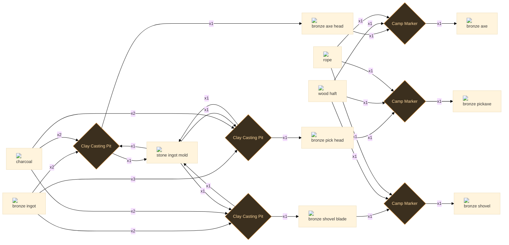

# Tier 2 — Metal Ages: smelting & alloys

53 recipes

## Bronze age

6 recipes

:ci[bronze_axe|1]

:ci[bronze_axe_head|1] :ci[wood_haft|1] :ci[rope|1] → :ci[bronze_axe|1]

Camp Marker 240.0s T1

Seat the bit in the haft's eye and lash it; a cast axe holds an edge far longer than a knapped one.

<code>e2_haft_bronze_axe</code>

:ci[bronze_axe_head|1] :ci[stone_mold_ingot|1]

:ci[bronze_ingot|2] :ci[charcoal|2] :ci[stone_mold_ingot|1] → :ci[bronze_axe_head|1] :ci[stone_mold_ingot|1]

Clay Casting Pit 480.0s T1 +1 byproduct

Melt the bronze over charcoal and pour the axe bit into the stone mold; knock it out cool and grind the edge.

<code>e2_cast_bronze_axe_head</code>

:ci[bronze_pick_head|1] :ci[stone_mold_ingot|1]

:ci[bronze_ingot|3] :ci[charcoal|2] :ci[stone_mold_ingot|1] → :ci[bronze_pick_head|1] :ci[stone_mold_ingot|1]

Clay Casting Pit 540.0s T1 +1 byproduct

Pour the heavier twin-point pick head; more metal than an axe bit, so it takes a longer, hotter melt.

<code>e2_cast_bronze_pick_head</code>

:ci[bronze_pickaxe|1]

:ci[bronze_pick_head|1] :ci[wood_haft|1] :ci[rope|1] → :ci[bronze_pickaxe|1]

Camp Marker 240.0s T1

Wedge the pick head onto the haft and bind it; unlocks mining of oxide and sulfide ores.

<code>e2_haft_bronze_pickaxe</code>

:ci[bronze_shovel|1]

:ci[bronze_shovel_blade|1] :ci[wood_haft|1] :ci[rope|1] → :ci[bronze_shovel|1]

Camp Marker 240.0s T1

Rivet or lash the blade to the haft; it moves far more soil per swing than the crude wood shovel.

<code>e2_haft_bronze_shovel</code>

:ci[bronze_shovel_blade|1] :ci[stone_mold_ingot|1]

:ci[bronze_ingot|2] :ci[charcoal|2] :ci[stone_mold_ingot|1] → :ci[bronze_shovel_blade|1] :ci[stone_mold_ingot|1]

Clay Casting Pit 480.0s T1 +1 byproduct

Pour a broad dished blade; planish the face cool so it sheds soil instead of holding it.

<code>e2_cast_bronze_shovel_blade</code>

## Copper chain

```mermaid
%%{init: {'securityLevel':'loose','flowchart':{'htmlLabels':true,'curve':'basis','nodeSpacing':38,'rankSpacing':70}, 'theme':'base', 'themeVariables':{'fontSize':'13px'}}}%%
graph LR
  i_raw_ore_chalcopyrite["<img src='/Conduvia/assets/icons/raw_ore_chalcopyrite.png' class='mmd-ico' />raw chalcopyrite ore"]
  i_crushed_ore_chalcopyrite["<img src='/Conduvia/assets/icons/crushed_ore_chalcopyrite.png' class='mmd-ico' />crushed chalcopyrite"]
  i_stone_dust["<img src='/Conduvia/assets/icons/stone_dust.png' class='mmd-ico' />stone dust"]
  i_ground_ore_chalcopyrite["<img src='/Conduvia/assets/icons/ground_ore_chalcopyrite.png' class='mmd-ico' />ground chalcopyrite"]
  i_concentrate_chalcopyrite["<img src='/Conduvia/assets/icons/concentrate_chalcopyrite.png' class='mmd-ico' />chalcopyrite concentrate"]
  i_tailings["<img src='/Conduvia/assets/icons/tailings.png' class='mmd-ico' />tailings"]
  i_calcine_chalcopyrite["<img src='/Conduvia/assets/icons/calcine_chalcopyrite.png' class='mmd-ico' />roasted chalcopyrite calcine"]
  i_gas_so2["<img src='/Conduvia/assets/icons/gas_so2.png' class='mmd-ico' />sulfur dioxide gas"]
  i_raw_ore_silica["<img src='/Conduvia/assets/icons/raw_ore_silica.png' class='mmd-ico' />raw silica ore"]
  i_charcoal["<img src='/Conduvia/assets/icons/charcoal.png' class='mmd-ico' />charcoal"]
  i_copper_matte["<img src='/Conduvia/assets/icons/copper_matte.png' class='mmd-ico' />copper matte"]
  i_slag["<img src='/Conduvia/assets/icons/slag.png' class='mmd-ico' />slag"]
  i_copper_blister["<img src='/Conduvia/assets/icons/copper_blister.png' class='mmd-ico' />blister copper"]
  i_copper_ingot["<img src='/Conduvia/assets/icons/copper_ingot.png' class='mmd-ico' />copper ingot"]
  i_refining_slag["<img src='/Conduvia/assets/icons/refining_slag.png' class='mmd-ico' />refining slag"]
  i_copper_anode["<img src='/Conduvia/assets/icons/copper_anode.png' class='mmd-ico' />copper anode"]
  i_copper_cathode["<img src='/Conduvia/assets/icons/copper_cathode.png' class='mmd-ico' />copper cathode"]
  i_anode_slime["<img src='/Conduvia/assets/icons/anode_slime.png' class='mmd-ico' />anode slime"]
  i_copper_ingot_refined["<img src='/Conduvia/assets/icons/copper_ingot_refined.png' class='mmd-ico' />refined copper ingot"]
  i_copper_plate["<img src='/Conduvia/assets/icons/copper_plate.png' class='mmd-ico' />copper plate"]
  i_copper_foil["<img src='/Conduvia/assets/icons/copper_foil.png' class='mmd-ico' />copper foil"]
  i_copper_rod["<img src='/Conduvia/assets/icons/copper_rod.png' class='mmd-ico' />copper rod"]
  i_copper_dust["<img src='/Conduvia/assets/icons/copper_dust.png' class='mmd-ico' />copper dust"]
  i_raw_ore_native_copper["<img src='/Conduvia/assets/icons/raw_ore_native_copper.png' class='mmd-ico' />raw native copper"]
  i_copper_wire_drawn["<img src='/Conduvia/assets/icons/copper_wire_drawn.png' class='mmd-ico' />drawn copper wire"]
  p_cu_crush_chalcopyrite{"Trip Hammer"}
  p_cu_grind_chalcopyrite{"Trip Hammer"}
  p_cu_float_chalcopyrite{"Froth Flotation Cell"}
  p_cu_roast_chalcopyrite{"Roasting Pit"}
  p_cu_matte_smelt{"Reverberatory Furnace"}
  p_cu_convert_blister{"Copper Converter (Peirce-Smith)"}
  p_cu_fire_refine{"Fire-Refining Furnace"}
  p_cu_cast_anode{"Clay Casting Pit"}
  p_cu_electrorefine{"Electrolytic Refining Cell"}
  p_cu_cathode_remelt{"Fire-Refining Furnace"}
  p_cu_form_plate{"Steam Rolling Mill"}
  p_cu_form_foil{"Steam Rolling Mill"}
  p_cu_form_rod{"Steam Rolling Mill"}
  p_cu_form_dust{"Trip Hammer"}
  p_t1_smelt_native_copper{"Clay Crucible"}
  p_t3_draw_copper_wire{"Wire Drawing Bench"}
  i_raw_ore_chalcopyrite --> |"x6"| p_cu_crush_chalcopyrite
  p_cu_crush_chalcopyrite --> |"x5"| i_crushed_ore_chalcopyrite
  p_cu_crush_chalcopyrite --> |"x1"| i_stone_dust
  i_crushed_ore_chalcopyrite --> |"x5"| p_cu_grind_chalcopyrite
  p_cu_grind_chalcopyrite --> |"x4"| i_ground_ore_chalcopyrite
  p_cu_grind_chalcopyrite --> |"x1"| i_stone_dust
  i_ground_ore_chalcopyrite --> |"x4"| p_cu_float_chalcopyrite
  p_cu_float_chalcopyrite --> |"x3"| i_concentrate_chalcopyrite
  p_cu_float_chalcopyrite --> |"x1"| i_tailings
  i_concentrate_chalcopyrite --> |"x3"| p_cu_roast_chalcopyrite
  p_cu_roast_chalcopyrite --> |"x2"| i_calcine_chalcopyrite
  p_cu_roast_chalcopyrite --> |"x1"| i_gas_so2
  i_calcine_chalcopyrite --> |"x2"| p_cu_matte_smelt
  i_raw_ore_silica --> |"x1"| p_cu_matte_smelt
  i_charcoal --> |"x2"| p_cu_matte_smelt
  p_cu_matte_smelt --> |"x1"| i_copper_matte
  p_cu_matte_smelt --> |"x2"| i_slag
  i_copper_matte --> |"x2"| p_cu_convert_blister
  i_raw_ore_silica --> |"x1"| p_cu_convert_blister
  p_cu_convert_blister --> |"x1"| i_copper_blister
  p_cu_convert_blister --> |"x1"| i_gas_so2
  p_cu_convert_blister --> |"x1"| i_slag
  i_copper_blister --> |"x2"| p_cu_fire_refine
  i_charcoal --> |"x1"| p_cu_fire_refine
  p_cu_fire_refine --> |"x2"| i_copper_ingot
  p_cu_fire_refine --> |"x1"| i_refining_slag
  i_copper_blister --> |"x2"| p_cu_cast_anode
  p_cu_cast_anode --> |"x2"| i_copper_anode
  i_copper_anode --> |"x4"| p_cu_electrorefine
  p_cu_electrorefine --> |"x4"| i_copper_cathode
  p_cu_electrorefine --> |"x1"| i_anode_slime
  i_copper_cathode --> |"x2"| p_cu_cathode_remelt
  p_cu_cathode_remelt --> |"x2"| i_copper_ingot_refined
  i_copper_ingot --> |"x2"| p_cu_form_plate
  p_cu_form_plate --> |"x2"| i_copper_plate
  i_copper_plate --> |"x1"| p_cu_form_foil
  p_cu_form_foil --> |"x2"| i_copper_foil
  i_copper_ingot --> |"x1"| p_cu_form_rod
  p_cu_form_rod --> |"x2"| i_copper_rod
  i_copper_ingot --> |"x1"| p_cu_form_dust
  p_cu_form_dust --> |"x2"| i_copper_dust
  i_raw_ore_native_copper --> |"x5"| p_t1_smelt_native_copper
  i_charcoal --> |"x4"| p_t1_smelt_native_copper
  p_t1_smelt_native_copper --> |"x1"| i_copper_ingot
  i_copper_ingot_refined --> |"x1"| p_t3_draw_copper_wire
  p_t3_draw_copper_wire --> |"x3"| i_copper_wire_drawn
  classDef proc fill:#3b2f1e,stroke:#d98a2b,stroke-width:1px,color:#ffd9a0;
  classDef world fill:#1d2a1d,stroke:#5a8f4d,color:#bfe6b0;
  class p_cu_crush_chalcopyrite proc;
  class p_cu_grind_chalcopyrite proc;
  class p_cu_float_chalcopyrite proc;
  class p_cu_roast_chalcopyrite proc;
  class p_cu_matte_smelt proc;
  class p_cu_convert_blister proc;
  class p_cu_fire_refine proc;
  class p_cu_cast_anode proc;
  class p_cu_electrorefine proc;
  class p_cu_cathode_remelt proc;
  class p_cu_form_plate proc;
  class p_cu_form_foil proc;
  class p_cu_form_rod proc;
  class p_cu_form_dust proc;
  class p_t1_smelt_native_copper proc;
  class p_t3_draw_copper_wire proc;
```

16 recipes

:ci[calcine_chalcopyrite|2] :ci[gas_so2|1]

:ci[concentrate_chalcopyrite|3] → :ci[calcine_chalcopyrite|2] :ci[gas_so2|1]

Roasting Pit 180s T1 30 kJ +1 byproduct

Partial roast: 2CuFeS2 + O2 -> Cu2S + 2FeS + SO2. Burns off part of the sulfur (SO2 captured for the acid plant) and starts oxidizing iron. Mass drops with the lost sulfur.

<code>cu_roast_chalcopyrite</code>

:ci[concentrate_chalcopyrite|3] :ci[tailings|1]

:ci[ground_ore_chalcopyrite|4] → :ci[concentrate_chalcopyrite|3] :ci[tailings|1]

Froth Flotation Cell 120s T1 25 kJ +1 byproduct

Condition with lime (depress pyrite, pH ~9-12), add a xanthate collector + pine-oil frother; copper sulfide floats off, silicate gangue sinks as tailings. 4 ground -> 3 concentrate.

<code>cu_float_chalcopyrite</code>

:ci[copper_anode|2]

:ci[copper_blister|2] → :ci[copper_anode|2]

Clay Casting Pit 60s T2 45 kJ

Cast blister/fire-refined copper into flat anodes for the electrorefining tankhouse.

<code>cu_cast_anode</code>

:ci[copper_blister|1] :ci[gas_so2|1] :ci[slag|1]

:ci[copper_matte|2] :ci[raw_ore_silica|1] → :ci[copper_blister|1] :ci[gas_so2|1] :ci[slag|1]

Copper Converter (Peirce-Smith) 200s T2 110 kJ +2 byproducts

Peirce-Smith two-blow. Slag blow: 2FeS + 3O2 -> 2FeO + 2SO2, then 2FeO + SiO2 -> fayalite slag. Copper blow: Cu2S + O2 -> 2Cu + SO2. Taps blister copper, ~98-99.5% Cu.

<code>cu_convert_blister</code>

:ci[copper_cathode|4] :ci[anode_slime|1]

:ci[copper_anode|4] → :ci[copper_cathode|4] :ci[anode_slime|1]

Electrolytic Refining Cell 600s T4 850 kJ +1 byproduct

Electrolytic refining in CuSO4/H2SO4. Anode: Cu -> Cu2+ + 2e-; cathode: Cu2+ + 2e- -> Cu (99.99%). Au/Ag/Se/Te drop as anode slime.

<code>cu_electrorefine</code>

:ci[copper_dust|2]

:ci[copper_ingot|1] → :ci[copper_dust|2]

Trip Hammer 30s T1

File/grind ingot to copper powder for alloying and powder metallurgy.

<code>cu_form_dust</code>

:ci[copper_foil|2]

:ci[copper_plate|1] → :ci[copper_foil|2]

Steam Rolling Mill 50s T3 55 kJ

Cold-roll plate down to thin foil.

<code>cu_form_foil</code>

:ci[copper_ingot|2] :ci[refining_slag|1]

:ci[copper_blister|2] :ci[charcoal|1] → :ci[copper_ingot|2] :ci[refining_slag|1]

Fire-Refining Furnace 150s T2 90 kJ +1 byproduct

Anode-furnace fire refining: oxidize off S/Fe/Pb/Zn, then "pole" with green wood/charcoal to reduce Cu2O back to metal -- tough-pitch copper (~99%). Drops a copper-rich refining slag (recycled).

<code>cu_fire_refine</code>

:ci[copper_ingot|1]

:ci[raw_ore_native_copper|5] :ci[charcoal|4] → :ci[copper_ingot|1]

Clay Crucible 120s T1 35 kJ

Era 3 (~20min). Reheat and hammer the billet with overlapping blows, rotating to draw it down to an even, measurable cross-section. Surface scale here is incidental -- no byproduct; collect pigment from the consolidation step instead.

<code>t1_smelt_native_copper</code>

:ci[copper_ingot_refined|2]

:ci[copper_cathode|2] → :ci[copper_ingot_refined|2]

Fire-Refining Furnace 120s T4 320 kJ

Remelt cathode under charcoal cover and cast oxygen-free refined ingot for wire and electronics.

<code>cu_cathode_remelt</code>

:ci[copper_matte|1] :ci[slag|2]

:ci[calcine_chalcopyrite|2] :ci[raw_ore_silica|1] :ci[charcoal|2] → :ci[copper_matte|1] :ci[slag|2]

Reverberatory Furnace 240s T2 140 kJ +1 byproduct

Matte smelt with silica flux. Overall: 2CuFeS2 + 2SiO2 + 4O2 -> Cu2S + 2FeSiO3 + 3SO2. Iron leaves as iron-silicate (fayalite) slag; copper + sulfur collect as matte (Cu2S.FeS, ~45-60% Cu).

<code>cu_matte_smelt</code>

:ci[copper_plate|2]

:ci[copper_ingot|2] → :ci[copper_plate|2]

Steam Rolling Mill 60s T3 50 kJ

Hot-roll copper ingot to plate stock.

<code>cu_form_plate</code>

:ci[copper_rod|2]

:ci[copper_ingot|1] → :ci[copper_rod|2]

Steam Rolling Mill 45s T3 40 kJ

Roll/forge ingot to round rod stock.

<code>cu_form_rod</code>

:ci[copper_wire_drawn|3]

:ci[copper_ingot_refined|1] → :ci[copper_wire_drawn|3]

Wire Drawing Bench 90s T3 45 kJ

Glass tube is collapsed over the filament mount, the air evacuated, and the stem sealed with a gas flame. Using pre-drawn tube stock is faster than blowing a bulb from scratch and gives consistent wall thickness.

<code>t3_draw_copper_wire</code>

:ci[crushed_ore_chalcopyrite|5] :ci[stone_dust|1]

:ci[raw_ore_chalcopyrite|6] → :ci[crushed_ore_chalcopyrite|5] :ci[stone_dust|1]

Trip Hammer 45s T1 +1 byproduct

Coarse stamp-crush to liberate chalcopyrite from gangue. ~1 in 6 reports to fines as stone dust. Muscle/trip-hammer -- pay in time, not energy.

<code>cu_crush_chalcopyrite</code>

:ci[ground_ore_chalcopyrite|4] :ci[stone_dust|1]

:ci[crushed_ore_chalcopyrite|5] → :ci[ground_ore_chalcopyrite|4] :ci[stone_dust|1]

Trip Hammer 60s T1 +1 byproduct

Fine grind to ~75 micron flotation size. Over-grind sheds a little more stone dust.

<code>cu_grind_chalcopyrite</code>

## Copper Oxide chain

```mermaid
%%{init: {'securityLevel':'loose','flowchart':{'htmlLabels':true,'curve':'basis','nodeSpacing':38,'rankSpacing':70}, 'theme':'base', 'themeVariables':{'fontSize':'13px'}}}%%
graph LR
  i_raw_ore_copper_oxide["<img src='/Conduvia/assets/icons/raw_ore_copper_oxide.png' class='mmd-ico' />oxidized copper ore"]
  i_crushed_ore_copper_oxide["<img src='/Conduvia/assets/icons/crushed_ore_copper_oxide.png' class='mmd-ico' />crushed oxide copper ore"]
  i_stone_dust["<img src='/Conduvia/assets/icons/stone_dust.png' class='mmd-ico' />stone dust"]
  i_acid_sulfuric["<img src='/Conduvia/assets/icons/acid_sulfuric.png' class='mmd-ico' />sulfuric acid"]
  i_copper_pls["<img src='/Conduvia/assets/icons/copper_pls.png' class='mmd-ico' />pregnant leach solution (PLS)"]
  i_tailings["<img src='/Conduvia/assets/icons/tailings.png' class='mmd-ico' />tailings"]
  i_copper_rich_electrolyte["<img src='/Conduvia/assets/icons/copper_rich_electrolyte.png' class='mmd-ico' />rich copper electrolyte"]
  i_acid_sulfuric_dilute["<img src='/Conduvia/assets/icons/acid_sulfuric_dilute.png' class='mmd-ico' />chamber acid (dilute H2SO4)"]
  i_copper_cathode["<img src='/Conduvia/assets/icons/copper_cathode.png' class='mmd-ico' />copper cathode"]
  i_gas_oxygen["<img src='/Conduvia/assets/icons/gas_oxygen.png' class='mmd-ico' />oxygen gas"]
  p_gather_ore_copper_oxide{"Gather"}
  p_cu_crush_oxide{"Trip Hammer"}
  p_cu_heap_leach_oxide{"Heap Leach Pad (acid irrigation)"}
  p_cu_solvent_extract{"Solvent-Extraction Mixer-Settler (LIX)"}
  p_cu_electrowin{"Electrowinning Cell (Pb anode / SS cathode)"}
  src_world["world"]:::world --> p_gather_ore_copper_oxide
  p_gather_ore_copper_oxide --> |"x3"| i_raw_ore_copper_oxide
  i_raw_ore_copper_oxide --> |"x2"| p_cu_crush_oxide
  p_cu_crush_oxide --> |"x2"| i_crushed_ore_copper_oxide
  p_cu_crush_oxide --> |"x1"| i_stone_dust
  i_crushed_ore_copper_oxide --> |"x3"| p_cu_heap_leach_oxide
  i_acid_sulfuric --> |"x2"| p_cu_heap_leach_oxide
  p_cu_heap_leach_oxide --> |"x3"| i_copper_pls
  p_cu_heap_leach_oxide --> |"x1"| i_tailings
  i_copper_pls --> |"x3"| p_cu_solvent_extract
  p_cu_solvent_extract --> |"x1"| i_copper_rich_electrolyte
  p_cu_solvent_extract --> |"x1"| i_acid_sulfuric_dilute
  i_copper_rich_electrolyte --> |"x2"| p_cu_electrowin
  p_cu_electrowin --> |"x2"| i_copper_cathode
  p_cu_electrowin --> |"x1"| i_acid_sulfuric
  p_cu_electrowin --> |"x1"| i_gas_oxygen
  classDef proc fill:#3b2f1e,stroke:#d98a2b,stroke-width:1px,color:#ffd9a0;
  classDef world fill:#1d2a1d,stroke:#5a8f4d,color:#bfe6b0;
  class p_gather_ore_copper_oxide proc;
  class p_cu_crush_oxide proc;
  class p_cu_heap_leach_oxide proc;
  class p_cu_solvent_extract proc;
  class p_cu_electrowin proc;
```

5 recipes

:ci[copper_cathode|2] :ci[acid_sulfuric|1] :ci[gas_oxygen|1]

:ci[copper_rich_electrolyte|2] → :ci[copper_cathode|2] :ci[acid_sulfuric|1] :ci[gas_oxygen|1]

Electrowinning Cell (Pb anode / SS cathode) 90s T3 400 kJ +2 byproducts

Pass current from inert lead-alloy anodes to stainless cathodes: Cu(2+) + 2 e- -> Cu(0) plates ~99.99% cathode copper, while 2 H2O -> O2 + 4 H+ + 4 e- at the anode. Net 2 CuSO4 + 2 H2O -> 2 Cu + O2 + 2 H2SO4 -- the regenerated acid goes back to stripping and leaching, closing the loop. Energy-hungry, but no smelting and no SO2.

<code>cu_electrowin</code>

:ci[copper_pls|3] :ci[tailings|1]

:ci[crushed_ore_copper_oxide|3] :ci[acid_sulfuric|2] → :ci[copper_pls|3] :ci[tailings|1]

Heap Leach Pad (acid irrigation) 120s T2 20 kJ +1 byproduct

Stack the ore on a lined pad and trickle dilute sulfuric acid through it. Oxides dissolve with NO oxidant needed: CuO + H2SO4 -> CuSO4 + H2O; malachite Cu2CO3(OH)2 + 2 H2SO4 -> 2 CuSO4 + 3 H2O + CO2. Carbonate/silicate gangue is the real acid sink. Copper-laden PLS drains off the base; spent tailings stay behind.

<code>cu_heap_leach_oxide</code>

:ci[copper_rich_electrolyte|1] :ci[acid_sulfuric_dilute|1]

:ci[copper_pls|3] → :ci[copper_rich_electrolyte|1] :ci[acid_sulfuric_dilute|1]

Solvent-Extraction Mixer-Settler (LIX) 40s T3 30 kJ +1 byproduct

Mixer-settler solvent extraction: a LIX oxime dissolved in kerosene chelates Cu(2+) out of the PLS at pH<2.5 while rejecting iron, then is stripped by strong spent electrolyte into a clean, concentrated copper liquor. The organic recirculates indefinitely; the acid-rich, copper-stripped raffinate returns to the heap as the leach solution.

<code>cu_solvent_extract</code>

:ci[crushed_ore_copper_oxide|2] :ci[stone_dust|1]

:ci[raw_ore_copper_oxide|2] → :ci[crushed_ore_copper_oxide|2] :ci[stone_dust|1]

Trip Hammer 25s T1 12 kJ +1 byproduct

Crush oxidized ore to a coarse, permeable gravel (12-50 mm). Oxide heaps want a COARSE crush -- fine grinding would only choke acid percolation and burn extra acid on freshly exposed gangue.

<code>cu_crush_oxide</code>

:ci[raw_ore_copper_oxide|3]

25s T1

Mine the weathered, brightly coloured oxide cap of a copper deposit. The easy, smelter-free entry to copper -- it leaches instead of roasting, so it pairs with the acid plant rather than the furnace.

<code>gather_ore_copper_oxide</code>

## Iron chain

```mermaid
%%{init: {'securityLevel':'loose','flowchart':{'htmlLabels':true,'curve':'basis','nodeSpacing':38,'rankSpacing':70}, 'theme':'base', 'themeVariables':{'fontSize':'13px'}}}%%
graph LR
  i_crushed_ore_magnetite["<img src='/Conduvia/assets/icons/crushed_ore_magnetite.png' class='mmd-ico' />crushed magnetite"]
  i_ore_iron_concentrate["<img src='/Conduvia/assets/icons/ore_iron_concentrate.png' class='mmd-ico' />iron ore concentrate"]
  i_tailings["<img src='/Conduvia/assets/icons/tailings.png' class='mmd-ico' />tailings"]
  i_crushed_ore_hematite["<img src='/Conduvia/assets/icons/crushed_ore_hematite.png' class='mmd-ico' />crushed hematite"]
  i_coke_fuel["<img src='/Conduvia/assets/icons/coke_fuel.png' class='mmd-ico' />coke fuel"]
  i_limestone_flux["<img src='/Conduvia/assets/icons/limestone_flux.png' class='mmd-ico' />limestone flux"]
  i_sinter_iron["<img src='/Conduvia/assets/icons/sinter_iron.png' class='mmd-ico' />iron ore sinter"]
  i_gas_so2["<img src='/Conduvia/assets/icons/gas_so2.png' class='mmd-ico' />sulfur dioxide gas"]
  i_clay["<img src='/Conduvia/assets/icons/clay.png' class='mmd-ico' />raw clay"]
  i_pellet_iron_oxide["<img src='/Conduvia/assets/icons/pellet_iron_oxide.png' class='mmd-ico' />iron ore pellets"]
  i_pig_iron_ingot["<img src='/Conduvia/assets/icons/pig_iron_ingot.png' class='mmd-ico' />pig iron ingot"]
  i_slag["<img src='/Conduvia/assets/icons/slag.png' class='mmd-ico' />slag"]
  i_iron_dri_sponge["<img src='/Conduvia/assets/icons/iron_dri_sponge.png' class='mmd-ico' />sponge iron (DRI)"]
  i_gas_co2["<img src='/Conduvia/assets/icons/gas_co2.png' class='mmd-ico' />carbon dioxide gas"]
  i_scrap_steel["<img src='/Conduvia/assets/icons/scrap_steel.png' class='mmd-ico' />steel scrap"]
  i_burned_lime_quicklime["<img src='/Conduvia/assets/icons/burned_lime_quicklime.png' class='mmd-ico' />burned lime (quicklime)"]
  i_steel_ingot["<img src='/Conduvia/assets/icons/steel_ingot.png' class='mmd-ico' />steel ingot"]
  i_metal_iron_ingot["<img src='/Conduvia/assets/icons/metal_iron_ingot.png' class='mmd-ico' />iron ingot"]
  i_ferrochrome["<img src='/Conduvia/assets/icons/ferrochrome.png' class='mmd-ico' />ferrochrome"]
  i_ferronickel["<img src='/Conduvia/assets/icons/ferronickel.png' class='mmd-ico' />ferronickel"]
  i_stainless_steel_ingot["<img src='/Conduvia/assets/icons/stainless_steel_ingot.png' class='mmd-ico' />stainless steel ingot"]
  p_iron_magsep_magnetite{"Wet Magnetic Separator (LIMS)"}
  p_iron_beneficiate_hematite{"Wet Magnetic Separator (LIMS)"}
  p_iron_sinter{"Sinter Strand (Dwight-Lloyd)"}
  p_iron_pelletize{"Pelletizing Disc + Induration Kiln"}
  p_iron_blast_sinter{"Blast Furnace"}
  p_iron_dri_coal{"Direct-Reduction Shaft (coal)"}
  p_iron_bof_steel{"Basic Oxygen Furnace (LD converter)"}
  p_iron_eaf_steel{"Electric Arc Furnace"}
  p_iron_melt_dri{"Electric Arc Furnace"}
  p_iron_aod_stainless{"AOD Converter (Argon-Oxygen Decarburization)"}
  p_gather_scrap_steel{"Gather"}
  i_crushed_ore_magnetite --> |"x2"| p_iron_magsep_magnetite
  p_iron_magsep_magnetite --> |"x1"| i_ore_iron_concentrate
  p_iron_magsep_magnetite --> |"x1"| i_tailings
  i_crushed_ore_hematite --> |"x3"| p_iron_beneficiate_hematite
  i_coke_fuel --> |"x1"| p_iron_beneficiate_hematite
  p_iron_beneficiate_hematite --> |"x2"| i_ore_iron_concentrate
  p_iron_beneficiate_hematite --> |"x1"| i_tailings
  i_ore_iron_concentrate --> |"x3"| p_iron_sinter
  i_coke_fuel --> |"x1"| p_iron_sinter
  i_limestone_flux --> |"x1"| p_iron_sinter
  p_iron_sinter --> |"x3"| i_sinter_iron
  p_iron_sinter --> |"x1"| i_gas_so2
  i_ore_iron_concentrate --> |"x3"| p_iron_pelletize
  i_clay --> |"x1"| p_iron_pelletize
  p_iron_pelletize --> |"x3"| i_pellet_iron_oxide
  i_sinter_iron --> |"x3"| p_iron_blast_sinter
  i_coke_fuel --> |"x2"| p_iron_blast_sinter
  i_limestone_flux --> |"x1"| p_iron_blast_sinter
  p_iron_blast_sinter --> |"x2"| i_pig_iron_ingot
  p_iron_blast_sinter --> |"x2"| i_slag
  i_pellet_iron_oxide --> |"x3"| p_iron_dri_coal
  i_coke_fuel --> |"x2"| p_iron_dri_coal
  p_iron_dri_coal --> |"x2"| i_iron_dri_sponge
  p_iron_dri_coal --> |"x1"| i_gas_co2
  i_pig_iron_ingot --> |"x3"| p_iron_bof_steel
  i_scrap_steel --> |"x1"| p_iron_bof_steel
  i_burned_lime_quicklime --> |"x1"| p_iron_bof_steel
  p_iron_bof_steel --> |"x3"| i_steel_ingot
  p_iron_bof_steel --> |"x1"| i_slag
  i_iron_dri_sponge --> |"x3"| p_iron_eaf_steel
  i_scrap_steel --> |"x1"| p_iron_eaf_steel
  i_burned_lime_quicklime --> |"x1"| p_iron_eaf_steel
  p_iron_eaf_steel --> |"x3"| i_steel_ingot
  p_iron_eaf_steel --> |"x1"| i_slag
  i_iron_dri_sponge --> |"x2"| p_iron_melt_dri
  p_iron_melt_dri --> |"x1"| i_metal_iron_ingot
  p_iron_melt_dri --> |"x1"| i_slag
  i_steel_ingot --> |"x2"| p_iron_aod_stainless
  i_ferrochrome --> |"x1"| p_iron_aod_stainless
  i_ferronickel --> |"x1"| p_iron_aod_stainless
  i_burned_lime_quicklime --> |"x1"| p_iron_aod_stainless
  p_iron_aod_stainless --> |"x2"| i_stainless_steel_ingot
  p_iron_aod_stainless --> |"x1"| i_slag
  src_world["world"]:::world --> p_gather_scrap_steel
  p_gather_scrap_steel --> |"x2"| i_scrap_steel
  classDef proc fill:#3b2f1e,stroke:#d98a2b,stroke-width:1px,color:#ffd9a0;
  classDef world fill:#1d2a1d,stroke:#5a8f4d,color:#bfe6b0;
  class p_iron_magsep_magnetite proc;
  class p_iron_beneficiate_hematite proc;
  class p_iron_sinter proc;
  class p_iron_pelletize proc;
  class p_iron_blast_sinter proc;
  class p_iron_dri_coal proc;
  class p_iron_bof_steel proc;
  class p_iron_eaf_steel proc;
  class p_iron_melt_dri proc;
  class p_iron_aod_stainless proc;
  class p_gather_scrap_steel proc;
```

11 recipes

:ci[iron_dri_sponge|2] :ci[gas_co2|1]

:ci[pellet_iron_oxide|3] :ci[coke_fuel|2] → :ci[iron_dri_sponge|2] :ci[gas_co2|1]

Direct-Reduction Shaft (coal) 160s T3 150 kJ +1 byproduct

Solid-state reduction: pellets meet coal/CO in a shaft or rotary kiln below irons melting point. Oxygen leaves as CO2 while the metal never liquefies, yielding porous metallic sponge iron (DRI). The low-energy, scrap-substitute charge for electric-arc steel.

<code>iron_dri_coal</code>

:ci[metal_iron_ingot|1] :ci[slag|1]

:ci[iron_dri_sponge|2] → :ci[metal_iron_ingot|1] :ci[slag|1]

Electric Arc Furnace 70s T3 140 kJ +1 byproduct

Melt sponge iron down to nearly pure, very-low-carbon iron ingots -- electromagnet cores and clean alloying stock. Gangue floats off as a little slag.

<code>iron_melt_dri</code>

:ci[ore_iron_concentrate|1] :ci[tailings|1]

:ci[crushed_ore_magnetite|2] → :ci[ore_iron_concentrate|1] :ci[tailings|1]

Wet Magnetic Separator (LIMS) 60s T2 35 kJ +1 byproduct

Magnetite (Fe3O4) is strongly ferromagnetic, so low-intensity wet magnetic separation (LIMS) cleanly pulls it from silica gangue -- upgrading crushed ore to a ~65-69% Fe concentrate. The rejected gangue leaves as tailings.

<code>iron_magsep_magnetite</code>

:ci[ore_iron_concentrate|2] :ci[tailings|1]

:ci[crushed_ore_hematite|3] :ci[coke_fuel|1] → :ci[ore_iron_concentrate|2] :ci[tailings|1]

Wet Magnetic Separator (LIMS) 75s T2 45 kJ +1 byproduct

Hematite (Fe2O3) is only weakly magnetic, so it is first magnetizing-roasted with a little reducing gas (3 Fe2O3 + CO -> 2 Fe3O4 + CO2) and THEN magnetically separated. Recovers a concentrate from low-grade hematite fines that gravity methods miss.

<code>iron_beneficiate_hematite</code>

:ci[pellet_iron_oxide|3]

:ci[ore_iron_concentrate|3] :ci[clay|1] → :ci[pellet_iron_oxide|3]

Pelletizing Disc + Induration Kiln 80s T3 60 kJ

Roll moist concentrate with ~1% bentonite binder (clay) into green balls on a disc, then indurate (fire) them hard. Uniform, high-Fe, high-strength pellets -- the ideal direct-reduction feed.

<code>iron_pelletize</code>

:ci[pig_iron_ingot|2] :ci[slag|2]

:ci[sinter_iron|3] :ci[coke_fuel|2] :ci[limestone_flux|1] → :ci[pig_iron_ingot|2] :ci[slag|2]

Blast Furnace 180s T2 130 kJ +1 byproduct

Charge sinter, coke and flux into the blast furnace. Coke burns to CO, which reduces the oxide (Fe2O3/Fe3O4 + CO -> Fe + CO2) as it descends; limestone fluxes the gangue to a fluid slag. Tap ~4%-carbon pig iron. A cleaner, more permeable burden than raw crushed ore.

<code>iron_blast_sinter</code>

:ci[scrap_steel|2]

20s T1

Collect and shear scrap steel from the world. Real arc-furnace steelmaking is fundamentally a recycling process -- scrap is a primary feedstock, not a byproduct.

<code>gather_scrap_steel</code>

:ci[sinter_iron|3] :ci[gas_so2|1]

:ci[ore_iron_concentrate|3] :ci[coke_fuel|1] :ci[limestone_flux|1] → :ci[sinter_iron|3] :ci[gas_so2|1]

Sinter Strand (Dwight-Lloyd) 90s T2 55 kJ +1 byproduct

Fuse concentrate fines with coke breeze and limestone on a travelling-grate sinter strand into a hard, self-fluxing, permeable cake. Roasting drives sulfur off as SO2 -- pipe it to the acid plant instead of venting.

<code>iron_sinter</code>

:ci[stainless_steel_ingot|2] :ci[slag|1]

:ci[steel_ingot|2] :ci[ferrochrome|1] :ci[ferronickel|1] :ci[burned_lime_quicklime|1] → :ci[stainless_steel_ingot|2] :ci[slag|1]

AOD Converter (Argon-Oxygen Decarburization) 140s T4 520 kJ +1 byproduct

Argon-oxygen decarburization: blow an O2/Ar mix through a chromium-bearing melt. Diluting the oxygen with argon lets carbon burn out while chromium does NOT oxidise away -- so cheap high-carbon ferrochrome can be used. Makes ~75% of the worlds stainless steel.

<code>iron_aod_stainless</code>

:ci[steel_ingot|3] :ci[slag|1]

:ci[pig_iron_ingot|3] :ci[scrap_steel|1] :ci[burned_lime_quicklime|1] → :ci[steel_ingot|3] :ci[slag|1]

Basic Oxygen Furnace (LD converter) 120s T3 220 kJ +1 byproduct

Basic oxygen (Linz-Donawitz) process: blow pure O2 onto molten pig iron to oxidise out carbon, silicon, manganese and phosphorus (the heat is autogenous). ~25% scrap cools the blow; burnt lime fluxes P and S into a basic slag. The dominant primary steel route worldwide.

<code>iron_bof_steel</code>

:ci[steel_ingot|3] :ci[slag|1]

:ci[iron_dri_sponge|3] :ci[scrap_steel|1] :ci[burned_lime_quicklime|1] → :ci[steel_ingot|3] :ci[slag|1]

Electric Arc Furnace 150s T4 480 kJ +1 byproduct

Electric-arc furnace: strike an arc onto a charge of sponge iron and scrap, melt and refine with a lime slag. The recycling route -- flexible, scrap-fed, and the basis for most specialty and low-CO2 steel.

<code>iron_eaf_steel</code>

## Ore processing

```mermaid
%%{init: {'securityLevel':'loose','flowchart':{'htmlLabels':true,'curve':'basis','nodeSpacing':38,'rankSpacing':70}, 'theme':'base', 'themeVariables':{'fontSize':'13px'}}}%%
graph LR
  i_raw_ore_hematite["<img src='/Conduvia/assets/icons/raw_ore_hematite.png' class='mmd-ico' />raw hematite ore"]
  i_roasted_ore_hematite["<img src='/Conduvia/assets/icons/roasted_ore_hematite.png' class='mmd-ico' />roasted hematite"]
  i_raw_ore_bog_iron["<img src='/Conduvia/assets/icons/raw_ore_bog_iron.png' class='mmd-ico' />raw bog iron"]
  i_roasted_ore_bog_iron["<img src='/Conduvia/assets/icons/roasted_ore_bog_iron.png' class='mmd-ico' />roasted bog iron"]
  i_iron_ore_crushed["<img src='/Conduvia/assets/icons/iron_ore_crushed.png' class='mmd-ico' />crushed iron ore"]
  i_charcoal["<img src='/Conduvia/assets/icons/charcoal.png' class='mmd-ico' />charcoal"]
  i_iron_bloom["<img src='/Conduvia/assets/icons/iron_bloom.png' class='mmd-ico' />iron bloom"]
  i_bloomery_slag["<img src='/Conduvia/assets/icons/bloomery_slag.png' class='mmd-ico' />bloomery slag"]
  i_wrought_iron_billet["<img src='/Conduvia/assets/icons/wrought_iron_billet.png' class='mmd-ico' />wrought iron billet"]
  i_hammer_scale["<img src='/Conduvia/assets/icons/hammer_scale.png' class='mmd-ico' />hammer scale"]
  i_wrought_iron_bar["<img src='/Conduvia/assets/icons/wrought_iron_bar.png' class='mmd-ico' />wrought iron bar"]
  i_raw_ore_cassiterite["<img src='/Conduvia/assets/icons/raw_ore_cassiterite.png' class='mmd-ico' />raw cassiterite ore"]
  i_tin_ingot["<img src='/Conduvia/assets/icons/tin_ingot.png' class='mmd-ico' />tin ingot"]
  i_copper_ingot["<img src='/Conduvia/assets/icons/copper_ingot.png' class='mmd-ico' />copper ingot"]
  i_bronze_ingot["<img src='/Conduvia/assets/icons/bronze_ingot.png' class='mmd-ico' />bronze ingot"]
  i_raw_ore_native_copper["<img src='/Conduvia/assets/icons/raw_ore_native_copper.png' class='mmd-ico' />raw native copper"]
  i_crushed_ore_hematite["<img src='/Conduvia/assets/icons/crushed_ore_hematite.png' class='mmd-ico' />crushed hematite"]
  i_waste_tailings["<img src='/Conduvia/assets/icons/waste_tailings.png' class='mmd-ico' />tailings"]
  i_raw_ore_magnetite["<img src='/Conduvia/assets/icons/raw_ore_magnetite.png' class='mmd-ico' />raw magnetite ore"]
  i_crushed_ore_magnetite["<img src='/Conduvia/assets/icons/crushed_ore_magnetite.png' class='mmd-ico' />crushed magnetite"]
  i_waste_slag["<img src='/Conduvia/assets/icons/waste_slag.png' class='mmd-ico' />slag"]
  i_crushed_slag["<img src='/Conduvia/assets/icons/crushed_slag.png' class='mmd-ico' />crushed slag"]
  i_raw_ore_limestone["<img src='/Conduvia/assets/icons/raw_ore_limestone.png' class='mmd-ico' />raw limestone ore"]
  i_limestone_flux["<img src='/Conduvia/assets/icons/limestone_flux.png' class='mmd-ico' />limestone flux"]
  i_burned_lime_quicklime["<img src='/Conduvia/assets/icons/burned_lime_quicklime.png' class='mmd-ico' />burned lime (quicklime)"]
  i_coal_bituminous["<img src='/Conduvia/assets/icons/coal_bituminous.png' class='mmd-ico' />bituminous coal"]
  i_coke_fuel["<img src='/Conduvia/assets/icons/coke_fuel.png' class='mmd-ico' />coke fuel"]
  p_t1_roast_hematite{"Roasting Pit"}
  p_t1_roast_bog_iron{"Roasting Pit"}
  p_t1_crush_roasted_bog_iron{"Stone Mortar"}
  p_t1_bloomery_bog_iron{"Clay Bloomery"}
  p_t1_bloomery_hematite{"Clay Bloomery"}
  p_t1_forge_bloom_to_wrought{"Forge Hearth"}
  p_t1_draw_billet_to_bar{"Iron Anvil"}
  p_t1_smelt_cassiterite{"Clay Crucible"}
  p_t1_alloy_bronze{"Clay Crucible"}
  p_t1_cosmelt_crude_bronze{"Clay Crucible"}
  p_t1_crush_hematite{"Trip Hammer"}
  p_t1_crush_magnetite{"Trip Hammer"}
  p_t1_crush_slag{"Trip Hammer"}
  p_t1_crush_limestone_flux{"Trip Hammer"}
  p_t1_coke_production{"Beehive Coke Oven"}
  i_raw_ore_hematite --> |"x4"| p_t1_roast_hematite
  p_t1_roast_hematite --> |"x4"| i_roasted_ore_hematite
  i_raw_ore_bog_iron --> |"x5"| p_t1_roast_bog_iron
  p_t1_roast_bog_iron --> |"x4"| i_roasted_ore_bog_iron
  i_roasted_ore_bog_iron --> |"x4"| p_t1_crush_roasted_bog_iron
  p_t1_crush_roasted_bog_iron --> |"x4"| i_iron_ore_crushed
  i_iron_ore_crushed --> |"x5"| p_t1_bloomery_bog_iron
  i_charcoal --> |"x10"| p_t1_bloomery_bog_iron
  p_t1_bloomery_bog_iron --> |"x1"| i_iron_bloom
  p_t1_bloomery_bog_iron --> |"x4"| i_bloomery_slag
  i_roasted_ore_hematite --> |"x5"| p_t1_bloomery_hematite
  i_charcoal --> |"x10"| p_t1_bloomery_hematite
  p_t1_bloomery_hematite --> |"x1"| i_iron_bloom
  p_t1_bloomery_hematite --> |"x4"| i_bloomery_slag
  i_iron_bloom --> |"x1"| p_t1_forge_bloom_to_wrought
  i_charcoal --> |"x4"| p_t1_forge_bloom_to_wrought
  p_t1_forge_bloom_to_wrought --> |"x2"| i_wrought_iron_billet
  p_t1_forge_bloom_to_wrought --> |"x2"| i_hammer_scale
  p_t1_forge_bloom_to_wrought --> |"x2"| i_bloomery_slag
  i_wrought_iron_billet --> |"x1"| p_t1_draw_billet_to_bar
  i_charcoal --> |"x1"| p_t1_draw_billet_to_bar
  p_t1_draw_billet_to_bar --> |"x1"| i_wrought_iron_bar
  i_raw_ore_cassiterite --> |"x4"| p_t1_smelt_cassiterite
  i_charcoal --> |"x6"| p_t1_smelt_cassiterite
  p_t1_smelt_cassiterite --> |"x1"| i_tin_ingot
  i_copper_ingot --> |"x9"| p_t1_alloy_bronze
  i_tin_ingot --> |"x1"| p_t1_alloy_bronze
  p_t1_alloy_bronze --> |"x9"| i_bronze_ingot
  i_raw_ore_native_copper --> |"x5"| p_t1_cosmelt_crude_bronze
  i_raw_ore_cassiterite --> |"x2"| p_t1_cosmelt_crude_bronze
  i_charcoal --> |"x8"| p_t1_cosmelt_crude_bronze
  p_t1_cosmelt_crude_bronze --> |"x3"| i_bronze_ingot
  i_raw_ore_hematite --> |"x4"| p_t1_crush_hematite
  p_t1_crush_hematite --> |"x3"| i_crushed_ore_hematite
  p_t1_crush_hematite --> |"x1"| i_waste_tailings
  i_raw_ore_magnetite --> |"x4"| p_t1_crush_magnetite
  p_t1_crush_magnetite --> |"x3"| i_crushed_ore_magnetite
  p_t1_crush_magnetite --> |"x1"| i_waste_tailings
  i_waste_slag --> |"x4"| p_t1_crush_slag
  p_t1_crush_slag --> |"x3"| i_crushed_slag
  i_raw_ore_limestone --> |"x3"| p_t1_crush_limestone_flux
  p_t1_crush_limestone_flux --> |"x2"| i_limestone_flux
  p_t1_crush_limestone_flux --> |"x1"| i_burned_lime_quicklime
  i_coal_bituminous --> |"x3"| p_t1_coke_production
  p_t1_coke_production --> |"x2"| i_coke_fuel
  classDef proc fill:#3b2f1e,stroke:#d98a2b,stroke-width:1px,color:#ffd9a0;
  classDef world fill:#1d2a1d,stroke:#5a8f4d,color:#bfe6b0;
  class p_t1_roast_hematite proc;
  class p_t1_roast_bog_iron proc;
  class p_t1_crush_roasted_bog_iron proc;
  class p_t1_bloomery_bog_iron proc;
  class p_t1_bloomery_hematite proc;
  class p_t1_forge_bloom_to_wrought proc;
  class p_t1_draw_billet_to_bar proc;
  class p_t1_smelt_cassiterite proc;
  class p_t1_alloy_bronze proc;
  class p_t1_cosmelt_crude_bronze proc;
  class p_t1_crush_hematite proc;
  class p_t1_crush_magnetite proc;
  class p_t1_crush_slag proc;
  class p_t1_crush_limestone_flux proc;
  class p_t1_coke_production proc;
```

15 recipes

:ci[bronze_ingot|9]

:ci[copper_ingot|9] :ci[tin_ingot|1] → :ci[bronze_ingot|9]

Clay Crucible 150s T1

Controlled 9:1 Cu:Sn melt gives ~10% tin bronze -- the historically documented sweet spot. Below ~6% Sn gives little hardness gain; above ~17% the alloy becomes brittle.

<code>t1_alloy_bronze</code>

:ci[bronze_ingot|3]

:ci[raw_ore_native_copper|5] :ci[raw_ore_cassiterite|2] :ci[charcoal|8] → :ci[bronze_ingot|3]

Clay Crucible 240s T1

Smelting copper ore and cassiterite together without pre-measuring ingots produces an unpredictable tin fraction. Yield is lower than controlled alloying: 5 native copper + 2 cassiterite + 8 charcoal → 3 bronze here. The controlled route (same ore mass) smelts separately → 1 copper_ingot + 0.5 tin_ingot → alloy → 3 bronze AND you know the exact ~10% Sn. The Bronze Age switched to controlled alloying for consistency, not just yield.

<code>t1_cosmelt_crude_bronze</code>

:ci[coke_fuel|2]

:ci[coal_bituminous|3] → :ci[coke_fuel|2]

Beehive Coke Oven 600s T1

Coking bakes bituminous coal at 900-1100°C without oxygen, driving off sulfur, tar, and volatile compounds. The resulting coke burns at blast-furnace temperatures that charcoal cannot sustain.

<code>t1_coke_production</code>

:ci[crushed_ore_hematite|3] :ci[waste_tailings|1]

:ci[raw_ore_hematite|4] → :ci[crushed_ore_hematite|3] :ci[waste_tailings|1]

Trip Hammer 60s T1 +1 byproduct

Stamp mill crushes lump hematite to a fine fraction suitable for blast furnace burden or wet separation. ~25% losses to tailings.

<code>t1_crush_hematite</code>

:ci[crushed_ore_magnetite|3] :ci[waste_tailings|1]

:ci[raw_ore_magnetite|4] → :ci[crushed_ore_magnetite|3] :ci[waste_tailings|1]

Trip Hammer 60s T1 +1 byproduct

Crushed magnetite can be magnetically separated at higher tiers; for now it serves as a direct blast furnace feed.

<code>t1_crush_magnetite</code>

:ci[crushed_slag|3]

:ci[waste_slag|4] → :ci[crushed_slag|3]

Trip Hammer 60s T1

Bloomery and furnace slag retains trapped iron particles. Crushing and re-feeding recovers a useful fraction -- important when ore is scarce.

<code>t1_crush_slag</code>

:ci[iron_bloom|1] :ci[bloomery_slag|4]

:ci[iron_ore_crushed|5] :ci[charcoal|10] → :ci[iron_bloom|1] :ci[bloomery_slag|4]

Clay Bloomery 360s T1 +1 byproduct

Carbon monoxide from charcoal reduces FeO·OH to spongy metalite iron at ~1100-1200°C. The resulting bloom contains trapped slag and must be hammered to consolidate.

<code>t1_bloomery_bog_iron</code>

:ci[iron_bloom|1] :ci[bloomery_slag|4]

:ci[roasted_ore_hematite|5] :ci[charcoal|10] → :ci[iron_bloom|1] :ci[bloomery_slag|4]

Clay Bloomery 420s T1 +1 byproduct

Fe₂O₃ + 3CO → 2Fe + 3CO₂. Hematite is harder and needs longer reduction time than bog iron, but produces a cleaner bloom with less sulfur.

<code>t1_bloomery_hematite</code>

:ci[iron_ore_crushed|4]

:ci[roasted_ore_bog_iron|4] → :ci[iron_ore_crushed|4]

Stone Mortar 60s T1

Era 3 (~30min hand work). Break roasted ore to walnut-fist size -- too large makes cold spots, too fine chokes airflow. Reject white silica veins. Crushing dust scatters; no byproduct worth a slot.

<code>t1_crush_roasted_bog_iron</code>

:ci[limestone_flux|2] :ci[burned_lime_quicklime|1]

:ci[raw_ore_limestone|3] → :ci[limestone_flux|2] :ci[burned_lime_quicklime|1]

Trip Hammer 60s T1 +1 byproduct

Crushed limestone (CaCO₃) is the flux for blast furnaces. Fines that pass through the screen partially calcine during crushing heat, yielding a quicklime byproduct (CaO).

<code>t1_crush_limestone_flux</code>

:ci[roasted_ore_bog_iron|4]

:ci[raw_ore_bog_iron|5] → :ci[roasted_ore_bog_iron|4]

Roasting Pit 90s T1

Bog iron (limonite, FeO·OH) is roasted to dehydrate it to hematite/magnetite before bloomery reduction. Loses ~10% mass as water (2FeO·OH → Fe₂O₃ + H₂O). Low hardness means it roasts quickly.

<code>t1_roast_bog_iron</code>

:ci[roasted_ore_hematite|4]

:ci[raw_ore_hematite|4] → :ci[roasted_ore_hematite|4]

Roasting Pit 120s T1

Unlike sulfide ores, hematite (Fe₂O₃) is already fully oxidized -- almost no mass is lost on roasting. The purpose is to drive off moisture and crack the ore structure for better reduction in the bloomery. Yield is effectively 100%.

<code>t1_roast_hematite</code>

:ci[tin_ingot|1]

:ci[raw_ore_cassiterite|4] :ci[charcoal|6] → :ci[tin_ingot|1]

Clay Crucible 210s T1

SnO₂ + 2C → Sn + 2CO₂. Carbon reduction at ~1100°C is required before the metallic tin can be tapped -- its low melting point of 232°C only applies after reduction.

<code>t1_smelt_cassiterite</code>

:ci[wrought_iron_bar|1]

:ci[wrought_iron_billet|1] :ci[charcoal|1] → :ci[wrought_iron_bar|1]

Iron Anvil 120s T1

Era 3 (~20min). Reheat and hammer the billet with overlapping blows, rotating to draw it down to an even, measurable cross-section. Surface scale here is incidental -- no byproduct; collect pigment from the consolidation step instead.

<code>t1_draw_billet_to_bar</code>

:ci[wrought_iron_billet|2] :ci[hammer_scale|2] :ci[bloomery_slag|2]

:ci[iron_bloom|1] :ci[charcoal|4] → :ci[wrought_iron_billet|2] :ci[hammer_scale|2] :ci[bloomery_slag|2]

Forge Hearth 240s T1 +2 byproducts

Era 3 (~45min active, 3-5 reheats). Hammer the hot bloom at welding heat from the centre outward -- welds the iron crystals and squeezes slag to the surface, leaving a dense but unsized billet. ~10-15% comes off as hammer scale (iron oxide); squeezed slag joins the heap. A cold bloom shatters -- reheat between passes. Draw the billet to bar next.

<code>t1_forge_bloom_to_wrought</code>

