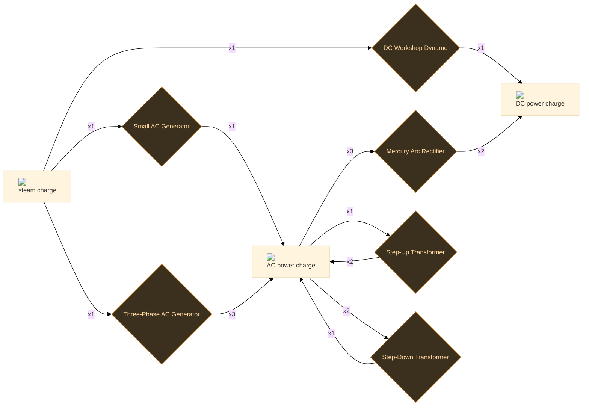
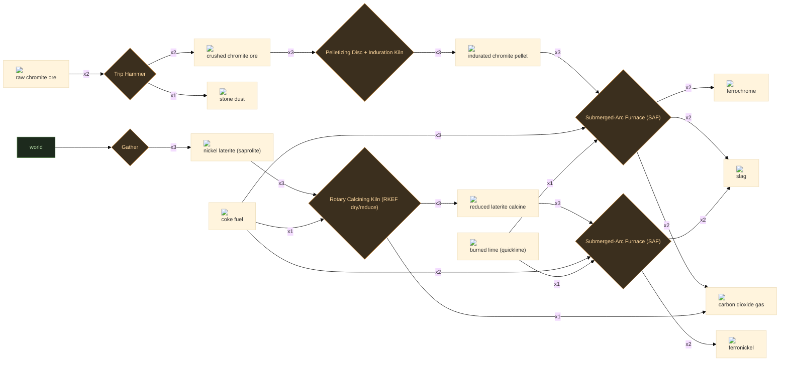
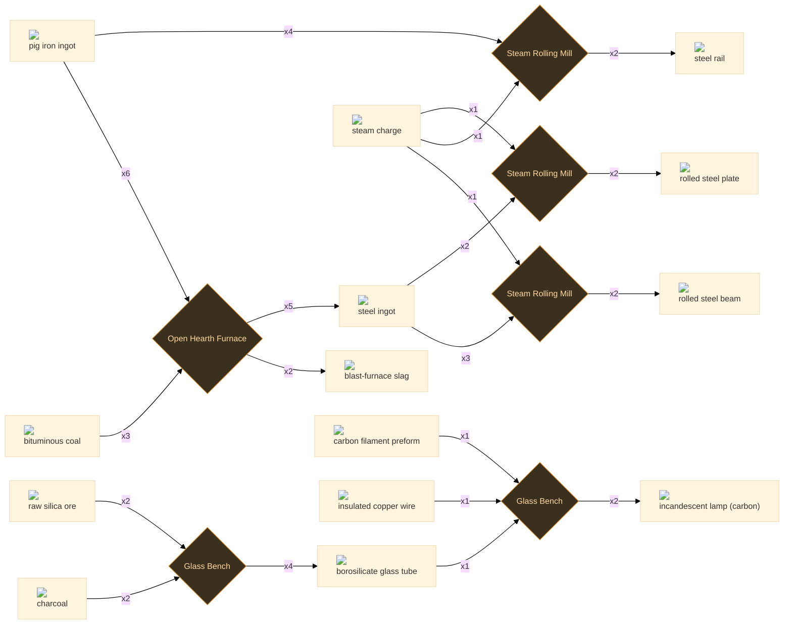
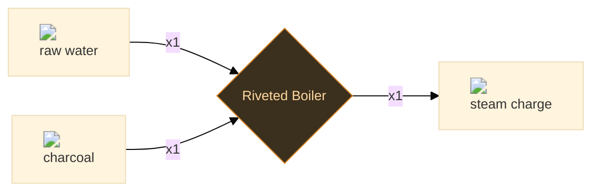
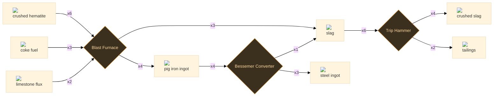

# Tier 3–4 — Steam, Coke & Steel

22 recipes

## Electric power

6 recipes

:ci[ac_charge|1]

:ci[steam_charge|1] → :ci[ac_charge|1]

Small AC Generator 25.0s T3

Slip rings instead of a commutator let the alternating current through unchanged. One steam charge per output cycle at single-phase workshop voltage.

<code>e6_generator_ac_small_charge</code>

:ci[ac_charge|3]

:ci[steam_charge|1] → :ci[ac_charge|3]

Three-Phase AC Generator 25.0s T3

Three-phase windings at 120° offset triple the power of a single-phase machine from the same prime-mover input. The three-phase output powers large AC induction motors and district distribution.

<code>e6_generator_three_phase_charge</code>

:ci[ac_charge|2]

:ci[ac_charge|1] → :ci[ac_charge|2]

Step-Up Transformer 8.0s T3

Iron-core transformer steps voltage up for long-distance transmission, doubling the effective charge throughput per cycle at the cost of matching step-down at the far end. AC-only -- DC has no transformer equivalent.

<code>e6_transformer_step_up</code>

:ci[ac_charge|1]

:ci[ac_charge|2] → :ci[ac_charge|1]

Step-Down Transformer 8.0s T3

Reduces high-voltage transmission AC back to working distribution voltage. Pair with step-up at the generator end.

<code>e6_transformer_step_down</code>

:ci[dc_charge|1]

:ci[steam_charge|1] → :ci[dc_charge|1]

DC Workshop Dynamo 25.0s T3

The dynamo's commutator and brushes rectify the armature's generated AC into smoothed DC. One steam charge (one engine cycle) drives one output charge.

<code>e6_dynamo_dc_charge</code>

:ci[dc_charge|2]

:ci[ac_charge|3] → :ci[dc_charge|2]

Mercury Arc Rectifier 10.0s T3

Mercury arc rectifier: AC strikes an arc at the mercury pool cathode; only forward-biased half-cycles conduct. The arc voltage drop and mercury vapour loss consume ~33% of the input power -- two DC charges out for every three AC charges in.

<code>e6_rectify_ac_to_dc</code>

## Ferroalloys chain

6 recipes

:ci[crushed_ore_chromite|2] :ci[stone_dust|1]

:ci[raw_ore_chromite|2] → :ci[crushed_ore_chromite|2] :ci[stone_dust|1]

Trip Hammer 30s T2 16 kJ +1 byproduct

Crush friable lump chromite to an even grain. Chromite is brittle and sheds fines, so it is crushed deliberately and then re-agglomerated rather than charged as-mined.

<code>fcr_crush_chromite</code>

:ci[ferrochrome|2] :ci[slag|2] :ci[gas_co2|2]

:ci[pellet_chromite|3] :ci[coke_fuel|3] :ci[burned_lime_quicklime|1] → :ci[ferrochrome|2] :ci[slag|2] :ci[gas_co2|2]

Submerged-Arc Furnace (SAF) 150s T4 380 kJ +2 byproducts

Bury the electrodes in a charge of pellets, coke and lime and pour the power in: FeCr2O4 + 4 C -> Fe + 2 Cr + 4 CO. The carbon strips the oxygen, lime fluxes the Mg/Al/Si gangue into a fluid slag, and the CO off-gas burns off as CO2. Taps as high-carbon ferrochrome. One of the most energy-hungry steps in the whole tech tree.

<code>fcr_saf_smelt</code>

:ci[ferronickel|2] :ci[slag|2]

:ci[nickel_laterite_calcine|3] :ci[coke_fuel|2] :ci[burned_lime_quicklime|1] → :ci[ferronickel|2] :ci[slag|2]

Submerged-Arc Furnace (SAF) 150s T4 360 kJ +1 byproduct

Reduction-smelt the hot calcine in the electric (submerged-arc) furnace. Nickel and a controlled amount of iron drop out together as a dense crude ferronickel; the silicate gangue floats off as slag. ~99% of the nickel is recovered -- the E and F of RKEF.

<code>fni_smelt_ferronickel</code>

:ci[nickel_laterite_calcine|3] :ci[gas_co2|1]

:ci[raw_ore_nickel_laterite|3] :ci[coke_fuel|1] → :ci[nickel_laterite_calcine|3] :ci[gas_co2|1]

Rotary Calcining Kiln (RKEF dry/reduce) 90s T3 120 kJ +1 byproduct

Tumble the wet saprolite down a fired rotary kiln to drive off free and crystal water and pre-reduce the NiO/FeO with coke and CO. The hot calcine is rushed straight to the furnace to keep its heat -- the R and K of RKEF.

<code>fni_calcine_laterite</code>

:ci[pellet_chromite|3]

:ci[crushed_ore_chromite|3] → :ci[pellet_chromite|3]

Pelletizing Disc + Induration Kiln 45s T3 40 kJ

Roll the chromite fines into green balls on the disc and fire them hard in the induration kiln. Indurated pellets keep the furnace burden permeable so reducing gas can climb through it.

<code>fcr_pelletize_chromite</code>

:ci[raw_ore_nickel_laterite|3]

30s T2

Strip-mine the soft, deeply weathered nickel laterite. Low grade but enormous and shallow -- no shaft, no concentration, straight to the kiln.

<code>gather_ore_nickel_laterite</code>

## Industrial processing

6 recipes

:ci[glass_tube|4]

:ci[raw_ore_silica|2] :ci[charcoal|2] → :ci[glass_tube|4]

Glass Bench 180s T3

Quartz silica is melted in the lampworking burner flame and drawn by hand into tube stock. Borosilicate composition (with trace mineral impurities) tolerates rapid thermal cycling without cracking.

<code>t3_glass_tube</code>

:ci[incandescent_lamp_carbon|2]

:ci[glass_tube|1] :ci[carbon_filament_preform|1] :ci[copper_wire_insulated|1] → :ci[incandescent_lamp_carbon|2]

Glass Bench 90s T3

Glass tube is collapsed over the filament mount, the air evacuated, and the stem sealed with a gas flame. Using pre-drawn tube stock is faster than blowing a bulb from scratch and gives consistent wall thickness.

<code>t3_glass_lamp_bulb</code>

:ci[steel_beam|2]

:ci[steel_ingot|3] :ci[steam_charge|1] → :ci[steel_beam|2]

Steam Rolling Mill 120s T3

Universal H-beam section rolled from steel billets. Structurally superior to wrought-iron box girders for the same mass -- flanges carry bending load, web carries shear.

<code>t3_roll_steel_beam</code>

:ci[steel_ingot|5] :ci[slag_ironmaking|2]

:ci[pig_iron_ingot|6] :ci[coal_bituminous|3] → :ci[steel_ingot|5] :ci[slag_ironmaking|2]

Open Hearth Furnace 600s T3 +1 byproduct

Regenerative open-hearth process: incoming cold gas heats through a brick checker-work that was itself heated by the last exhaust stroke. The reversal cycle maintains furnace temperature while using far less fuel than a non-regenerative flame. Operator controls carbon content precisely -- Bessemer is faster but open-hearth produces more consistent structural steel grades.

<code>t3_open_hearth_steel</code>

:ci[steel_plate_rolled|2]

:ci[steel_ingot|2] :ci[steam_charge|1] → :ci[steel_plate_rolled|2]

Steam Rolling Mill 90s T3

Steel ingots are passed between hardened rolls under full steam pressure. The rolling action reduces cross-section, work-hardens the surface, and aligns the grain for better tensile properties.

<code>t3_roll_steel_plate</code>

:ci[steel_rail|2]

:ci[pig_iron_ingot|4] :ci[steam_charge|1] → :ci[steel_rail|2]

Steam Rolling Mill 120s T3

Hot pig iron rolled through a profiled rail die. The I-section profile distributes wheel load across the foot and head; air-cooling after rolling relieves thermal stress.

<code>t3_roll_steel_rail</code>

## Steam processing

1 recipes

:ci[steam_charge|1]

:ci[water_raw|1] :ci[charcoal|1] → :ci[steam_charge|1]

Riveted Boiler 20.0s T4

Boil the charge until pressure builds and tap one puff into a holding flask. Water goes in the input, charcoal in the fuel slot.

<code>e5_boil_steam_charge</code>

## Steel processing

3 recipes

:ci[crushed_slag|4] :ci[waste_tailings|2]

:ci[waste_slag|6] → :ci[crushed_slag|4] :ci[waste_tailings|2]

Trip Hammer 90s T2 +1 byproduct

Blast furnace slag contains 0.5-1.5% trapped iron particles and glassy silicate phases. Crushing liberates the iron granules for magnetic or gravity separation in later tiers. The silicate fines become tailings; the iron-rich fraction can be re-fed to the blast furnace at small loss.

<code>t2_slag_reprocess</code>

:ci[pig_iron_ingot|4] :ci[waste_slag|3]

:ci[crushed_ore_hematite|6] :ci[coke_fuel|3] :ci[limestone_flux|2] → :ci[pig_iron_ingot|4] :ci[waste_slag|3]

Blast Furnace 480s T2 +1 byproduct

The blast furnace drives a continuous reduction column: coke burns to CO at tuyere level (~1600 degC), CO reduces Fe2O3 to iron as the burden descends, and limestone flux (CaO after calcination) reacts with gangue silica to form liquid slag (CaSiO3) that floats above liquid pig iron. Pig iron absorbs ~4% C from coke -- it is hard but brittle. The slag must be tapped separately from the iron notch.

<code>t2_blast_furnace_pig_iron</code>

:ci[steel_ingot|3] :ci[waste_slag|1]

:ci[pig_iron_ingot|4] → :ci[steel_ingot|3] :ci[waste_slag|1]

Bessemer Converter 300s T2 +1 byproduct

The Bessemer blow forces cold air through liquid pig iron from tuyeres at the converter base. Oxygen in the air burns out carbon, silicon, and manganese in a violent 15-20 minute exothermic reaction -- the heat released is so intense that no external fuel is needed after ignition. Carbon drops from ~4% to ~0.2-0.5%, producing steel. The blow must be stopped at the right carbon level; over-blowing produces wrought iron, under-blowing leaves cast iron.

<code>t2_bessemer_steel</code>

