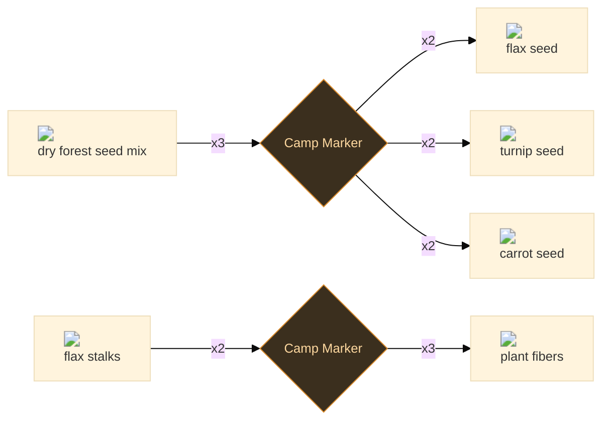
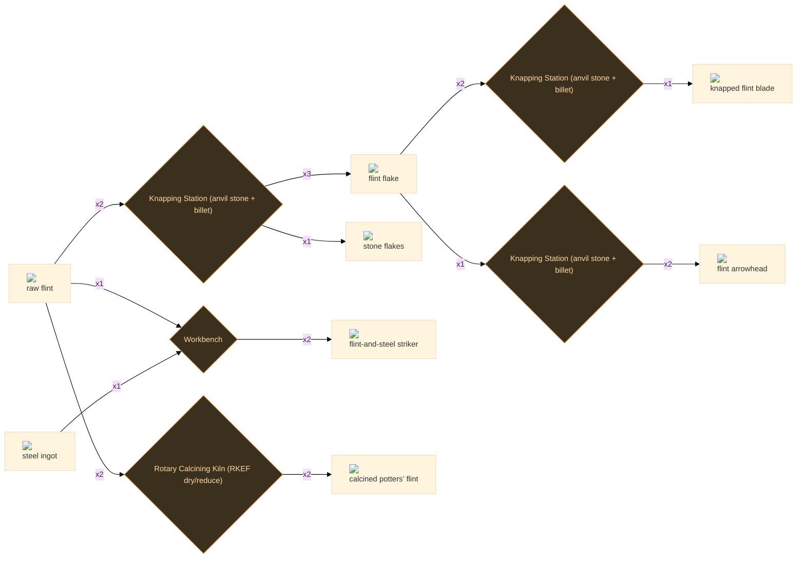
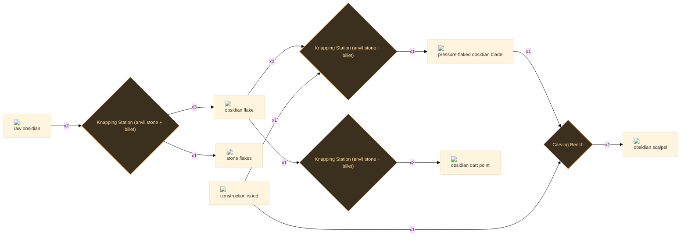
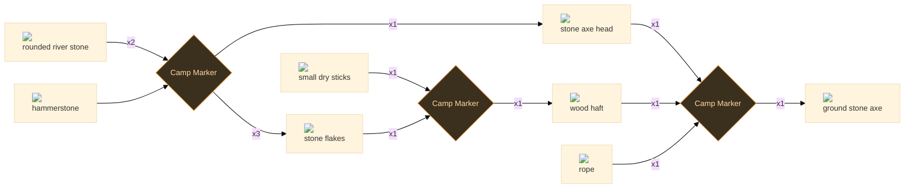
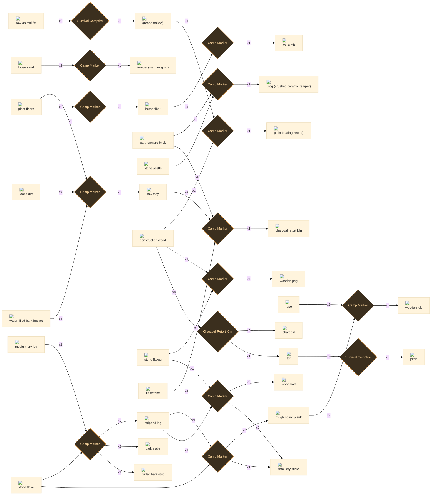

# Tier 1 — Stone & Early Materials

45 recipes

## Farming

2 recipes

:ci[forest_seed_mix_dry|3] → :ci[flax_seed|2] :ci[turnip_seed|2] :ci[carrot_seed|2]

<a class="stn-link" href="../../stations/#camp_marker_basic">Camp Marker</a> 120s T0 +2 byproducts

Winnow and pick the dry mix apart into seed you can actually sow on purpose.

<code>e1_sort_seed_mix</code>

:ci[flax|2] → :ci[plant_fibers|3]

<a class="stn-link" href="../../stations/#camp_marker_basic">Camp Marker</a> 300s T0

Soak the pulled stalks until the core rots free, then beat out the long bast.

<code>e1_ret_flax</code>

## Flint chain

5 recipes

:ci[raw_ore_flint|1] :ci[steel_ingot|1] → :ci[fire_steel_striker|2]

<a class="stn-link" href="../../stations/#workbench">Workbench</a> 60s T2 25 kJ

Forge/fit a high-carbon steel striker to a flint nodule. Real flint-and-steel: the harder flint shaves heated steel particles that ignite -- the most primitive ore meets the steel chain.

<code>fl_fire_steel</code>

:ci[flint_flake|1] → :ci[flint_arrowhead|2]

<a class="stn-link" href="../../stations/#knapping_station">Knapping Station (anvil stone + billet)</a> 25s T1 5 kJ

Bifacially work a flake into a tipped, barbed projectile point for arrows and darts.

<code>fl_make_arrowhead</code>

:ci[flint_flake|2] → :ci[flint_blade_knapped|1]

<a class="stn-link" href="../../stations/#knapping_station">Knapping Station (anvil stone + billet)</a> 40s T1 8 kJ

Pressure-retouch a flake down one edge into a straight, durable knife/scraper blade.

<code>fl_knap_blade</code>

:ci[raw_ore_flint|2] → :ci[flint_calcined_silica|2]

<a class="stn-link" href="../../stations/#rotary_calciner_kiln">Rotary Calcining Kiln (RKEF dry/reduce)</a> 200s T2 150 kJ

Calcine flint near 600 C until it crumbles, then grind to a fine silica powder (partly cristobalite). The classic potters’ flint for clay bodies and glazes.

<code>fl_calcine_silica</code>

:ci[raw_ore_flint|2] → :ci[flint_flake|3] :ci[stone_flakes|1]

<a class="stn-link" href="../../stations/#knapping_station">Knapping Station (anvil stone + billet)</a> 30s T1 6 kJ +1 byproduct

Strike a flint core with a hammerstone: conchoidal fracture shears off sharp flakes. The blunt shatter and trimming chips fall away as stone debitage -- a salvage byproduct, not loss.

<code>fl_knap_flint</code>

## Obsidian chain

4 recipes

:ci[obsidian_flake|1] → :ci[obsidian_arrowhead|2]

<a class="stn-link" href="../../stations/#knapping_station">Knapping Station (anvil stone + billet)</a> 25s T1 5 kJ

Bifacially pressure-flake a flake into a razor projectile point for arrows and atlatl darts.

<code>ob_make_arrowhead</code>

:ci[obsidian_flake|2] :ci[wood|1] → :ci[obsidian_blade_pressure|1]

<a class="stn-link" href="../../stations/#knapping_station">Knapping Station (anvil stone + billet)</a> 50s T2 10 kJ

Pressure-flake a flake with a wood/antler billet, pressing off tiny chips to refine the edge to ~3 nm -- sharper than surgical steel. The billet is consumed.

<code>ob_pressure_blade</code>

:ci[raw_ore_obsidian|2] → :ci[obsidian_flake|3] :ci[stone_flakes|1]

<a class="stn-link" href="../../stations/#knapping_station">Knapping Station (anvil stone + billet)</a> 30s T1 6 kJ +1 byproduct

Strike an obsidian core: the glass fractures conchoidally into flakes already keener than flint. Shatter and trim chips fall away as stone debitage.

<code>ob_knap_obsidian</code>

:ci[obsidian_blade_pressure|1] :ci[wood|1] → :ci[obsidian_scalpel|1]

<a class="stn-link" href="../../stations/#carving_bench">Carving Bench</a> 90s T3 30 kJ

Haft an obsidian micro-blade to a carved wooden handle: a surgical-grade scalpel whose edge cuts between cells for clean, low-scarring incisions.

<code>ob_make_scalpel</code>

## Stone age

3 recipes

:ci[stone_axe_head|1] :ci[wood_haft|1] :ci[rope|1] → :ci[stone_axe_ground|1]

<a class="stn-link" href="../../stations/#camp_marker_basic">Camp Marker</a> 240s T0

Seat the head in a split or notch in the haft and lash it tight; wet rope shrinks as it dries.

<code>e1_assemble_stone_axe</code>

:ci[stone_river_rounded|2] :ci[hammerstone|0] → :ci[stone_axe_head|1] :ci[stone_flakes|3]

<a class="stn-link" href="../../stations/#camp_marker_basic">Camp Marker</a> 600s T0 +1 byproduct

Hard-hammer percussion to rough the wedge, then grind the edge on coarse stone.

<code>e1_knap_stone_axe_head</code>

:ci[stick_dry_small|1] :ci[stone_flakes|1] → :ci[wood_haft|1]

<a class="stn-link" href="../../stations/#camp_marker_basic">Camp Marker</a> 300s T0

Strip the bark and whittle the stick straight and smooth with a fresh flake edge.

<code>e1_carve_wood_haft</code>

## Stone age materials

15 recipes

:ci[stripped_log|1] :ci[tool_stone_flake|0] → :ci[board_plank_rough|2] :ci[stick_dry_small|1]

<a class="stn-link" href="../../stations/#camp_marker_basic">Camp Marker</a> 200s T0 +1 byproduct

Score and split a stripped log lengthwise into rough flat planks. Slow without a metal saw, but the planks unlock shovel scoops and cooperage.

<code>e1_saw_planks_from_stripped</code>

:ci[wood|8] → :ci[charcoal|5] :ci[tar|1]

<a class="stn-link" href="../../stations/#charcoal_retort_kiln">Charcoal Retort Kiln</a> 720s T0 +1 byproduct

Bake a sealed charge so it carbonises without burning; the offtake condenses the wood tar the clamp lets escape.

<code>e1_char_retort</code>

:ci[earthenware_brick|6] :ci[clay|4] :ci[stone|4] → :ci[charcoal_retort_kiln|1]

<a class="stn-link" href="../../stations/#camp_marker_basic">Camp Marker</a> 600s T0

Lay a sealed brick chamber with a condensing offtake; the wood gas is driven through it instead of up a vent.

<code>e1_build_charcoal_retort_kiln</code>

:ci[dirt|4] :ci[bark_bucket_water|1] :ci[plant_fibers|1] → :ci[clay|1]

<a class="stn-link" href="../../stations/#camp_marker_basic">Camp Marker</a> 30s T0

Slurry dirt with water in the bucket, let it settle, and screen the heavy clay fraction through plant fibre. Wet, dirty, low-yield -- but it works anywhere with dirt and a water source.

<code>e1_wash_dirt_for_clay</code>

:ci[fat_raw|2] → :ci[grease_tallow|1]

<a class="stn-link" href="../../stations/#campfire_survival">Survival Campfire</a> 240s T0

Render trimmed fat low and slow, skim the clean tallow off the cracklings, and let it set hard.

<code>e1_render_grease_tallow</code>

:ci[earthenware_brick|1] :ci[pestle_stone|0] → :ci[grog_crushed_ceramic_temper|2]

<a class="stn-link" href="../../stations/#camp_marker_basic">Camp Marker</a> 180s T0

Pound a spare fired brick to grit; mixed back into raw clay it stops the shrink-cracks that ruin a pot.

<code>e1_crush_grog</code>

:ci[plant_fibers|3] → :ci[hemp_fiber|1]

<a class="stn-link" href="../../stations/#camp_marker_basic">Camp Marker</a> 360s T0

Soak the stalks until the woody core rots free, then beat and comb out the long bast -- the line fibre for cloth and packing.

<code>e1_ret_hemp_fiber</code>

:ci[tar|2] → :ci[pitch|1]

<a class="stn-link" href="../../stations/#campfire_survival">Survival Campfire</a> 240s T0

Boil tar down until the light fractions cook off and it sets stiff -- pitch that seals seams hard instead of staying tacky.

<code>e1_reduce_pitch</code>

:ci[wood|1] :ci[grease_tallow|1] → :ci[plain_bearing_wood|1]

<a class="stn-link" href="../../stations/#camp_marker_basic">Camp Marker</a> 200s T0

Bore a hardwood block to the shaft and pack it with tallow; it runs cool enough for slow mill work.

<code>e1_fit_plain_bearing_wood</code>

:ci[hemp_fiber|4] → :ci[sail_cloth|1]

<a class="stn-link" href="../../stations/#camp_marker_basic">Camp Marker</a> 480s T0

Weave the line fibre tight on a warped frame; close, even cloth that holds wind without tearing.

<code>e1_weave_sail_cloth</code>

:ci[log_medium_dry|1] :ci[tool_stone_flake|0] → :ci[stripped_log|1] :ci[forest_bark_slabs|2] :ci[forest_bark_strip|2]

<a class="stn-link" href="../../stations/#camp_marker_basic">Camp Marker</a> 180s T0 +2 byproducts

Score the bark, peel it off in slabs, and curl the inner bark into strips -- the log is now clean stock.

<code>e1_strip_log</code>

:ci[sand|2] → :ci[temper_sand_or_grog|1]

<a class="stn-link" href="../../stations/#camp_marker_basic">Camp Marker</a> 90s T0

Screen river sand to an even grit -- the sand option when no fired ceramic is spare to crush for grog.

<code>e1_screen_temper_sand</code>

:ci[stripped_log|1] :ci[stone_flakes|1] → :ci[wood_haft|3] :ci[stick_dry_small|2]

<a class="stn-link" href="../../stations/#camp_marker_basic">Camp Marker</a> 240s T0 +1 byproduct

Quarter the stripped log into hafts and trim the offcuts into kindling sticks.

<code>e1_carve_haft_from_stripped</code>

:ci[wood|1] :ci[stone_flakes|1] → :ci[wooden_peg|4]

<a class="stn-link" href="../../stations/#camp_marker_basic">Camp Marker</a> 150s T0

Split a billet and whittle a handful of tapered pegs; driven dry they swell into the hole and lock.

<code>e1_carve_wooden_peg</code>

:ci[board_plank_rough|2] :ci[rope|1] → :ci[wooden_tub|1]

<a class="stn-link" href="../../stations/#camp_marker_basic">Camp Marker</a> 300s T0

Stand split staves in a ring and bind them with a tight rope hoop; swelling wood seals the seams.

<code>e1_build_wooden_tub</code>

## Stone age tools

```mermaid
%%{init: {'securityLevel':'loose','flowchart':{'htmlLabels':true,'curve':'basis','nodeSpacing':38,'rankSpacing':70}, 'theme':'base', 'themeVariables':{'fontSize':'13px'}}}%%
graph LR
  i_stone["<img src='../../assets/icons/stone.png' class='mmd-ico' />fieldstone"]
  i_hammerstone["<img src='../../assets/icons/hammerstone.png' class='mmd-ico' />hammerstone"]
  i_stone_adze_head["<img src='../../assets/icons/stone_adze_head.png' class='mmd-ico' />stone adze head"]
  i_stone_flakes["<img src='../../assets/icons/stone_flakes.png' class='mmd-ico' />stone flakes"]
  i_stone_hoe_blade["<img src='../../assets/icons/stone_hoe_blade.png' class='mmd-ico' />stone hoe blade"]
  i_wood_haft["<img src='../../assets/icons/wood_haft.png' class='mmd-ico' />wood haft"]
  i_rope["<img src='../../assets/icons/rope.png' class='mmd-ico' />rope"]
  i_adze["<img src='../../assets/icons/adze.png' class='mmd-ico' />adze"]
  i_hoe["<img src='../../assets/icons/hoe.png' class='mmd-ico' />hoe"]
  i_board_plank_rough["<img src='../../assets/icons/board_plank_rough.png' class='mmd-ico' />rough board plank"]
  i_shovel["<img src='../../assets/icons/shovel.png' class='mmd-ico' />crude shovel"]
  i_wood["<img src='../../assets/icons/wood.png' class='mmd-ico' />construction wood"]
  i_mallet["<img src='../../assets/icons/mallet.png' class='mmd-ico' />mallet"]
  i_wedge["<img src='../../assets/icons/wedge.png' class='mmd-ico' />wedge"]
  i_lever_pry_bar["<img src='../../assets/icons/lever_pry_bar.png' class='mmd-ico' />lever (pry bar)"]
  i_gold_pan["<img src='../../assets/icons/gold_pan.png' class='mmd-ico' />gold pan"]
  i_stick_dry_small["<img src='../../assets/icons/stick_dry_small.png' class='mmd-ico' />small dry sticks"]
  i_chisel["<img src='../../assets/icons/chisel.png' class='mmd-ico' />chisel"]
  i_drawknife["<img src='../../assets/icons/drawknife.png' class='mmd-ico' />drawknife"]
  i_bow_saw_frame["<img src='../../assets/icons/bow_saw_frame.png' class='mmd-ico' />bow saw frame"]
  i_shaft_wood_round["<img src='../../assets/icons/shaft_wood_round.png' class='mmd-ico' />wooden shaft (round)"]
  i_bow_drill["<img src='../../assets/icons/bow_drill.png' class='mmd-ico' />bow drill"]
  i_plant_fibers["<img src='../../assets/icons/plant_fibers.png' class='mmd-ico' />plant fibers"]
  i_spindle_drill["<img src='../../assets/icons/spindle_drill.png' class='mmd-ico' />spindle drill"]
  i_measuring_cord["<img src='../../assets/icons/measuring_cord.png' class='mmd-ico' />measuring cord"]
  i_plumb_bob["<img src='../../assets/icons/plumb_bob.png' class='mmd-ico' />plumb bob"]
  p_e1_knap_stone_adze_head{"Camp Marker"}
  p_e1_knap_stone_hoe_blade{"Camp Marker"}
  p_e1_assemble_adze{"Camp Marker"}
  p_e1_assemble_hoe{"Camp Marker"}
  p_e1_assemble_shovel_wood{"Camp Marker"}
  p_e1_assemble_mallet{"Camp Marker"}
  p_e1_carve_wedge{"Camp Marker"}
  p_e1_carve_lever_pry_bar{"Camp Marker"}
  p_e1_carve_gold_pan{"Camp Marker"}
  p_e1_haft_chisel{"Camp Marker"}
  p_e1_haft_drawknife{"Camp Marker"}
  p_e1_build_bow_saw_frame{"Camp Marker"}
  p_e1_build_bow_drill{"Camp Marker"}
  p_e1_build_spindle_drill{"Camp Marker"}
  p_e1_knot_measuring_cord{"Camp Marker"}
  p_e1_shape_plumb_bob{"Camp Marker"}
  i_stone --> |"x2"| p_e1_knap_stone_adze_head
  i_hammerstone --> p_e1_knap_stone_adze_head
  p_e1_knap_stone_adze_head --> |"x1"| i_stone_adze_head
  p_e1_knap_stone_adze_head --> |"x2"| i_stone_flakes
  i_stone --> |"x2"| p_e1_knap_stone_hoe_blade
  i_hammerstone --> p_e1_knap_stone_hoe_blade
  p_e1_knap_stone_hoe_blade --> |"x1"| i_stone_hoe_blade
  p_e1_knap_stone_hoe_blade --> |"x2"| i_stone_flakes
  i_stone_adze_head --> |"x1"| p_e1_assemble_adze
  i_wood_haft --> |"x1"| p_e1_assemble_adze
  i_rope --> |"x1"| p_e1_assemble_adze
  p_e1_assemble_adze --> |"x1"| i_adze
  i_stone_hoe_blade --> |"x1"| p_e1_assemble_hoe
  i_wood_haft --> |"x1"| p_e1_assemble_hoe
  i_rope --> |"x1"| p_e1_assemble_hoe
  p_e1_assemble_hoe --> |"x1"| i_hoe
  i_board_plank_rough --> |"x1"| p_e1_assemble_shovel_wood
  i_wood_haft --> |"x1"| p_e1_assemble_shovel_wood
  i_rope --> |"x1"| p_e1_assemble_shovel_wood
  p_e1_assemble_shovel_wood --> |"x1"| i_shovel
  i_wood --> |"x1"| p_e1_assemble_mallet
  i_wood_haft --> |"x1"| p_e1_assemble_mallet
  i_rope --> |"x1"| p_e1_assemble_mallet
  p_e1_assemble_mallet --> |"x1"| i_mallet
  i_wood --> |"x1"| p_e1_carve_wedge
  i_stone_flakes --> |"x1"| p_e1_carve_wedge
  p_e1_carve_wedge --> |"x1"| i_wedge
  i_wood --> |"x1"| p_e1_carve_lever_pry_bar
  i_stone_flakes --> |"x1"| p_e1_carve_lever_pry_bar
  p_e1_carve_lever_pry_bar --> |"x1"| i_lever_pry_bar
  i_wood --> |"x1"| p_e1_carve_gold_pan
  i_stone_flakes --> |"x1"| p_e1_carve_gold_pan
  p_e1_carve_gold_pan --> |"x1"| i_gold_pan
  i_stone_flakes --> |"x1"| p_e1_haft_chisel
  i_stick_dry_small --> |"x1"| p_e1_haft_chisel
  i_rope --> |"x1"| p_e1_haft_chisel
  p_e1_haft_chisel --> |"x1"| i_chisel
  i_stone_flakes --> |"x1"| p_e1_haft_drawknife
  i_stick_dry_small --> |"x2"| p_e1_haft_drawknife
  i_rope --> |"x1"| p_e1_haft_drawknife
  p_e1_haft_drawknife --> |"x1"| i_drawknife
  i_wood --> |"x1"| p_e1_build_bow_saw_frame
  i_rope --> |"x1"| p_e1_build_bow_saw_frame
  p_e1_build_bow_saw_frame --> |"x1"| i_bow_saw_frame
  i_stick_dry_small --> |"x1"| p_e1_build_bow_drill
  i_rope --> |"x1"| p_e1_build_bow_drill
  i_shaft_wood_round --> |"x1"| p_e1_build_bow_drill
  p_e1_build_bow_drill --> |"x1"| i_bow_drill
  i_shaft_wood_round --> |"x1"| p_e1_build_spindle_drill
  i_stone --> |"x1"| p_e1_build_spindle_drill
  i_plant_fibers --> |"x2"| p_e1_build_spindle_drill
  p_e1_build_spindle_drill --> |"x1"| i_spindle_drill
  i_rope --> |"x1"| p_e1_knot_measuring_cord
  i_stick_dry_small --> |"x1"| p_e1_knot_measuring_cord
  p_e1_knot_measuring_cord --> |"x1"| i_measuring_cord
  i_stone --> |"x1"| p_e1_shape_plumb_bob
  i_stone_flakes --> |"x1"| p_e1_shape_plumb_bob
  i_plant_fibers --> |"x1"| p_e1_shape_plumb_bob
  p_e1_shape_plumb_bob --> |"x1"| i_plumb_bob
  classDef proc fill:#3b2f1e,stroke:#d98a2b,stroke-width:1px,color:#ffd9a0;
  classDef world fill:#1d2a1d,stroke:#5a8f4d,color:#bfe6b0;
  class p_e1_knap_stone_adze_head proc;
  class p_e1_knap_stone_hoe_blade proc;
  class p_e1_assemble_adze proc;
  class p_e1_assemble_hoe proc;
  class p_e1_assemble_shovel_wood proc;
  class p_e1_assemble_mallet proc;
  class p_e1_carve_wedge proc;
  class p_e1_carve_lever_pry_bar proc;
  class p_e1_carve_gold_pan proc;
  class p_e1_haft_chisel proc;
  class p_e1_haft_drawknife proc;
  class p_e1_build_bow_saw_frame proc;
  class p_e1_build_bow_drill proc;
  class p_e1_build_spindle_drill proc;
  class p_e1_knot_measuring_cord proc;
  class p_e1_shape_plumb_bob proc;
```

16 recipes

:ci[stone_adze_head|1] :ci[wood_haft|1] :ci[rope|1] → :ci[adze|1]

<a class="stn-link" href="../../stations/#camp_marker_basic">Camp Marker</a> 240s T0

Seat the bit transverse on a knee-bend haft and lash it tight; the edge faces the worker.

<code>e1_assemble_adze</code>

:ci[stick_dry_small|1] :ci[rope|1] :ci[shaft_wood_round|1] → :ci[bow_drill|1]

<a class="stn-link" href="../../stations/#camp_marker_basic">Camp Marker</a> 150s T0

Loop the cord once around a straight spindle so sawing the bow spins it -- drills holes and starts fire.

<code>e1_build_bow_drill</code>

:ci[wood|1] :ci[rope|1] → :ci[bow_saw_frame|1]

<a class="stn-link" href="../../stations/#camp_marker_basic">Camp Marker</a> 180s T0

Bend a green stave into a bow and string it tight; the cutting blade is fitted later when metal exists.

<code>e1_build_bow_saw_frame</code>

:ci[stone_flakes|1] :ci[stick_dry_small|1] :ci[rope|1] → :ci[chisel|1]

<a class="stn-link" href="../../stations/#camp_marker_basic">Camp Marker</a> 180s T0

Set a narrow flake end-on in a split stick and bind it so a mallet blow drives straight through.

<code>e1_haft_chisel</code>

:ci[stone_flakes|1] :ci[stick_dry_small|2] :ci[rope|1] → :ci[drawknife|1]

<a class="stn-link" href="../../stations/#camp_marker_basic">Camp Marker</a> 200s T0

Lash a long flake between two short grips so it can be pulled toward you to shave bark and round stock.

<code>e1_haft_drawknife</code>

:ci[wood|1] :ci[stone_flakes|1] → :ci[gold_pan|1]

<a class="stn-link" href="../../stations/#camp_marker_basic">Camp Marker</a> 240s T0

Hollow a shallow batea from a wood round; the gentle dish lets heavy fines settle while you swirl off the light sand.

<code>e1_carve_gold_pan</code>

:ci[stone_hoe_blade|1] :ci[wood_haft|1] :ci[rope|1] → :ci[hoe|1]

<a class="stn-link" href="../../stations/#camp_marker_basic">Camp Marker</a> 240s T0

Lash the blade across the haft at a chopping-down angle for turning soil.

<code>e1_assemble_hoe</code>

:ci[wood|1] :ci[stone_flakes|1] → :ci[lever_pry_bar|1]

<a class="stn-link" href="../../stations/#camp_marker_basic">Camp Marker</a> 150s T0

Strip a stout pole and flatten one end into a prying tip; the longer the pole the more it lifts.

<code>e1_carve_lever_pry_bar</code>

:ci[wood|1] :ci[wood_haft|1] :ci[rope|1] → :ci[mallet|1]

<a class="stn-link" href="../../stations/#camp_marker_basic">Camp Marker</a> 240s T0

Bore a dense billet, drive the haft through, and bind the cheeks so it cannot split out.

<code>e1_assemble_mallet</code>

:ci[rope|1] :ci[stick_dry_small|1] → :ci[measuring_cord|1]

<a class="stn-link" href="../../stations/#camp_marker_basic">Camp Marker</a> 90s T0

Tie even knots along a stretched rope as repeatable length marks; wind it on a stick to carry.

<code>e1_knot_measuring_cord</code>

:ci[stone|1] :ci[stone_flakes|1] :ci[plant_fibers|1] → :ci[plumb_bob|1]

<a class="stn-link" href="../../stations/#camp_marker_basic">Camp Marker</a> 120s T0

Peck a groove round a small stone, tie on a line, and let it hang -- it finds true vertical every time.

<code>e1_shape_plumb_bob</code>

:ci[board_plank_rough|1] :ci[wood_haft|1] :ci[rope|1] → :ci[shovel|1]

<a class="stn-link" href="../../stations/#camp_marker_basic">Camp Marker</a> 300s T0

Dish a rough board into a scoop, split the haft to grip its neck, and lash it fast.

<code>e1_assemble_shovel_wood</code>

:ci[shaft_wood_round|1] :ci[stone|1] :ci[plant_fibers|2] → :ci[spindle_drill|1]

<a class="stn-link" href="../../stations/#camp_marker_basic">Camp Marker</a> 180s T0

Weight a spindle with a holed stone whorl so a flick of the cords keeps it turning through the bore.

<code>e1_build_spindle_drill</code>

:ci[stone|2] :ci[hammerstone|0] → :ci[stone_adze_head|1] :ci[stone_flakes|2]

<a class="stn-link" href="../../stations/#camp_marker_basic">Camp Marker</a> 540s T0 +1 byproduct

Knap a core to a gouging lip set across the long axis, then grind it keen for transverse cuts.

<code>e1_knap_stone_adze_head</code>

:ci[stone|2] :ci[hammerstone|0] → :ci[stone_hoe_blade|1] :ci[stone_flakes|2]

<a class="stn-link" href="../../stations/#camp_marker_basic">Camp Marker</a> 540s T0 +1 byproduct

Flake a flat, broad blade and grind one long edge; it lashes broad-side to the haft.

<code>e1_knap_stone_hoe_blade</code>

:ci[wood|1] :ci[stone_flakes|1] → :ci[wedge|1]

<a class="stn-link" href="../../stations/#camp_marker_basic">Camp Marker</a> 120s T0

Whittle a hardwood billet to a clean taper; season it hard so it bites instead of crushing.

<code>e1_carve_wedge</code>

