# Stations

Stations are the machines and work surfaces you craft *at* — **153** of them, each modeled on a real piece of equipment. Drop one to place it, then open it to queue recipes. Stations with no slots are **passive**: they work or monitor automatically once placed.

 AC District Network

<code>network_ac_district</code>

in ×1 out ×2

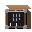 AC Grid Mimic Panel

<code>panel_mimic_ac_grid</code>

in ×1 out ×2

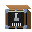 AC Induction Motor

<code>motor_ac_induction_small</code>

in ×1 out ×2

 Aluminothermic Reduction Crucible

<code>aluminothermic_crucible</code>

in ×6 out ×3

 Amine Gas-Sweetening Unit

<code>amine_gas_treater</code>

in ×6 out ×3

 AOD Converter (Argon-Oxygen Decarburization)

<code>aod_converter</code>

in ×6 out ×3

 APT Crystalliser (ammonia precipitation)

<code>apt_crystallizer</code>

in ×6 out ×3

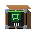 Assembly Cell

<code>assembler_workshop</code>

in ×4 out ×2

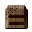 Bark Storage Crate

<code>storage_crate_bark</code>

in ×27

 Basic Bedroll

<code>bedroll_basic</code>

in ×1 out ×2

 Basic Oxygen Furnace (LD converter)

<code>basic_oxygen_furnace</code>

in ×6 out ×3

 Bayer Digestion Autoclave

<code>bayer_digester</code>

in ×6 out ×3

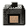 Beehive Coke Oven

<code>coke_oven_beehive</code>

in ×1 fuel ×3 out ×2

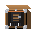 Bellows

<code>bellows</code>

in ×1 out ×2

 Bessemer Converter

<code>bessemer_converter_basic</code>

in ×1 out ×2

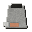 Blast Furnace

<code>blast_furnace_small</code>

in ×9 out ×2

 Brine Saturation & Softening Unit

<code>brine_treatment_unit</code>

in ×6 out ×3

 Butchering Block

<code>butchering_block_basic</code>

in ×1 out ×2

 Camp Marker

<code>camp_marker_basic</code>

in ×9 out ×2

 Carbo-Chlorination Reactor (MgCl2)

<code>mg_chloride_chlorinator</code>

in ×6 out ×3

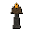 Carbon Incandescent Lamp

<code>incandescent_lamp_carbon</code>

in ×1 out ×2

 Carbonation Precipitation Reactor

<code>carbonation_reactor</code>

in ×6 out ×3

 Carving Bench

<code>carving_bench</code>

in ×9 out ×2

 Cast Iron Firebox

<code>firebox_cast_iron</code>

in ×1

 Caustic Concentration Evaporator

<code>caustic_evaporator</code>

in ×6 out ×3

 Caustic Digester Autoclave (alkali leach)

<code>caustic_digester_autoclave</code>

in ×6 out ×3

 Cement Ball Mill

<code>cement_ball_mill</code>

in ×6 out ×3

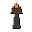 Charcoal Clamp

<code>charcoal_clamp_earth_mound_kiln</code>

in ×1 fuel ×3 out ×2

 Charcoal Retort Kiln

<code>charcoal_retort_kiln</code>

in ×1 fuel ×3 out ×2

 Chlor-Alkali Membrane Cell

<code>membrane_electrolysis_cell</code>

in ×6 out ×3

 Claus Sulfur-Recovery Unit

<code>claus_sulfur_unit</code>

in ×6 out ×3

 Clay Bloomery

<code>clay_bloomery_furnace</code>

in ×1 fuel ×3 out ×2

 Clay Casting Pit

<code>clay_casting_pit</code>

in ×1 out ×2

 Clay Crucible

<code>clay_crucible_small</code>

in ×9 out ×2

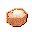 Clay Pot

<code>clay_pot</code>

in ×1 out ×2

 Contact Converter (V2O5 beds, DCDA)

<code>contact_converter</code>

in ×6 out ×3

 Copper Converter (Peirce-Smith)

<code>copper_converter</code>

in ×6 out ×3

 Cryogenic Air Separation Unit (ASU)

<code>air_separation_unit</code>

in ×6 out ×3

 Cryogenic Helium Recovery (N2 rejection) Unit

<code>cryo_helium_unit</code>

in ×6 out ×3

 Cupellation Hearth (silver assay/refine)

<code>cupellation_hearth</code>

in ×6 out ×3

 Czochralski Crystal Puller

<code>czochralski_crystal_puller</code>

in ×6 out ×3

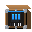 DC Workshop Dynamo

<code>dynamo_dc_workshop</code>

in ×1 out ×2

 Direct-Reduction Shaft (coal)

<code>dri_shaft_furnace</code>

in ×6 out ×3

 Drying Rack

<code>drying_rack_survival</code>

in ×1 out ×2

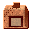 Earthen Kiln

<code>earthen_kiln_updraft</code>

in ×1 fuel ×3 out ×2

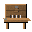 Earthenware Vessel

<code>earthenware_vessel</code>

in ×1 out ×2

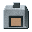 Electric Arc Furnace

<code>arc_furnace_electric</code>

in ×4 out ×2

 Electric Machine Shop

<code>machine_shop_electric</code>

in ×9 out ×2

 Electrolytic Refining Cell

<code>electrolytic_refining_cell</code>

in ×6 out ×3

 Electrowinning Cell (Pb anode / SS cathode)

<code>electrowinning_cell</code>

in ×6 out ×3

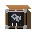 Engine Lathe

<code>lathe_workshop</code>

in ×2 out ×2

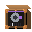 Feedwater Pump

<code>feedwater_pump_simple</code>

in ×1

 Fire-Refining Furnace

<code>fire_refining_furnace</code>

in ×6 out ×3

 Firewood Rack

<code>storage_firewood_rack</code>

in ×1

 Fishing Weir

<code>fishing_trap_weir</code>

in ×1 out ×2

 Flash Smelting Furnace (autogenous, O2-enriched)

<code>flash_smelting_furnace</code>

in ×6 out ×3

 Fluid Handler

<code>station_fluid_handler</code>

in ×1 out ×2

 Fluidised-Bed Chlorinator

<code>fluidized_bed_chlorinator</code>

in ×6 out ×3

 Fluorine Electrolysis Cell (HF -> F2)

<code>fluorine_cell</code>

in ×6 out ×3

 Flux-Protected Remelt Furnace (Mg)

<code>mg_flux_remelt_furnace</code>

in ×6 out ×3

 Flyball Governor

<code>flyball_governor</code>

passive

 Flywheel

<code>flywheel</code>

passive

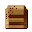 Food Storage Pit

<code>storage_food_pit</code>

in ×9

 Forge Hearth

<code>forge_hearth</code>

in ×1 fuel ×3 out ×2

 Froth Flotation Cell

<code>froth_flotation_cell</code>

in ×6 out ×3

 Fused-Salt Electrolysis Cell (Mg)

<code>mg_electrolysis_cell</code>

in ×6 out ×3

 Gas Compressor

<code>station_gas_compressor</code>

in ×1 out ×2

 Gas-Centrifuge Enrichment Cascade

<code>gas_centrifuge_cascade</code>

in ×6 out ×3

 Gibbsite Precipitation Tank

<code>precipitation_tank</code>

in ×6 out ×3

 Glass Bench

<code>glass_bench</code>

in ×1 out ×2

 Haber-Bosch Ammonia Converter (iron cat., high P)

<code>haber_bosch_reactor</code>

in ×6 out ×3

 Hall-Heroult Reduction Cell (Pot)

<code>hall_heroult_cell</code>

in ×6 out ×3

 Heap Leach Pad (acid irrigation)

<code>heap_leach_pad</code>

in ×6 out ×3

 Helium PSA Purifier

<code>helium_purifier</code>

in ×6 out ×3

 HF Digestion Reactor (acid-proof, lined)

<code>fluoride_digestion_reactor</code>

in ×6 out ×3

 Hf/Zr Extractive-Distillation & Solvent-Extraction Column

<code>hf_zr_separation_column</code>

in ×6 out ×3

 Hot Blast Stove

<code>hot_blast_stove</code>

in ×1 fuel ×3 out ×2

 Hunter Reduction Retort (sealed, inert)

<code>hunter_reduction_retort</code>

in ×6 out ×3

 Hydrogen Reduction Pusher Furnace

<code>hydrogen_reduction_furnace</code>

in ×6 out ×3

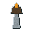 Industrial Lamp Fixture

<code>lamp_fixture_industrial</code>

in ×1 out ×2

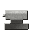 Iron Anvil

<code>iron_anvil_block</code>

in ×1 out ×2

 Iron Belt Pulley

<code>belt_pulley_iron</code>

passive

 Jet Condenser

<code>condenser_jet</code>

in ×1

 Knapping Station (anvil stone + billet)

<code>knapping_station</code>

in ×6 out ×3

 Lab Vacuum Pump

<code>vacuum_pump_lab</code>

in ×1 out ×2

 Lead Chamber (NOx)

<code>lead_chamber</code>

in ×6 out ×3

 Lean-To Shelter

<code>debris_shelter_lean_to</code>

in ×1 out ×2

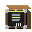 Lever Press

<code>lever_press</code>

in ×1 out ×2

 Mannheim Muffle Furnace

<code>mannheim_furnace</code>

in ×6 out ×3

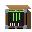 Mercury Arc Rectifier

<code>rectifier_mercury_arc</code>

in ×1 out ×2

 Natural-Gas Well & Derrick

<code>gas_well_derrick</code>

in ×6 out ×3

 Nuclear Fuel Assembly Line

<code>fuel_rod_assembly_line</code>

in ×6 out ×3

 Oleum Absorption Tower

<code>absorption_tower</code>

in ×6 out ×3

 Open Hearth Furnace

<code>open_hearth_furnace_basic</code>

in ×1 fuel ×3 out ×2

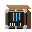 Overshot Waterwheel

<code>waterwheel_overshot</code>

passive

 Pelletizing Disc + Induration Kiln

<code>pelletizer_disc</code>

in ×6 out ×3

 Pidgeon Vacuum Retort (silicothermic)

<code>pidgeon_retort</code>

in ×6 out ×3

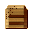 Pit Storage Cache

<code>pit_storage_cache</code>

in ×9

 Powder Press & Sinter Furnace

<code>powder_press_sinter_furnace</code>

in ×6 out ×3

 Power Pole

<code>wood_pole_power</code>

in ×1 out ×2

 Prebake Anode Furnace

<code>anode_baking_furnace</code>

in ×6 out ×3

 Reactor Assembly Bay

<code>reactor_assembly_bay</code>

in ×6 out ×3

 Reagent Filling & Sealing Line

<code>reagent_filling_line</code>

in ×6 out ×3

 Reverberatory Furnace

<code>reverberatory_furnace</code>

in ×6 out ×3

 Riveted Boiler

<code>boiler_shell_riveted</code>

in ×1 fuel ×3 out ×2

 Roasting Pit

<code>roasting_pit</code>

in ×1 fuel ×3 out ×2

 Rotary Calcining Kiln (RKEF dry/reduce)

<code>rotary_calciner_kiln</code>

in ×6 out ×3

 Saddle Quern

<code>quern_saddle</code>

in ×1 out ×2

 Sheet-Metal Forming & Seaming Press

<code>sheet_metal_press</code>

in ×6 out ×3

 Shelter Frame

<code>debris_shelter_frame</code>

in ×1 out ×2

 Siemens CVD Reactor (polysilicon deposition)

<code>siemens_cvd_reactor</code>

in ×6 out ×3

 Simple Snare

<code>snare_simple</code>

in ×1 out ×2

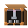 Simple Steam Engine

<code>steam_engine_simple</code>

passive

 Sinter Strand (Dwight-Lloyd)

<code>sinter_strand</code>

in ×6 out ×3

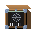 Small AC Generator

<code>generator_ac_small</code>

in ×1 out ×2

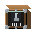 Small DC Motor

<code>electric_motor_small_dc</code>

in ×1 out ×2

 Solvent-Extraction Mixer-Settler (LIX)

<code>sx_mixer_settler</code>

in ×6 out ×3

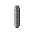 Steam Cylinder

<code>steam_cylinder_cast_iron</code>

in ×1

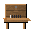 Steam Drill

<code>steam_drill</code>

in ×1 out ×2

 Steam Machine Shop

<code>machine_shop_steam</code>

in ×9 out ×2

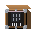 Steam Rolling Mill

<code>rolling_mill_steam</code>

in ×4 out ×2

 Steam-Methane Reformer

<code>steam_reformer</code>

in ×6 out ×3

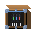 Step-Down Transformer

<code>transformer_step_down</code>

in ×1 out ×2

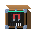 Step-Up Transformer

<code>transformer_step_up</code>

in ×1 out ×2

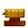 Stone Anvil

<code>anvil_stone</code>

in ×1 out ×2

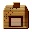 Stone Fire Ring

<code>fire_ring_stones</code>

in ×1 fuel ×3 out ×2

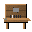 Stone Mortar

<code>mortar_stone</code>

in ×1 out ×2

 Stone Pestle

<code>pestle_stone</code>

in ×1 out ×2

 Straw Bedroll

<code>bedroll_straw</code>

in ×1 out ×2

 Submerged-Arc Furnace (SAF)

<code>submerged_arc_furnace</code>

in ×6 out ×3

 Sulfation Acid-Roast Kiln

<code>li_acid_roast_kiln</code>

in ×6 out ×3

 Sulfur Burner / Pyrite Roaster

<code>sulfur_burner</code>

in ×6 out ×3

 Survival Campfire

<code>campfire_survival</code>

in ×1 fuel ×3 out ×2

 Three-Phase AC Generator

<code>generator_ac_three_phase</code>

in ×1 out ×2

 TiCl4 Fractional Distillation Column

<code>ticl4_distillation_column</code>

in ×6 out ×3

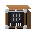 Trip Hammer

<code>stamp_mill_manual_trip_hammer</code>

in ×1 out ×2

 Uranium Conversion Reactor (UO2/UF4/UF6)

<code>uranium_conversion_reactor</code>

in ×6 out ×3

 Vacuum Arc Remelting Furnace (VAR)

<code>vacuum_arc_remelt_furnace</code>

in ×6 out ×3

 Vent Stack

<code>station_vent_stack</code>

in ×1 out ×2

 Wafer Slicing & Polishing Line

<code>wafer_fab_line</code>

in ×6 out ×3

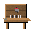 Waste Midden

<code>waste_midden_basic</code>

in ×1

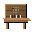 Wattle Screen

<code>wattle_screen</code>

in ×1 out ×2

 Wet Magnetic Separator (LIMS)

<code>magnetic_separator</code>

in ×6 out ×3

 Wire Drawing Bench

<code>wire_drawing_bench</code>

in ×1 out ×2

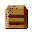 Wooden Chest

<code>storage_chest_wood</code>

in ×27

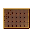 Wooden Chute

<code>chute_wood</code>

passive

 Wooden Cooling Tank

<code>cooling_tank_wooden</code>

in ×1

 Wooden Switchboard

<code>switchboard_panel_wooden</code>

in ×1 out ×2

 Workbench

<code>workbench</code>

in ×9 out ×2

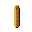 Wrought Beam Frame

<code>beam_frame_wrought</code>

in ×1

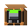 Wrought Line Shaft

<code>line_shaft_wrought</code>

passive

 Yellowcake Precipitation & Calcining Line

<code>yellowcake_precipitator</code>

in ×6 out ×3

 Zinc Distillation Retort (thermal)

<code>zinc_distillation_retort</code>

in ×6 out ×3

